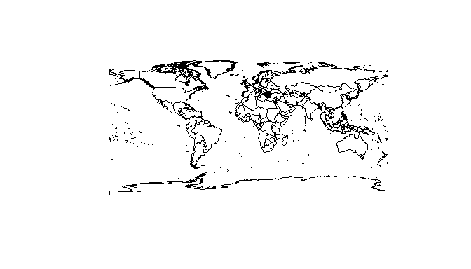
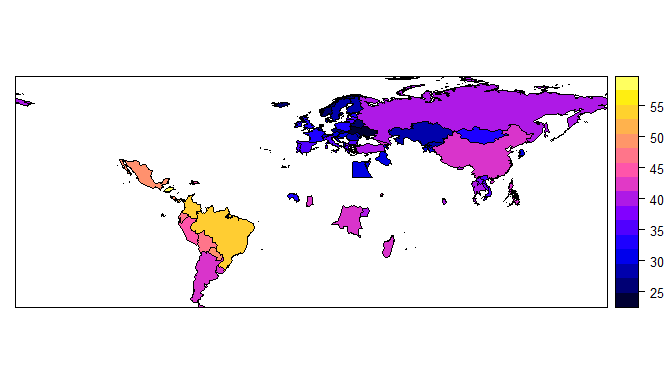
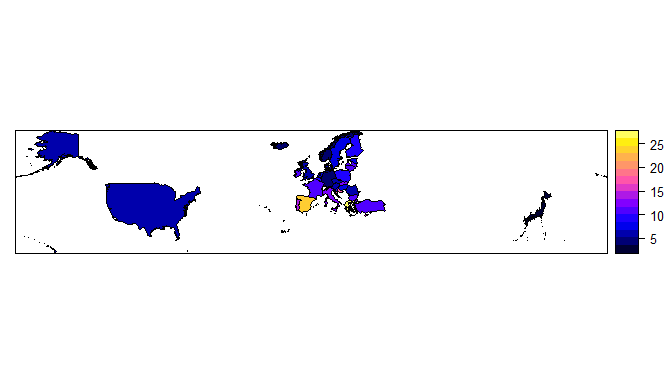
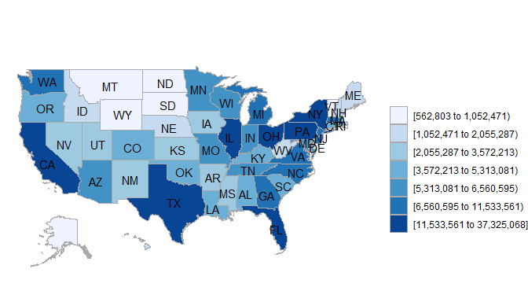
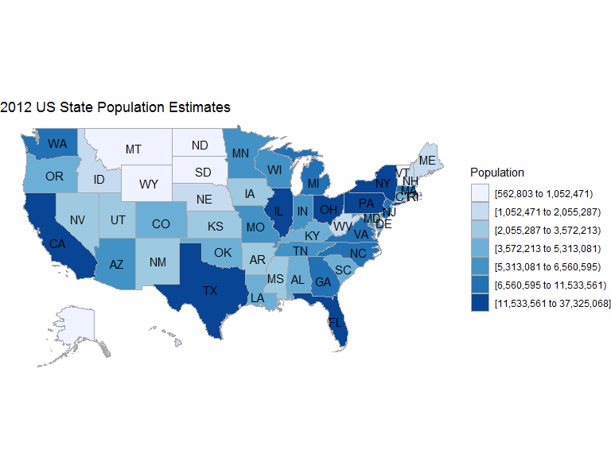
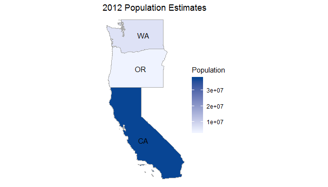
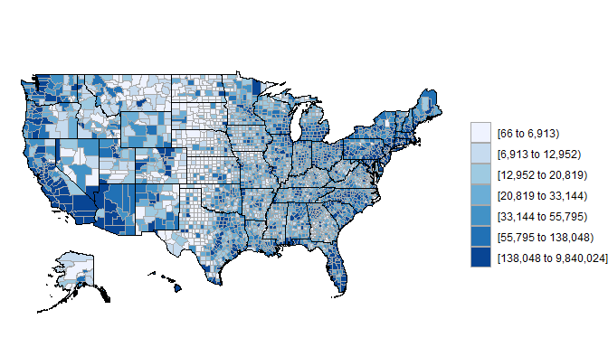
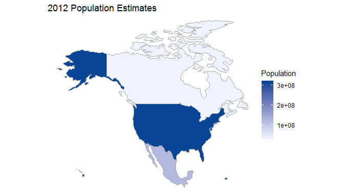
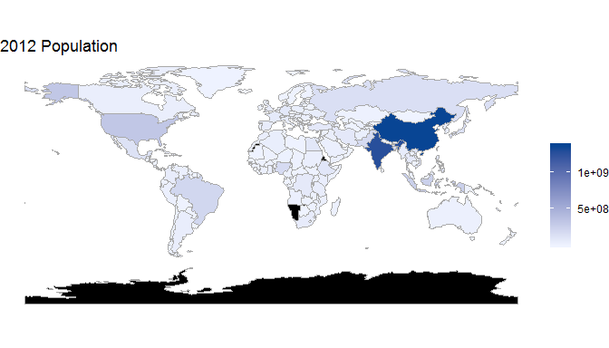
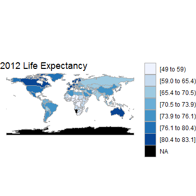

Inhalt dieses Abschnitts
------------------------

-   Der Beispieldatensatz `wrld_simpl` im Paket `maptools` wird
    vorgestellt.
-   Es wird gezeigt, wie man Daten aus anderen Quellen mit Kartendaten
    verbinden kann.
-   Mit dieser Verbindung ist es dann möglich thematische Karten - so
    genannte Choroplethen - zu erstellen
-   Zudem wird das Paket `choroplethr` vorgestellt.

Was ist ein Choropleth
----------------------

Ein Choropleth ist eine Karte, die

-   geografische Grenzen zeigt.
-   bei denen Bereiche basierend auf Metriken eingefärbt werden.

Choroplethen sind nützlich für die Visualisierung von Daten, wo
geografische Grenzen eine natürliche Einheit der Aggregation sind.

Das Paket `maptools`
--------------------

-   Datensatz wrld\_simpl aus dem Paket `maptools`
-   Polygone für fast alle Staaten der Erde

<!-- -->

    library(maptools)
    data(wrld_simpl)

<table>
<thead>
<tr class="header">
<th></th>
<th style="text-align: left;">ISO2</th>
<th style="text-align: left;">NAME</th>
<th style="text-align: right;">AREA</th>
<th style="text-align: right;">POP2005</th>
</tr>
</thead>
<tbody>
<tr class="odd">
<td>ATG</td>
<td style="text-align: left;">AG</td>
<td style="text-align: left;">Antigua and Barbuda</td>
<td style="text-align: right;">44</td>
<td style="text-align: right;">83039</td>
</tr>
<tr class="even">
<td>DZA</td>
<td style="text-align: left;">DZ</td>
<td style="text-align: left;">Algeria</td>
<td style="text-align: right;">238174</td>
<td style="text-align: right;">32854159</td>
</tr>
<tr class="odd">
<td>AZE</td>
<td style="text-align: left;">AZ</td>
<td style="text-align: left;">Azerbaijan</td>
<td style="text-align: right;">8260</td>
<td style="text-align: right;">8352021</td>
</tr>
<tr class="even">
<td>ALB</td>
<td style="text-align: left;">AL</td>
<td style="text-align: left;">Albania</td>
<td style="text-align: right;">2740</td>
<td style="text-align: right;">3153731</td>
</tr>
<tr class="odd">
<td>ARM</td>
<td style="text-align: left;">AM</td>
<td style="text-align: left;">Armenia</td>
<td style="text-align: right;">2820</td>
<td style="text-align: right;">3017661</td>
</tr>
<tr class="even">
<td>AGO</td>
<td style="text-align: left;">AO</td>
<td style="text-align: left;">Angola</td>
<td style="text-align: right;">124670</td>
<td style="text-align: right;">16095214</td>
</tr>
</tbody>
</table>

Hallo Welt
----------

    plot(wrld_simpl)



[Daten zum Gini Index](https://datahub.io/core/gini-index#data)
---------------------------------------------------------------

-   Daten von [**datahub.io**](https://datahub.io/core/gini-index#data)
-   Statistisches Maß zur Darstellung von
    [Ungleichverteilungen](https://de.wikipedia.org/wiki/Gini-Koeffizient)

<!-- -->

    gini <- read.csv("../data/gini-index_csv.csv")

<table>
<thead>
<tr class="header">
<th style="text-align: left;">Country.Name</th>
<th style="text-align: left;">Country.Code</th>
<th style="text-align: right;">Year</th>
<th style="text-align: right;">Value</th>
</tr>
</thead>
<tbody>
<tr class="odd">
<td style="text-align: left;">Albania</td>
<td style="text-align: left;">ALB</td>
<td style="text-align: right;">1996</td>
<td style="text-align: right;">27.0</td>
</tr>
<tr class="even">
<td style="text-align: left;">Albania</td>
<td style="text-align: left;">ALB</td>
<td style="text-align: right;">2002</td>
<td style="text-align: right;">31.7</td>
</tr>
<tr class="odd">
<td style="text-align: left;">Albania</td>
<td style="text-align: left;">ALB</td>
<td style="text-align: right;">2005</td>
<td style="text-align: right;">30.6</td>
</tr>
<tr class="even">
<td style="text-align: left;">Albania</td>
<td style="text-align: left;">ALB</td>
<td style="text-align: right;">2008</td>
<td style="text-align: right;">30.0</td>
</tr>
<tr class="odd">
<td style="text-align: left;">Albania</td>
<td style="text-align: left;">ALB</td>
<td style="text-align: right;">2012</td>
<td style="text-align: right;">29.0</td>
</tr>
<tr class="even">
<td style="text-align: left;">Algeria</td>
<td style="text-align: left;">DZA</td>
<td style="text-align: right;">1988</td>
<td style="text-align: right;">40.2</td>
</tr>
</tbody>
</table>

Der Gini Index im Jahr 2012
---------------------------

-   Für das Jahr 2012 sind am meisten Beobachtungen vorhanden.

<!-- -->

    gini12 <- gini[gini$Year==2012,]
    summary(gini12$Value)

    ##    Min. 1st Qu.  Median    Mean 3rd Qu.    Max. 
    ##   24.70   29.80   35.10   36.15   41.40   57.40

Exkurs: der Befehl `match`
--------------------------

    vec_a <- c("A",2,6,1,"C")
    vec_b <- c(1,"C",2)

    match(vec_a,vec_b)

    ## [1] NA  3 NA  1  2

Die Daten matchen
-----------------

-   WIr matchen die Gini-Daten mit den Kartendaten

<!-- -->

    ind <- match(gini12$Country.Code,wrld_simpl$ISO3)

-   Wir nehmen die Länder raus, für die keine Daten vorhanden sind:

<!-- -->

    ind2 <- ind[!is.na(ind)]

-   Eine neue Karte wird erstellt:

<!-- -->

    ginimap <- wrld_simpl[ind2,]

-   Die Gini-Daten werden in den Datenslot geschrieben

<!-- -->

    ginimap@data$gini12 <- gini12$Value[!is.na(ind)]

Die Daten plotten
-----------------

    library(sp)
    spplot(ginimap,"gini12")



Aufgabe A4A - Eine Choroplethenkarte erzeugen
---------------------------------------------

-   Lade Datensatz [**Unemployment
    Datensatz**](https://raw.githubusercontent.com/Japhilko/GeoData/master/2015/data/Unemployment.csv)
    herunter
-   Matche die Daten mit einer passenden Karte
-   Erzeuge mit der (Variable `X2014M10`) folgende Karte:



Das Paket `choroplethr`
-----------------------

### Paket von [**Ari Lamstein**](http://www.arilamstein.com/) - [**`choroplethr`**](https://cran.r-project.org/web/packages/choroplethr/index.html)

-   Vereinfachung der Erstellung von Choroplethen in R

-   World Development Indicators
    [**`WDI`**](https://cran.r-project.org/web/packages/WDI/index.html)
    (World Bank)

-   Die folgenden Beispiele basieren auf der
    [**Vignette**](https://cran.r-project.org/web/packages/choroplethr/index.html)
    des `choroplethr`-Paketes

<!-- -->

    install.packages("choroplethr")

Bevölkerungsschätzungen für den US-Staaten
---------------------------------------------

`df_pop_state` ist ein Datensatz , der in dem Paket `choroplethr`
enthalten ist, es enthält Schätzungen zu den US-Staaten für das Jahr
2012.

<table>
<thead>
<tr class="header">
<th style="text-align: left;">region</th>
<th style="text-align: right;">value</th>
</tr>
</thead>
<tbody>
<tr class="odd">
<td style="text-align: left;">alabama</td>
<td style="text-align: right;">4777326</td>
</tr>
<tr class="even">
<td style="text-align: left;">alaska</td>
<td style="text-align: right;">711139</td>
</tr>
<tr class="odd">
<td style="text-align: left;">arizona</td>
<td style="text-align: right;">6410979</td>
</tr>
<tr class="even">
<td style="text-align: left;">arkansas</td>
<td style="text-align: right;">2916372</td>
</tr>
<tr class="odd">
<td style="text-align: left;">california</td>
<td style="text-align: right;">37325068</td>
</tr>
<tr class="even">
<td style="text-align: left;">colorado</td>
<td style="text-align: right;">5042853</td>
</tr>
</tbody>
</table>

`choroplethr` - [Hallo Welt](http://mirrors.softliste.de/cran/web/packages/choroplethr/vignettes/a-introduction.html)
---------------------------------------------------------------------------------------------------------------------

Die Karte zeigt die US Bevölkerungsschätzung für die US-Staaten und
das Jahr 2012:

Wir bekommen eine Choroplethenkarte mit nur einem Argument:

    state_choropleth(df_pop_state)



Aber wir können auch einen Titel erstellen und die Legende benennen:

    state_choropleth(df_pop_state, title="2012 US State Population Estimates", legend="Population")



[Nur drei Staaten darstellen](http://mirrors.softliste.de/cran/web/packages/choroplethr/vignettes/b-state-choropleth.html)
--------------------------------------------------------------------------------------------------------------------------

    state_choropleth(df_pop_state,
                     title= "2012 Population Estimates",
                     legend= "Population", num_colors = 1,
                     zoom=c("california","washington","oregon"))



US County Chroplethen
---------------------

### [Choroplethen der US Counties](http://mirrors.softliste.de/cran/web/packages/choroplethr/vignettes/c-county-choropleth.html)

-   [**Vignette des
    Pakets**](http://mirrors.softliste.de/cran/web/packages/choroplethr/vignettes/c-county-choropleth.html)

<!-- -->

    # A data.frame containing population estimates for US Counties in 2012.
    ?df_pop_county

    # Create a choropleth of US Counties
    ?county_choropleth

Eine Karte der US Counties
--------------------------

    data(df_pop_county)
    county_choropleth(df_pop_county)



[Choroplethen Länder](http://mirrors.softliste.de/cran/web/packages/choroplethr/vignettes/d-country-choropleth.html)
---------------------------------------------------------------------------------------------------------------------

    data(df_pop_country)
    country_choropleth(df_pop_country,
                  title      = "2012 Population Estimates",
                  legend     = "Population",
                  num_colors = 1,
                  zoom       = c("united states of america",
                                 "mexico", "canada"))

[Choroplethen Länder](http://mirrors.softliste.de/cran/web/packages/choroplethr/vignettes/d-country-choropleth.html)
---------------------------------------------------------------------------------------------------------------------



Weltbank Daten
--------------

    library(WDI) 
    choroplethr_wdi(code="SP.POP.TOTL", year=2012, 
                    title="2012 Population", 
                    num_colors=1)



[Lebenserwartung](http://mirrors.softliste.de/cran/web/packages/choroplethr/vignettes/f-world-bank-data.html)
-------------------------------------------------------------------------------------------------------------

    choroplethr_wdi(code="SP.DYN.LE00.IN", year=2012,
                    title="2012 Life Expectancy")



Ein weiterer Datensatz
----------------------

> A data.frame containing all US presdiential election results from 1789
> to 2012

    data(df_president_ts)

<!--
Mit dem Fragezeichen bekommen wir Hilfe


```r
?df_president_ts
```

-->
D = Democratic; R = Republican; PR = Progressive;

<table>
<thead>
<tr class="header">
<th></th>
<th style="text-align: left;">region</th>
<th style="text-align: left;">1908</th>
<th style="text-align: left;">1912</th>
<th style="text-align: left;">1916</th>
<th style="text-align: left;">1920</th>
<th style="text-align: left;">1924</th>
<th style="text-align: left;">1928</th>
<th style="text-align: left;">1932</th>
</tr>
</thead>
<tbody>
<tr class="odd">
<td>42</td>
<td style="text-align: left;">south dakota</td>
<td style="text-align: left;">R</td>
<td style="text-align: left;">PR</td>
<td style="text-align: left;">R</td>
<td style="text-align: left;">R</td>
<td style="text-align: left;">R</td>
<td style="text-align: left;">R</td>
<td style="text-align: left;">D</td>
</tr>
<tr class="even">
<td>43</td>
<td style="text-align: left;">tennessee</td>
<td style="text-align: left;">D</td>
<td style="text-align: left;">D</td>
<td style="text-align: left;">D</td>
<td style="text-align: left;">R</td>
<td style="text-align: left;">D</td>
<td style="text-align: left;">R</td>
<td style="text-align: left;">D</td>
</tr>
<tr class="odd">
<td>44</td>
<td style="text-align: left;">texas</td>
<td style="text-align: left;">D</td>
<td style="text-align: left;">D</td>
<td style="text-align: left;">D</td>
<td style="text-align: left;">D</td>
<td style="text-align: left;">D</td>
<td style="text-align: left;">R</td>
<td style="text-align: left;">D</td>
</tr>
<tr class="even">
<td>45</td>
<td style="text-align: left;">utah</td>
<td style="text-align: left;">R</td>
<td style="text-align: left;">R</td>
<td style="text-align: left;">D</td>
<td style="text-align: left;">R</td>
<td style="text-align: left;">R</td>
<td style="text-align: left;">R</td>
<td style="text-align: left;">D</td>
</tr>
<tr class="odd">
<td>46</td>
<td style="text-align: left;">vermont</td>
<td style="text-align: left;">R</td>
<td style="text-align: left;">R</td>
<td style="text-align: left;">R</td>
<td style="text-align: left;">R</td>
<td style="text-align: left;">R</td>
<td style="text-align: left;">R</td>
<td style="text-align: left;">R</td>
</tr>
<tr class="even">
<td>47</td>
<td style="text-align: left;">virginia</td>
<td style="text-align: left;">D</td>
<td style="text-align: left;">D</td>
<td style="text-align: left;">D</td>
<td style="text-align: left;">D</td>
<td style="text-align: left;">D</td>
<td style="text-align: left;">R</td>
<td style="text-align: left;">D</td>
</tr>
<tr class="odd">
<td>48</td>
<td style="text-align: left;">washington</td>
<td style="text-align: left;">R</td>
<td style="text-align: left;">PR</td>
<td style="text-align: left;">D</td>
<td style="text-align: left;">R</td>
<td style="text-align: left;">R</td>
<td style="text-align: left;">R</td>
<td style="text-align: left;">D</td>
</tr>
</tbody>
</table>

<!--
R = Republican; 
D = Democratic; 
DR = Democratic-Republican; 
W = Whig;
F = Federalist;
GW = George Washington;
NR = National Republican;
SD = Southern Democrat;
PR = Progressive; 
AI = American Independent;
SR = States' Rights; 
PO = Populist; 
CU = Constitutional Union; 
I = Independent; 
ND = Northern Democrat; 
KN = Know Nothing;
AM = Anti-Masonic;
N = Nullifier; 
SP = Split evenly
-->
    # install.packages("choroplethrMaps")
    library("choroplethrMaps")

Resourcen
---------

    citation("choroplethr")

    ## 
    ## To cite package 'choroplethr' in publications use:
    ## 
    ##   Ari Lamstein (2018). choroplethr: Simplify the Creation of
    ##   Choropleth Maps in R. R package version 3.6.3.
    ##   https://CRAN.R-project.org/package=choroplethr
    ## 
    ## A BibTeX entry for LaTeX users is
    ## 
    ##   @Manual{,
    ##     title = {choroplethr: Simplify the Creation of Choropleth Maps in R},
    ##     author = {Ari Lamstein},
    ##     year = {2018},
    ##     note = {R package version 3.6.3},
    ##     url = {https://CRAN.R-project.org/package=choroplethr},
    ##   }

Resources / Links
-----------------

-   [**Einführung - Was sind
    Choroplethen**](https://cran.r-project.org/web/packages/choroplethr/vignettes/a-introduction.html)

-   [**Beschreibung**](http://radar.oreilly.com/2014/01/new-choropleth-package-in-r.html)
    der Nutzung des `choroplethr` Paketes

-   Die [**US
    Staaten**](https://cran.r-project.org/web/packages/choroplethr/vignettes/b-state-choropleth.html)
    plotten mit `choroplethr`

-   [**Weltbankdaten in Karten
    darstellen**](https://cran.r-project.org/web/packages/choroplethr/vignettes/f-world-bank-data.html)
    mit `choroplethr`

-   [**Revolutions-Blog**](http://blog.revolutionanalytics.com/2014/01/easy-data-maps-with-r-the-choroplethr-package-.html)
    über das `choroplethr` Paket

-   [**trulia**](http://www.trulia.com/tech/2014/01/15/the-choroplethr-package-for-r/)-blog
    über das `choroplethr` Paket

-   [**Präsentation von Ari
    Lamstein**](http://www.r-bloggers.com/slides-for-my-upcoming-talk-mapping-census-data-in-r/)
    über das `choroplethr` Paket
