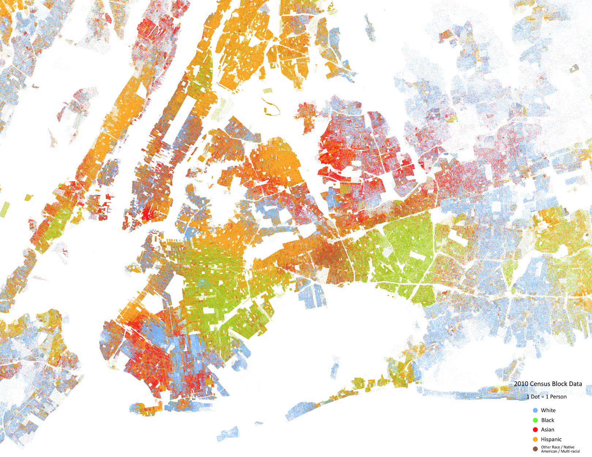
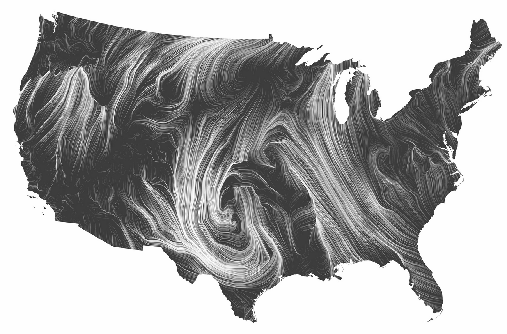
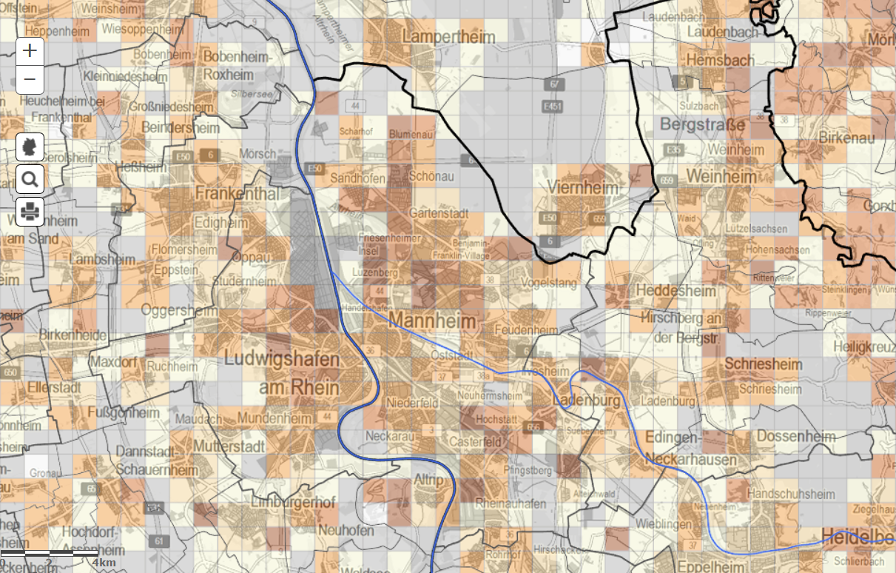
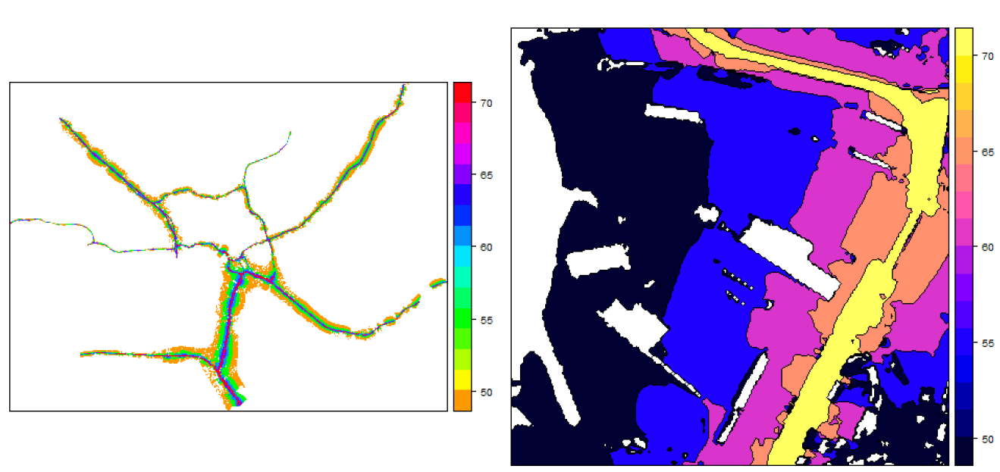
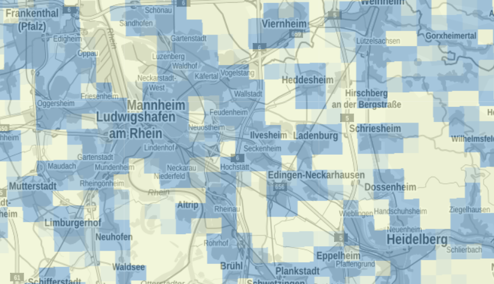
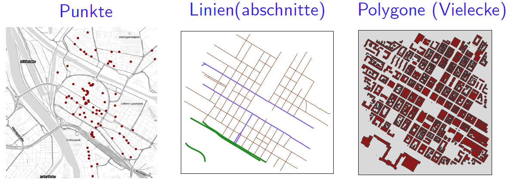
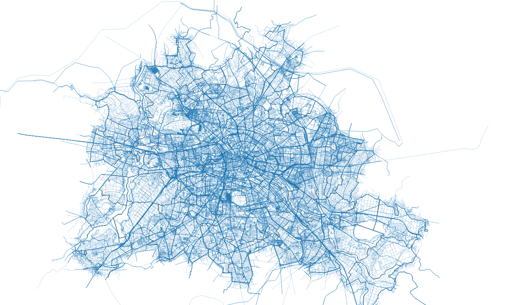
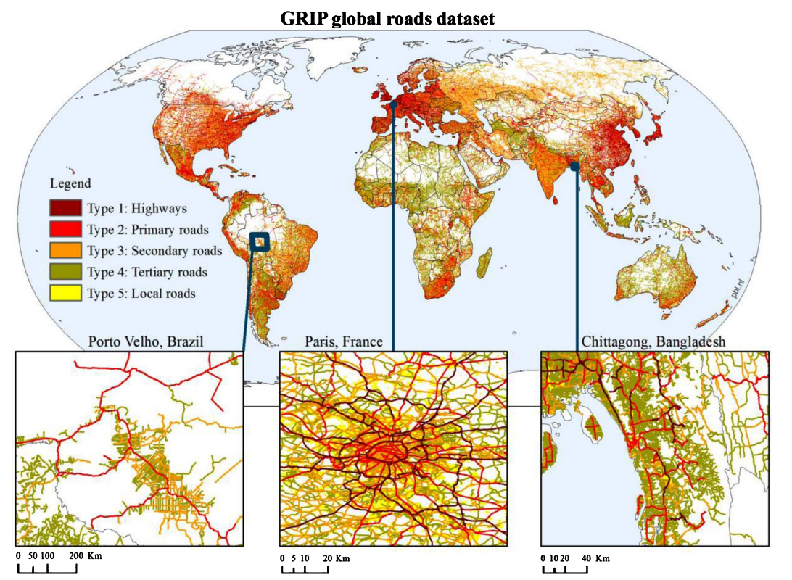
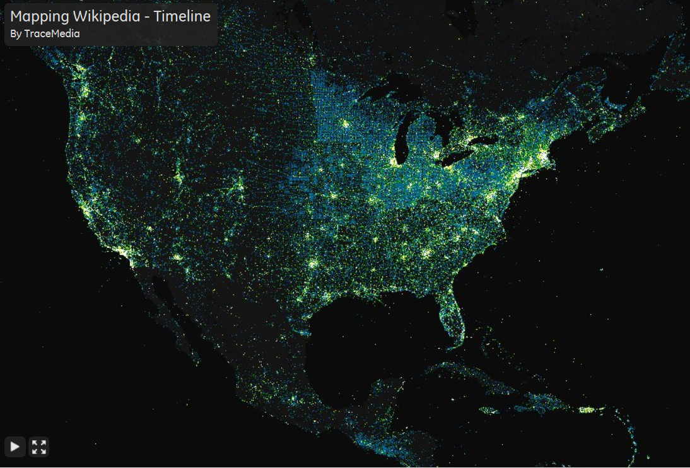
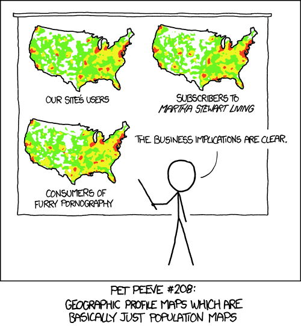

## Kleine Vorstellungsrunde

- Wo kommt Ihr her?
- Wo arbeitet oder studiert Ihr?
- Wie beurteilt Ihr Eure Fähigkeiten mit R?
- Habt Ihr Erfahrungen mit anderen Programmiersprachen / Statistiksoftware? Wenn ja welche?
- Was sind Eure Erwartungen für diesen Kurs? 

## Informationen vorab

Normalerweise gibt es große Unterschiede bei Vorkenntnissen und Fähigkeiten, insbesondere bei diesem Kurs.

- Bitte gebt Bescheid, wenn es zu schnell oder zu langsam geht oder etwas unklar geblieben ist.
- Wenn es Fragen gibt - immer fragen
- Wenn Ihr etwas hinzuzufügen habt - sehr gerne
- In diesem Kurs gibt es viele [**Übungen**](http://web.math.ku.dk/~helle/R-intro/exercises.pdf), denn das Programmieren / die Nutzung von Geodaten in R lernt man am Ende (wie vieles) nur allein.
- Ich habe viele [**Beispiele**](https://www.showmeshiny.com/) - probiert sie aus 
- R macht mehr Spaß zusammen - arbeitet zusammen!

## Disclaimer

- Zum Import, zur Verarbeitung und Visualisierung gibt es bereits sehr viele Pakete.
- Das Gebiet entwickelt sich sehr schnell.
- Es ist nicht möglich alles davon in diesem Kurs vorzustellen.
- Ich möchte anhand einiger interessanter Beispiele einen Einblick darin geben, was alles möglich ist. 


## [Laws of Spatial Sience](http://de.slideshare.net/rheimann04/big-social-data-the-spatial-turn-in-big-data)

### [Tobler's law](https://en.wikipedia.org/wiki/Tobler's_first_law_of_geography)

> everything is related to everything else, but near things are more related than distant things.

### [Spatial Turn](https://de.wikipedia.org/wiki/Spatial_turn)

> Spatial turn is a term used to describe an intellectual movement that places emphasis on place and space in social science and the humanities.


## Motivation - [Deutschlands größte Klimasünder](http://www.spiegel.de/wissenschaft/mensch/deutschland-das-sind-die-groessten-klimasuender-a-1178207.html)

- Spiegel Artikel am 16.11.2017 aus Anlass der Jamaika Gespräche


## Was heißt das für diesen Kurs

### Vorgestellt werden:

- Möglichkeiten für den Download, den Import, die Verarbeitung und die Visualisierung von Geodaten 


<!--
Die Daten auf OSM werden unter der Open Database License (ODbL) 1.0 freigegeben. Das ermöglicht eine Mehrfachverwendung der Daten \citep{schmidt2013extraction}. Die Studie von \cite{barrington2017world} zeigt, dass die Datenqualität von OSM in vielen Ländern bereits ausreichend ist, um sie für wissenschaftliche und analytische Zwecke zu nutzen.
Siehe zum Beispiel das Projekt Simulation of Urban MObility (SUMO) (\citealt{behrisch2011sumo}). Viel mehr Forschung, die in verschiedenen Ländern durchgeführt wird, ist unter \cite{wiki:research} aufgeführt.
-->

- Quellen für Geodaten

- Bspw. die wichtigsten Programmierschnittstellen (APIs) um die Daten zu bekommen

- R-Pakete um diese Daten zu verarbeiten und zu visualisieren

## Motivation

<!--
Mit diesem Paper möchte ich einige interessante Web Services vorstellen, um Geodaten herunterzuladen, zu verarbeiten und zu visualisieren. 

Ein Schwerpunkt liegt dabei auf OSM-Daten.
-->

### Motivation allgemein

- Raumbezug herstellen/nutzen
- Sekundäranalyse für bestehenden Daten 
- Analysepotentiale der Geokodierung vorstellen
- Verbindung von sozial- mit raumwissenschaftlichen Daten


### Warum die Darstellung in Karten

- Darstellung in Karten ermöglicht besseres Verständnis von sozialwissenschaftlicher Phänomene - Attraktiver Output

- Durch die INSPIRE Richtlinie und *Collaborative Mapping* wächst der verfügbare Bestand an Geodaten.

- Daten sind oft frei verfügbar im Internet (z.B. Nutzung von APIs)
- Die Daten sind oft wenig oder gar nicht strukturiert, heterogen und oft nicht zur räumlichen Visualisierung vorgesehen, beinhalten aber implizit  geographische Informationen (Web 2.0)
- Oftmals sind wenig oder keine Metadaten vorhanden

## Das Thema Geodatenlandschaft


<!--
Background Maps - Download via Tile Servers
-->


<!--
## Inhalt dieses Abschnitts


Einerseits die Daten vorstellen, die vorhanden sind

Zensus, IÖR Daten

Andererseits neue Entwicklungen in R vorstellen

-->


## R-Pakete - Zum Download von Geo-Information

### [Das Paket `ggmap`](https://sites.google.com/site/davidkahle/ggmap)


- David Kahle and Hadley Wickham: `ggmap` - Spatial Visualization with `ggplot2`


## [Worum geht es?](http://blog.revolutionanalytics.com/2012/07/making-beautiful-maps-in-r-with-ggmap.html)


### Weine probieren im Napa Valley?


## Interessante Visualisierungen - [One dot per person](https://carsten.io/the-racial-dot-map-one-dot-per-person-for-the-entire-u-s/)




<!--
[Englisches Wikipedia](https://en.wikipedia.org/wiki/Spatial_turn)
-->

<!--

## Regional/geographical differences in the perception of...

- ... measures to promote climatic change
- ... big infrastructure projects


## Nice output - example [Wind Map](http://hint.fm/wind/)

<http://hint.fm/wind/>

<!--

-->

<!--

-->

<!--
## Availability of data - Example Census Atlas
-->

## Datenquellen


## Ergebnisse des Zensus 2011 zum [**Download**](https://www.zensus2011.de/SharedDocs/Aktuelles/Ergebnisse/DemografischeGrunddaten.html?nn=3065474)

<!--
## Verfügbarkeit von Daten - Beispiel Zensus Atlas

<https://atlas.zensus2011.de/>
-->


### Gemeindeebene

- Bevölkerung nach Geschlecht, Altersgruppe, Familienstatus, Staatsangehörigkeit und Religion

###  1 $\text{km}^2$ Raster

- Bevölkerung, Leerstandsquote, Wohnfläche und Haushaltsgröße

###  100 $\text{m}^2$ Raster

Bevölkerung

## Zensus Ergebnisse

Beispiel Anteil der Personen aus EU27 Land an Einwohnerzahl pro
Gemeinde in Oberfranken


<!--
## Verfügbarkeit der Daten - Beispiel [Fahrradunfälle in Berlin](http://michael-hoerz.de/maps/berlin-bike/)

<http://www.sowirdberlin.de/>


-->

<!--
## Heterogener Datenbestand - Beispiel <http://names.mappinglondon.co.uk/>


-->

<!--
## Übersicht - [warum R](http://www.edureka.co/)


-->

<!--
## [R Nutzer rund um die Welt](http://blog.revolutionanalytics.com/)


## [Wo sind die aktivsten Nutzer?](http://spatial.ly/)


-->

## Zensus Daten zur Leerstandsquote



https://atlas.zensus2011.de/

## Datenquelle: Eionet

### [Eionet - Central Data Repository](http://cdr.eionet.europa.eu/de/eu/noise/df8/colvi7k8q)

- Europäisches Umweltinformations- und Umweltbeobachtungsnetz
- Qualitätsgesicherte Daten über den Zustand / Einflussfaktoren auf die Umwelt in Europa
- Strategische Lärmkartierungen

## Lärmbelastung durch Schienenlärm 


### Beispiel: Lärmbelastung durch nächtlichen Schienenlärm in Hamburg




## Institut für ökologische Raumforschung (IÖR)

### IÖR Monitor - Beispiel Siedlungsdichte



## Das Openstreetmap Projekt...

### Openstreetmap (OSM)

- Durch kollaboratives Mapping ist eine riesige Datenmenge zugänglich. 
- Viele Menschen tragen jeden Tag Informationen bei.
- Die wachsende Menge an Geodaten wird von Freiwilligen gesammelt bzw. über Crowdsourcing gewonnen.
- OSM ermöglicht Zugang zu Big Data der Geographie.


## Drei wichtige OSM Objekttypen

### Vektordaten werden für den Betrachter dargestellt durch:

- Polygone sind als (eine Reihe von) verbundenen Prunkten mit gleichem Start- und Endpunkt definiert. Die Ausrichtung verläuft gegen den Uhrzeigersinn




## Beispiel für verfügbare Daten - Straßen in Berlin

Dargestellt werden OpenStreetMap Daten, die mit der Overpass API heruntergeladen wurden.




## Paper mit OSM Daten 

### [**Studie von Gervasoni et al. (2018)**](https://hal.inria.fr/hal-01852585/document)

- Convolutional neural networks for disaggregated
population mapping using open data


<!--
https://hal.inria.fr/hal-01852585/document
-->


<!--
## [Openstreetmap Daten](https://github.com/Japhilko/OSMshinyApp/)


-->


## Globale Muster der Straßeninfrastruktur

<!--
Global patterns of current and future road infrastructure
-->

### [**Studie von Johan Meijer et al.**](http://iopscience.iop.org/article/10.1088/1748-9326/aabd42/meta)

<!--
, Mark AJ Huijbregts,  Kees Schotten,  und Aafke Schipper
--> 



<!--
@article{meijer2018global,
  title={Global patterns of current and future road infrastructure},
  author={Meijer, Johan and Huijbregts, Mark AJ and Schotten, Kees and Schipper, Aafke},
  journal={Environmental Research Letters},
  year={2018},
  publisher={IOP Publishing}
}
-->

## [Mapping Wikipedia](http://www.visualizing.org/visualizations/mapping-wikipedia-timeline)



## [Allerdings...](http://xkcd.com/1138/)



## Links mit Beispielen

- Shiny App zu [**Indikatoren**](https://japhilko.shinyapps.io/Choropleths/) für Europa

- Räumliche Visualisierung in den USA - [**Walmarts in den USA**](https://rpubs.com/Radcliffe/walmart)
- [**Race Gap Police USA**](http://www.nytimes.com/interactive/2014/09/03/us/the-race-gap-in-americas-police-departments.html?_r=0) - [**Wahl USA**](http://fivethirtyeight.com/)

- Zeit Artikel zum Zustand der [**Eisenbahnbrücken**](http://detektor.fm/digital/datenjournalismus-interaktive-karte-zeigt-marode-deutsche-bahn-bruecken) 

- [**Fahrradunfälle**](http://michael-hoerz.de/maps/berlin-bike/) in Berlin

- [**Verteilung Fußballfans**](http://interaktiv.morgenpost.de/beta-fussballkarte/#7/51.258/10.756)

- [**Plastiktüten im Meer**](http://news.nationalgeographic.com/news/2014/07/140715-ocean-plastic-debris-trash-pacific-garbage-patch/)

<!--
### Datenquellen: 
-->

- Datensätze zu [**Pegelständen**](https://www.pegelonline.wsv.de/gast/start) in Deutschland
- Viele Datensätze auf [**driven by data**](http://driven-by-data.net/)

### Resourcen

- Andreas Plank - [**Grafiken und Statistik in R**](http://www.chironomidaeproject.com/fileadmin/downloads/Formeln_in_R.pdf)

<!--
## Verschiedene Kartentypen

- [Create and integrate maps in your R workflow with the cartography package](https://rgeomatic.hypotheses.org/842)


- [Das Paket cartography](https://cran.r-project.org/web/packages/cartography/vignettes/cartography.html)

https://nowosad.github.io/post/world-pop-change/

http://development-frontiers.com/tutorials/

https://m.xkcd.com/2048/

-->


## A1A Übung -  zusätzliche Pakete

Gehe auf <https://cran.r-project.org/> und suche nach Paketen...

- die Umrisse der Länder der Welt enthalten
- mit denen man die Google maps API nutzen kann
- mit denen man Openstreetmap Daten bekommen kann


## CRAN Task Views		
		
- Bezüglich mancher Themen gibt es einen Überblick über alle wichtigen Pakete - ([**CRAN Task Views**](https://cran.r-project.org/web/views/))
- Momentan gibt es 35 Task Views.
- Alle Pakete einer Task-View können mit folgendem [**Befehl**](https://mran.microsoft.com/rpackages/) installiert werden: 


```r
install.packages("ctv")
library("ctv")
install.views("Spatial")
```

<!--
http://www.floatingsheep.org/2012/07/church-or-beer-americans-on-twitter.html
http://www.visualizing.org/visualizations/mapping-wikipedia-timeline
http://www.visualizing.org/visualizations/luminous-cities-flickr-tags
http://www.josis.org/index.php/josis/article/view/13/26
http://www.jaroffacts.com/open.php?tag=vernacular
-->
