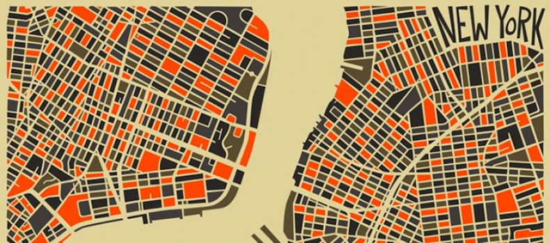
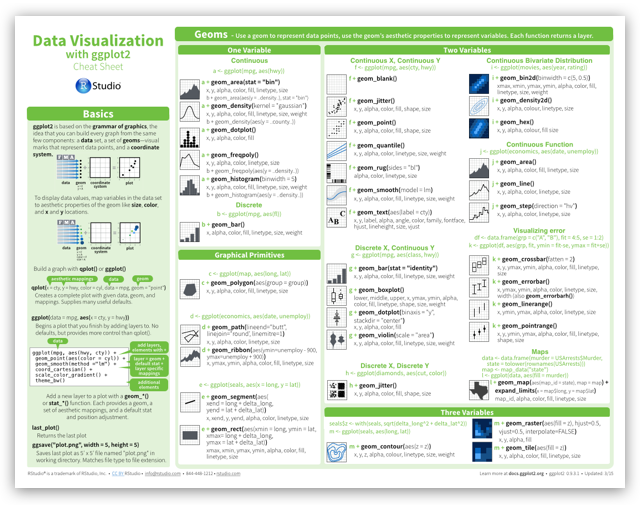

## Inhalt dieses Abschnitts

Arten von räumlichen Daten: 

- [**Straßenkarten**](https://www.nceas.ucsb.edu/~frazier/RSpatialGuides/ggmap/ggmapCheatsheet.pdf) 
- [**Satelliten Bilder**](http://www.mostlymuppet.com/tag/maps/)
- [**Physische Daten und Karten**](http://gis.stackexchange.com/questions/3083/what-makes-a-map-beautiful/45518#45518)
- [**Abstrakte Karten**](http://www.designfaves.com/2014/03/abstracted-maps-reveal-cities-personalities)
- ...

Das R-paket [**`ggmap`**](http://journal.r-project.org/archive/2013-1/kahle-wickham.pdf) wird im folgenden genutzt um verschiedene Kartentypen darzustellen.

Mit [**`qmap`**](http://www.inside-r.org/packages/cran/ggmap/docs/qmap) kann man eine schnelle Karte erzeugen.

## Installieren des Paketes

### Zur Erstellung der Karten brauchen wir die Pakete `ggmap` und `ggplot2`:

Entwicklungsversion installieren:


```r
devtools::install_github("dkahle/ggmap")
devtools::install_github("hadley/ggplot2")
```


Version vom CRAN Server installieren


```r
install.packages("ggmap")
```

## Paket `ggmap` - Hallo Welt

- Um das Paket zu laden verwenden wir den Befehl `library`


```r
library(ggmap)
```

Und schon kann die erste Karte erstellt werden:


```r
qmap("Mannheim")
```


## Karte für eine Sehenswürdigkeit


```r
qmap("Berlin Brandenburger Tor")
```


## Karte für einen ganzen Staat


```r
qmap("Germany")
```


- Wir brauchen ein anderes *zoom level*


## Ein anderes *zoom level*

- level 3 - Kontinent / level 10 - Stadt / level 21 - Gebäude


```r
qmap("England", zoom = 6)
```


## Hilfe bekommen wir mit dem Fragezeichen


```r
?qmap
```

Verschiedene Abschnitte in der Hilfe:

- Description
- Usage
- Arguments
- Value
- Author(s)
- See Also
- Examples

<!--
## Ein anderes *zoom level*


```r
qmap("Hamburg", zoom = 12)
```


-->

## Ganz nah dran


```r
qmap('Mannheim', zoom = 20)
```


## `ggmap` - maptype satellite


```r
qmap('Hamburg', zoom = 14, maptype="satellite")
```


## `ggmap` - maptype satellite zoom 20


```r
qmap('Hamburg', zoom = 20, maptype="hybrid")
```


## Terrain/physical maps

- Aus Physischen Karten kann man Informationen über Berge, Flüsse und Seen ablesen. 

- Farben werden oft genutzt um Höhenunterschiede zu visualisieren


```r
qmap('Arequipa', maptype="terrain")
```


## Eine physische Karte von Arequipa


<!--
### `ggmap` - terrain map


```r
qmap('Donnersberg', zoom = 14, maptype="terrain")
```


-->


<!--

-->
<!--

-->

## Abstrahierte Karten ([http://www.designfaves.com](http://www.designfaves.com/2014/03/abstracted-maps-reveal-cities-personalities))


- Abstraktion wird genutzt um nur essentielle Informationen darzustellen. 
- Bsp. U-Bahn Karten - wichtig sind Richtungen und Orientierung
- Im folgenden werden Karten vorgestellt, die sich gut als Hintergrundkarten eignen.




## ggmap - maptype watercolor


```r
qmap('Los Angeles', zoom = 14,
 maptype="watercolor",source="stamen")
```


<!--
## ggmap - source stamen


```r
qmap('Mannheim', zoom = 14,
 maptype="toner",source="stamen")
```


## ggmap - maptype toner-lite


```r
qmap('Mannheim', zoom = 14,
 maptype="toner-lite",source="stamen")
```

## ggmap - maptype toner-hybrid


```r
qmap('Mannheim', zoom = 14,
 maptype="toner-hybrid",source="stamen")
```


## ggmap - maptype terrain-lines


```r
qmap('Mannheim', zoom = 14,
 maptype="terrain-lines",source="stamen")
```
-->

## Graphiken speichern


## ggmap - ein Objekt erzeugen

- `<-` ist der Zuweisungspfeil um ein Objekt zu erzeugen
- Dieses Vorgehen macht bspw. Sinn, wenn mehrere Karten nebeneinander gebraucht werden.


```r
MA_map <- qmap('Mannheim', 
               zoom = 14,
               maptype="toner",
               source="stamen")
```


<!--
## 


```r
library(ggmap)
```


```r
?qmap
```


```r
triermap <- qmap(location = "Trier", zoom = 14,scale=2)
```


-->

## [Eine Karte für Trier](https://blog.dominodatalab.com/geographic-visualization-with-rs-ggmaps/)


- Mit dem Befehl `OSM_scale_lookup` bekommt man heraus, welchen Wert man für `scale` angeben muss.


```r
OSM_scale_lookup(zoom = 10)
qmap(location = "Trier", zoom = 10, source = "osm",
     scale=575000)
```

<!--
## A2A Aufgabe - Nutzung von `ggmap`


- Erzeuge mit dem Paket `ggmap` eine Karte von einem Ort, der Dir besonders gut gefällt und speichere diesen als Objekt im Workspace und als .png-Graphik.
-->


## Cheatsheet

- Cheatsheet zu [data visualisation](https://www.rstudio.com/wp-content/uploads/2015/04/ggplot2-cheatsheet.pdf)

<https://www.rstudio.com/>




## Resourcen und Literatur


- Artikel von [**David Kahle und Hadley Wickham**](http://journal.r-project.org/archive/2013-1/kahle-wickham.pdf) zur Nutzung von `ggmap`.


- [**Schnell eine Karte bekommen** ](http://rpackages.ianhowson.com/cran/ggmap/man/get_map.html)


- Kev Johnson - [**Karten mit R**](http://www.kevjohnson.org/making-maps-in-r-part-2/) erstellen (Zweiter Teil)


## Das was ihr gerade gesehen habt...

- ... hat bis vor kurzem gut funktioniert
- nun haben sich die [**Google Bedingungen geändert**](https://stackoverflow.com/questions/19827598/error-in-get-map-using-ggmap-in-r)


- [**hier**](https://github.com/dkahle/ggmap/issues/83) seht ihr, was ihr tun müsst, falls ihr das Paket dennoch nutzen wollt.

- oder ihr könnt das als Anlass sehen OpenStreetMap Daten stärker zu nutzen.


