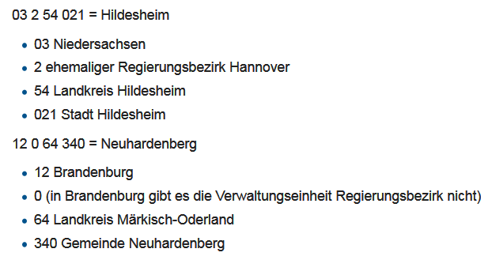
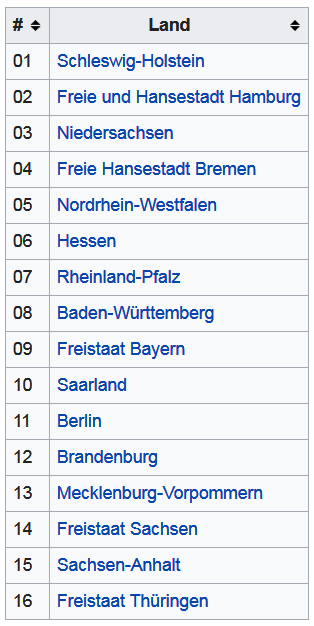
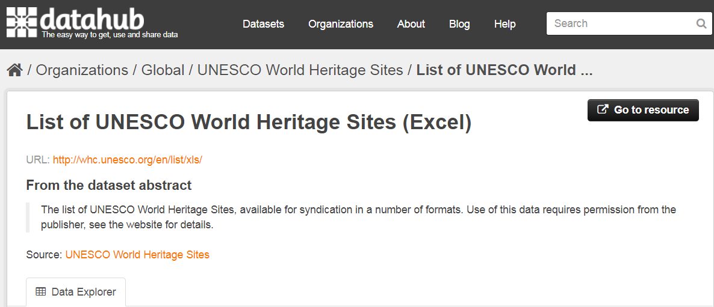
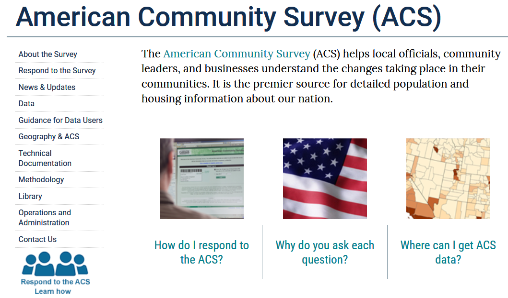
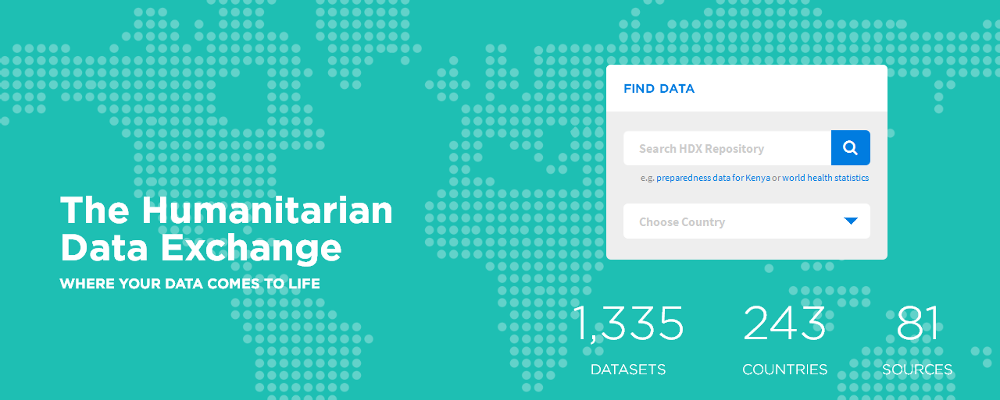
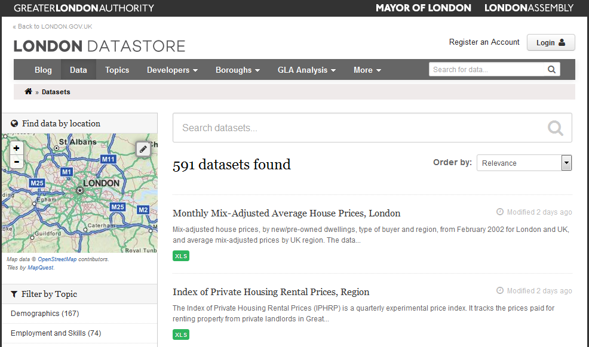
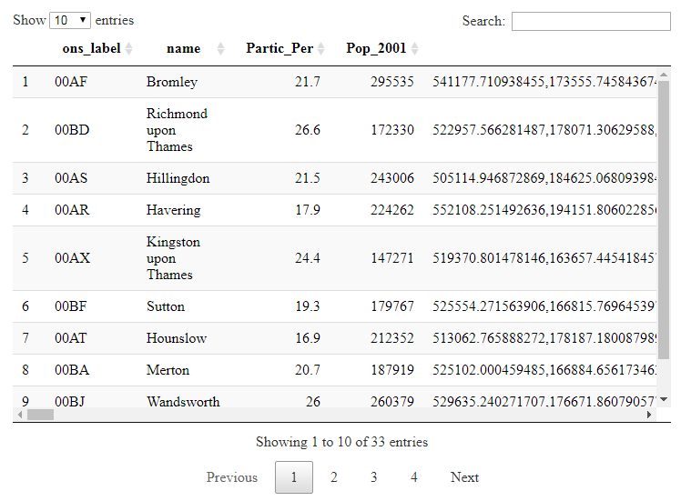

## [EU Initiative INSPIRE](http://inspire.ec.europa.eu/reports/Registration_form.pdf)


<!--
## Datenzugang

- Public-Use-File (PUF) Datei zur öffentlichen Nutzung - meist stark anonymisierte Daten
(Beispiele: [FDZ](www.forschungsdatenzentrum.de), [Statistik Portal](www.statistik-portal.de), [Meine Region](www.infothek.statistik.rlp.de/lis/MeineRegion/index.asp) )

- Scientific-Use-File (SUF) - Datei zur wissenschaftlichen Nutzung - anonymisierte Daten, die zu wissenschaftlichen Zwecken und zur Sekundäranalyse genutzt werden können. 
 
- On-Site-Nutzung - Arbeitsplätze für Gastwissenschaftler - Kontrollierte Datenfernverarbeitung
-->


### Ziele:

- Räumliche Information zugänglicher und interoperabel machen
- Nachhaltige Entwicklung in diesem Bereich unterstützen

### Entwicklung

- Aufgrund der  Richtlinie sind mehr Daten frei verfügbar.

## Zensus Atlas

Für den Zensus 2011 kann man Daten herunterladen und/oder diese in Karten visualisieren.

### https://ergebnisse.zensus2011.de/


## [Zensus Gemeindeergebnisse](https://www.destatis.de/DE/Methoden/Zensus_/Zensus.html)


```r
setwd(zen_path)
bev_dat <- readxl::read_excel("xlsx_Bevoelkerung.xlsx",3)
DT::datatable(bev_dat[1:1000,1:20])
```


## A3A Aufgabe: Zensus Ergebnisse für Gemeinden downloaden

- Lade die Zensus Gemeinde Ergebnisse [**hier**](https://www.zensus2011.de/SharedDocs/Aktuelles/Ergebnisse/DemografischeGrunddaten.html) herunter.
- Importiere die Daten mit einer geeigneten Funktion in R.
- Welche Information ist in den Daten enthalten?


## [Der amtliche Gemeindeschlüssel](https://de.wikipedia.org/wiki/Amtlicher_Gemeindeschl%C3%BCssel)




## AGS - Bundesländer




## A3B Aufgabe 

- Nutze die Gemeindeergebnisse für den Zensus 2011 und erzeuge einen Datensatz, der nur die Ergebnisse für die Saarländischen Gemeinden enthält.
- Ermittle aus diesem Datensatz die Gemeinde in der der Anteil der unter 1-jährigen am höchsten ist. 
- Speichere einen Datensatz ab, in dem die folgenden Variablen enthalten sind:
    - der amtliche Gemeindeschlüssel, 
    - die Gemeindenamen,  
    - die Bevölkerungszahl insgesamt 
    - die Zahl der Einjährigen und 
    - die Zahl der Zwanzigjährigen 


## Forschungsdatenzentren

- Bspw. FDZ der statistischen Ämter:

<http://www.forschungsdatenzentrum.de/>

- Es werden hauptsächlich Public Use Files angeboten, 

- Teilweise können Gewichtungsfaktoren verwendet werden um regionale Ergebnisse zu bekommen

- In der Regel ist Darstellung in Karten aber schwierig

## Weitere Amtliche Datenquellen

- Die Regionaldatenbank [**Genesis**](https://www-genesis.destatis.de/genesis/online)


- Daneben gibt es Angebote der Landesämter bspw das Angebot des [**statistischen Landesamts Rheinland-Pfalz**](https://www.statistik.rlp.de/de/regional/meine-heimat/)


## Eurostat Daten

### Beispiel: Principal European Economic Indicators

<http://ec.europa.eu/eurostat/web/euro-indicators/peeis>


```r
library(xlsx)
HHsr<-read.xlsx2(paste0(eurostatpath,"HHsavingRate.xls"),1)
```


geo                        X2012Q3   X2012Q4   X2013Q1   X2013Q2 
-------------------------  --------  --------  --------  --------
Euro area (19 countries)   9.82      11.86     11.37     16.28   
EU (28 countries)          8.67      10.92     9.42      14.63   
Belgium                    12.52     9.33      13.99     19.03   
Czech Republic             10.16     14.81     9.46      10.44   


<!--
- Laden Sie die Daten für den Inflationsindikator von Eurostat herunter.

<http://ec.europa.eu/eurostat/web/euro-indicators/peeis>
-->


## A3A Übung: Download von Eurostat Daten

- Gehe auf die Website mit den *Principal European Economic Indicators* und lade die Statistik der Sparquote [**hier**](http://ec.europa.eu/eurostat/web/euro-indicators/peeis) herunter.
- Importiere die Daten in R mit einem geeigneten Befehl.


## Daten - Institut für ökologische Raumforschung (IÖR)


- Hier gibt es bspw. Indikatoren zu Nachhaltigkeit, Siedlung, Gebäuden, Verkehr etc. 
- Es könnte also interessant sein, diese Daten an das Gesis Panel anzuspielen
- Aber dazu später mehr


## Datahub.io

- Auf dieser Plattform sind sehr viele Daten vorhanden, 
- bspw. der UNESCO [**Weltkulturerbe**](http://datahub.io/dataset/unesco-world-heritage-sites/resource/d4116195-44d8-4bc1-9f91-9b570870dc19) Datensatz, den ich in der Folge auch in Beispielen verwenden werde. 



<!--
- Funktioniert nur im Windows Explorer ?????!!!!
-->


|   |name_en                 | longitude| latitude|category_short |
|:--|:-----------------------|---------:|--------:|:--------------|
|4  |Butrint                 |     20.03|    39.75|C              |
|5  |Al Qal'a of Beni Hammad |      4.79|    35.82|C              |
|6  |M'Zab Valley            |      3.68|    32.48|C              |
|7  |Djémila                |      5.74|    36.32|C              |
|8  |Timgad                  |      6.63|    35.45|C              |


## American Community Survey

### [Die Daten des *American Community Survey:*](http://www.census.gov/acs/www/)





## [The Humanitarian Data Exchange](data.hdx.rwlabs.org)

### Zum Beispiel Daten zur [Ebola Epedemie](https://data.hdx.rwlabs.org/dataset/rowca-ebola-cases)



<!--
- Zum Beispiel Ebola Fälle
-->


## Weltbank Daten

- AG.AGR.TRAC.NO - [**Agricultural machinery, tractors**](https://data.worldbank.org/indicator/AG.AGR.TRAC.NO)


```r
library(WDI) 
WDI_dat <- WDI(country="all",
    indicator=c("AG.AGR.TRAC.NO",
    "TM.TAX.TCOM.BC.ZS"),
    start=1990, end=2000)
```

- Es gibt auch eine Funktion `WDIsearch` mit der man nach Indikatoren suchen kann


```r
head(WDI_dat)
```


## [London Datastore](http://data.london.gov.uk/dataset)




## Ein Beispieldatensatz für London



