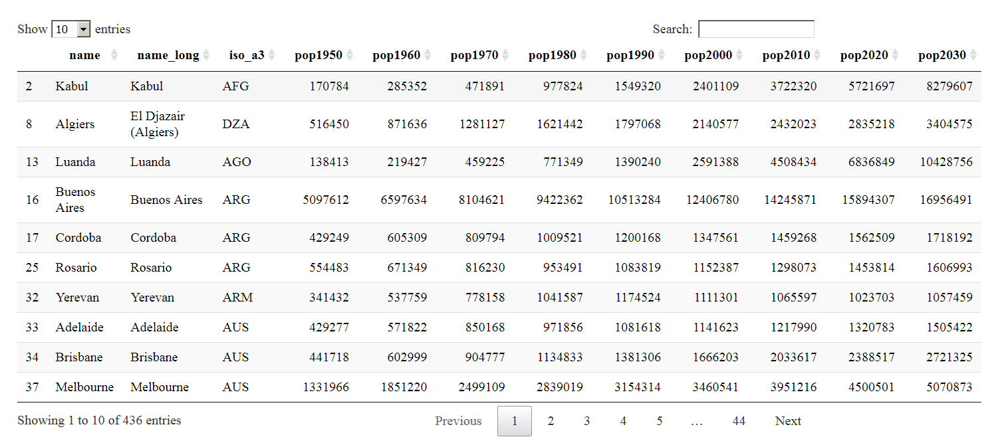

## Inhalt dieses Abschnitts

- Das Paket `tmap` wird vorgestellt. 
- Die Datenquelle `naturalearthdata` wird vorgestellt.
- Es wird gezeigt, wie man Karten von Europa, der Welt und einzelnen Ländern erzeugen kann


## Das Paket [tmap](https://cran.r-project.org/web/packages/tmap/index.html)

### Thematische Karten

- Mit dem Paket [**tmap**](http://twitter.com/sharon000/status/593028906820599808/photo/1?ref_src=twsrc%5Etfw) kann man thematische Karten erzeugen
- Die olgenden Beispiele basieren auf der [**Vignette**](https://cran.r-project.org/web/packages/tmap/vignettes/tmap-nutshell.html) des Paketes .


```r
install.packages("tmap")
```


```r
library(tmap)
```


## Der `Europe` Datensatz

### Natural Earth

- Datensatz enthält Informationen von  [**Natural Earth**](http://www.naturalearthdata.com/)


```r
data(Europe)
```


## Der Befehl `qtm` aus dem Paket `tmap`

### Schnelle thematische Karte

- Mit dem Befehl [**qtm**](https://cran.r-project.org/web/packages/tmap/vignettes/tmap-nutshell.html) kann man eine schnelle thematische Karte erzeugen

- Beispiel aus der [**Vignette**](https://cran.r-project.org/web/packages/tmap/vignettes/tmap-nutshell.html) zum Paket `tmap`


```r
qtm(Europe)
```

<!-- -->


## Der Europa-Datensatz


### [**Der Europa Datensatz im Paket `tmap`**](http://rpubs.com/Japhilko82/tmap_europe_dataset)
<!--

     iso_a3   name               sovereignt               continent 
---  -------  -----------------  -----------------------  ----------
5    ALB      Albania            Albania                  Europe    
6    ALA      Aland              Finland                  Europe    
7    AND      Andorra            Andorra                  Europe    
10   ARM      Armenia            Armenia                  Asia      
17   AUT      Austria            Austria                  Europe    
18   AZE      Azerbaijan         Azerbaijan               Asia      
20   BEL      Belgium            Belgium                  Europe    
24   BGR      Bulgaria           Bulgaria                 Europe    
27   BIH      Bosnia and Herz.   Bosnia and Herzegovina   Europe    
29   BLR      Belarus            Belarus                  Europe    
-->


## Um mehr Farbe in die Karte zu bekommen

### Entwicklungsstand der Wirtschaft

<!--
<http://www.naturalearthdata.com/>
-->

```r
qtm(Europe, fill="economy")
```

<!-- -->


## Eine Karte mit Text 

### Bevölkerung


```r
qtm(Europe, fill="pop_est", text="iso_a3")
```

<!-- -->

## Dieses Schema passt besser:

### [**GDP**](https://en.wikipedia.org/wiki/Population_density)


```r
qtm(Europe, fill="gdp_cap_est", text="iso_a3", 
    text.size="AREA", root=5, fill.title="GDP per capita", 
    fill.textNA="Non-European countries", theme="Europe")
```

<!-- -->

<!--

```r
qtm(Europe, fill="pop_est_dens", 
    fill.title="Population density")
```

<!-- -->
-->

## Themen des Europa-Datensatzes

### Verfügbare Variablen im Datensatz

- [**ISO Klassifikation**](http://userpage.chemie.fu-berlin.de/diverse/doc/ISO_3166.html)
- Ländername
- Ist das Land Teil Europas? 
- Fläche, Bevölkerung, Bevölkerungsdichte, 
- [**Bruttoinlandsprodukt**](https://en.wikipedia.org/wiki/Gross_domestic_product)
- Bruttoinlandsprodukt [**zu Kaufkraftparitäten**](https://en.wikipedia.org/wiki/List_of_countries_by_GDP_%28PPP%29_per_capita)
- Ökonomie, Einkommensgruppe

## Der Europa Datensatz - Variablen und was dahinter steckt


     iso_a3   name         sovereignt   continent   part            
---  -------  -----------  -----------  ----------  ----------------
5    ALB      Albania      Albania      Europe      Southern Europe 
6    ALA      Aland        Finland      Europe      Northern Europe 
7    AND      Andorra      Andorra      Europe      Southern Europe 
10   ARM      Armenia      Armenia      Asia        NA              
17   AUT      Austria      Austria      Europe      Western Europe  
18   AZE      Azerbaijan   Azerbaijan   Asia        NA              
20   BEL      Belgium      Belgium      Europe      Western Europe  
24   BGR      Bulgaria     Bulgaria     Europe      Eastern Europe  

<!--
## Die ISO Kodierung: 


```
##   [1] "AALAND ISLANDS                                  AX      ALA     248"      
##   [2] "AFGHANISTAN                                     AF      AFG     004"      
##   [3] "ALBANIA                                         AL      ALB     008"      
##   [4] "ALGERIA                                         DZ      DZA     012"      
##   [5] "AMERICAN SAMOA                                  AS      ASM     016"      
##   [6] "ANDORRA                                         AD      AND     020"      
##   [7] "ANGOLA                                          AO      AGO     024"      
##   [8] "ANGUILLA                                        AI      AIA     660"      
##   [9] "ANTARCTICA                                      AQ      ATA     010"      
##  [10] "ANTIGUA AND BARBUDA                             AG      ATG     028"      
##  [11] "ARGENTINA                                       AR      ARG     032"      
##  [12] "ARMENIA                                         AM      ARM     051  "    
##  [13] "ARUBA                                           AW      ABW     533"      
##  [14] "AUSTRALIA                                       AU      AUS     036"      
##  [15] "AUSTRIA                                         AT      AUT     040"      
##  [16] "AZERBAIJAN                                      AZ      AZE     031  "    
##  [17] "BAHAMAS                                         BS      BHS     044"      
##  [18] "BAHRAIN                                         BH      BHR     048"      
##  [19] "BANGLADESH                                      BD      BGD     050"      
##  [20] "BARBADOS                                        BB      BRB     052"      
##  [21] "BELARUS                                         BY      BLR     112  "    
##  [22] "BELGIUM                                         BE      BEL     056"      
##  [23] "BELIZE                                          BZ      BLZ     084"      
##  [24] "BENIN                                           BJ      BEN     204"      
##  [25] "BERMUDA                                         BM      BMU     060"      
##  [26] "BHUTAN                                          BT      BTN     064"      
##  [27] "BOLIVIA                                         BO      BOL     068"      
##  [28] "BOSNIA AND HERZEGOWINA                          BA      BIH     070"      
##  [29] "BOTSWANA                                        BW      BWA     072"      
##  [30] "BOUVET ISLAND                                   BV      BVT     074"      
##  [31] "BRAZIL                                          BR      BRA     076"      
##  [32] "BRITISH INDIAN OCEAN TERRITORY                  IO      IOT     086"      
##  [33] "BRUNEI DARUSSALAM                               BN      BRN     096"      
##  [34] "BULGARIA                                        BG      BGR     100"      
##  [35] "BURKINA FASO                                    BF      BFA     854"      
##  [36] "BURUNDI                                         BI      BDI     108"      
##  [37] "CAMBODIA                                        KH      KHM     116"      
##  [38] "CAMEROON                                        CM      CMR     120"      
##  [39] "CANADA                                          CA      CAN     124"      
##  [40] "CAPE VERDE                                      CV      CPV     132"      
##  [41] "CAYMAN ISLANDS                                  KY      CYM     136"      
##  [42] "CENTRAL AFRICAN REPUBLIC                        CF      CAF     140"      
##  [43] "CHAD                                            TD      TCD     148"      
##  [44] "CHILE                                           CL      CHL     152"      
##  [45] "CHINA                                           CN      CHN     156"      
##  [46] "CHRISTMAS ISLAND                                CX      CXR     162"      
##  [47] "COCOS (KEELING) ISLANDS                         CC      CCK     166"      
##  [48] "COLOMBIA                                        CO      COL     170"      
##  [49] "COMOROS                                         KM      COM     174"      
##  [50] "CONGO, Democratic Republic of (was Zaire)       CD      COD     180"      
##  [51] "CONGO, Republic of                              CG      COG     178"      
##  [52] "COOK ISLANDS                                    CK      COK     184"      
##  [53] "COSTA RICA                                      CR      CRI     188"      
##  [54] "COTE D'IVOIRE                                   CI      CIV     384"      
##  [55] "CROATIA (local name: Hrvatska)                  HR      HRV     191      "
##  [56] "CUBA                                            CU      CUB     192"      
##  [57] "CYPRUS                                          CY      CYP     196"      
##  [58] "CZECH REPUBLIC                                  CZ      CZE     203  "    
##  [59] "DENMARK                                         DK      DNK     208"      
##  [60] "DJIBOUTI                                        DJ      DJI     262"      
##  [61] "DOMINICA                                        DM      DMA     212"      
##  [62] "DOMINICAN REPUBLIC                              DO      DOM     214"      
##  [63] "ECUADOR                                         EC      ECU     218"      
##  [64] "EGYPT                                           EG      EGY     818"      
##  [65] "EL SALVADOR                                     SV      SLV     222"      
##  [66] "EQUATORIAL GUINEA                               GQ      GNQ     226"      
##  [67] "ERITREA                                         ER      ERI     232"      
##  [68] "ESTONIA                                         EE      EST     233  "    
##  [69] "ETHIOPIA                                        ET      ETH     231"      
##  [70] "FALKLAND ISLANDS (MALVINAS)                     FK      FLK     238"      
##  [71] "FAROE ISLANDS                                   FO      FRO     234"      
##  [72] "FIJI                                            FJ      FJI     242"      
##  [73] "FINLAND                                         FI      FIN     246"      
##  [74] "FRANCE                                          FR      FRA     250"      
##  [75] "FRENCH GUIANA                                   GF      GUF     254"      
##  [76] "FRENCH POLYNESIA                                PF      PYF     258"      
##  [77] "FRENCH SOUTHERN TERRITORIES                     TF      ATF     260"      
##  [78] "GABON                                           GA      GAB     266"      
##  [79] "GAMBIA                                          GM      GMB     270"      
##  [80] "GEORGIA                                         GE      GEO     268  "    
##  [81] "GERMANY                                         DE      DEU     276"      
##  [82] "GHANA                                           GH      GHA     288"      
##  [83] "GIBRALTAR                                       GI      GIB     292"      
##  [84] "GREECE                                          GR      GRC     300"      
##  [85] "GREENLAND                                       GL      GRL     304"      
##  [86] "GRENADA                                         GD      GRD     308"      
##  [87] "GUADELOUPE                                      GP      GLP     312"      
##  [88] "GUAM                                            GU      GUM     316"      
##  [89] "GUATEMALA                                       GT      GTM     320"      
##  [90] "GUINEA                                          GN      GIN     324"      
##  [91] "GUINEA-BISSAU                                   GW      GNB     624"      
##  [92] "GUYANA                                          GY      GUY     328"      
##  [93] "HAITI                                           HT      HTI     332"      
##  [94] "HEARD AND MC DONALD ISLANDS                     HM      HMD     334"      
##  [95] "HONDURAS                                        HN      HND     340"      
##  [96] "HONG KONG                                       HK      HKG     344"      
##  [97] "HUNGARY                                         HU      HUN     348"      
##  [98] "ICELAND                                         IS      ISL     352"      
##  [99] "INDIA                                           IN      IND     356"      
## [100] "INDONESIA                                       ID      IDN     360"      
## [101] "IRAN (ISLAMIC REPUBLIC OF)                      IR      IRN     364"      
## [102] "IRAQ                                            IQ      IRQ     368"      
## [103] "IRELAND                                         IE      IRL     372"      
## [104] "ISRAEL                                          IL      ISR     376"      
## [105] "ITALY                                           IT      ITA     380"      
## [106] "JAMAICA                                         JM      JAM     388"      
## [107] "JAPAN                                           JP      JPN     392"      
## [108] "JORDAN                                          JO      JOR     400"      
## [109] "KAZAKHSTAN                                      KZ      KAZ     398  "    
## [110] "KENYA                                           KE      KEN     404"      
## [111] "KIRIBATI                                        KI      KIR     296"      
## [112] "KOREA, DEMOCRATIC PEOPLE'S REPUBLIC OF          KP      PRK     408"      
## [113] "KOREA, REPUBLIC OF                              KR      KOR     410"      
## [114] "KUWAIT                                          KW      KWT     414"      
## [115] "KYRGYZSTAN                                      KG      KGZ     417  "    
## [116] "LAO PEOPLE'S DEMOCRATIC REPUBLIC                LA      LAO     418"      
## [117] "LATVIA                                          LV      LVA     428  "    
## [118] "LEBANON                                         LB      LBN     422"      
## [119] "LESOTHO                                         LS      LSO     426"      
## [120] "LIBERIA                                         LR      LBR     430"      
## [121] "LIBYAN ARAB JAMAHIRIYA                          LY      LBY     434"      
## [122] "LIECHTENSTEIN                                   LI      LIE     438"      
## [123] "LITHUANIA                                       LT      LTU     440  "    
## [124] "LUXEMBOURG                                      LU      LUX     442"      
## [125] "MACAU                                           MO      MAC     446"      
## [126] "MACEDONIA, THE FORMER YUGOSLAV REPUBLIC OF      MK      MKD     807 "     
## [127] "MADAGASCAR                                      MG      MDG     450"      
## [128] "MALAWI                                          MW      MWI     454"      
## [129] "MALAYSIA                                        MY      MYS     458"      
## [130] "MALDIVES                                        MV      MDV     462"      
## [131] "MALI                                            ML      MLI     466"      
## [132] "MALTA                                           MT      MLT     470"      
## [133] "MARSHALL ISLANDS                                MH      MHL     584"      
## [134] "MARTINIQUE                                      MQ      MTQ     474"      
## [135] "MAURITANIA                                      MR      MRT     478"      
## [136] "MAURITIUS                                       MU      MUS     480"      
## [137] "MAYOTTE                                         YT      MYT     175  "    
## [138] "MEXICO                                          MX      MEX     484"      
## [139] "MICRONESIA, FEDERATED STATES OF                 FM      FSM     583"      
## [140] "MOLDOVA, REPUBLIC OF                            MD      MDA     498  "    
## [141] "MONACO                                          MC      MCO     492"      
## [142] "MONGOLIA                                        MN      MNG     496"      
## [143] "MONTSERRAT                                      MS      MSR     500"      
## [144] "MOROCCO                                         MA      MAR     504"      
## [145] "MOZAMBIQUE                                      MZ      MOZ     508"      
## [146] "MYANMAR                                         MM      MMR     104"      
## [147] "NAMIBIA                                         NA      NAM     516"      
## [148] "NAURU                                           NR      NRU     520"      
## [149] "NEPAL                                           NP      NPL     524"      
## [150] "NETHERLANDS                                     NL      NLD     528"      
## [151] "NETHERLANDS ANTILLES                            AN      ANT     530"      
## [152] "NEW CALEDONIA                                   NC      NCL     540"      
## [153] "NEW ZEALAND                                     NZ      NZL     554"      
## [154] "NICARAGUA                                       NI      NIC     558"      
## [155] "NIGER                                           NE      NER     562"      
## [156] "NIGERIA                                         NG      NGA     566"      
## [157] "NIUE                                            NU      NIU     570"      
## [158] "NORFOLK ISLAND                                  NF      NFK     574"      
## [159] "NORTHERN MARIANA ISLANDS                        MP      MNP     580"      
## [160] "NORWAY                                          NO      NOR     578"      
## [161] "OMAN                                            OM      OMN     512"      
## [162] "PAKISTAN                                        PK      PAK     586"      
## [163] "PALAU                                           PW      PLW     585"      
## [164] "PALESTINIAN TERRITORY, Occupied                 PS      PSE     275"      
## [165] "PANAMA                                          PA      PAN     591"      
## [166] "PAPUA NEW GUINEA                                PG      PNG     598"      
## [167] "PARAGUAY                                        PY      PRY     600"      
## [168] "PERU                                            PE      PER     604"      
## [169] "PHILIPPINES                                     PH      PHL     608"      
## [170] "PITCAIRN                                        PN      PCN     612"      
## [171] "POLAND                                          PL      POL     616"      
## [172] "PORTUGAL                                        PT      PRT     620"      
## [173] "PUERTO RICO                                     PR      PRI     630"      
## [174] "QATAR                                           QA      QAT     634"      
## [175] "REUNION                                         RE      REU     638"      
## [176] "ROMANIA                                         RO      ROU     642"      
## [177] "RUSSIAN FEDERATION                              RU      RUS     643"      
## [178] "RWANDA                                          RW      RWA     646"      
## [179] "SAINT HELENA                                    SH      SHN     654"      
## [180] "SAINT KITTS AND NEVIS                           KN      KNA     659"      
## [181] "SAINT LUCIA                                     LC      LCA     662"      
## [182] "SAINT PIERRE AND MIQUELON                       PM      SPM     666"      
## [183] "SAINT VINCENT AND THE GRENADINES                VC      VCT     670"      
## [184] "SAMOA                                           WS      WSM     882"      
## [185] "SAN MARINO                                      SM      SMR     674"      
## [186] "SAO TOME AND PRINCIPE                           ST      STP     678"      
## [187] "SAUDI ARABIA                                    SA      SAU     682"      
## [188] "SENEGAL                                         SN      SEN     686"      
## [189] "SERBIA AND MONTENEGRO                           CS      SCG     891"      
## [190] "SEYCHELLES                                      SC      SYC     690"      
## [191] "SIERRA LEONE                                    SL      SLE     694"      
## [192] "SINGAPORE                                       SG      SGP     702"      
## [193] "SLOVAKIA                                        SK      SVK     703  "    
## [194] "SLOVENIA                                        SI      SVN     705  "    
## [195] "SOLOMON ISLANDS                                 SB      SLB     090"      
## [196] "SOMALIA                                         SO      SOM     706"      
## [197] "SOUTH AFRICA                                    ZA      ZAF     710"      
## [198] "SOUTH GEORGIA AND THE SOUTH SANDWICH ISLANDS    GS      SGS     239"      
## [199] "SPAIN                                           ES      ESP     724"      
## [200] "SRI LANKA                                       LK      LKA     144"      
## [201] "SUDAN                                           SD      SDN     736"      
## [202] "SURINAME                                        SR      SUR     740"      
## [203] "SVALBARD AND JAN MAYEN ISLANDS                  SJ      SJM     744"      
## [204] "SWAZILAND                                       SZ      SWZ     748"      
## [205] "SWEDEN                                          SE      SWE     752"      
## [206] "SWITZERLAND                                     CH      CHE     756"      
## [207] "SYRIAN ARAB REPUBLIC                            SY      SYR     760"      
## [208] "TAIWAN                                          TW      TWN     158"      
## [209] "TAJIKISTAN                                      TJ      TJK     762  "    
## [210] "TANZANIA, UNITED REPUBLIC OF                    TZ      TZA     834"      
## [211] "THAILAND                                        TH      THA     764"      
## [212] "TIMOR-LESTE                                     TL      TLS     626"      
## [213] "TOGO                                            TG      TGO     768"      
## [214] "TOKELAU                                         TK      TKL     772"      
## [215] "TONGA                                           TO      TON     776"      
## [216] "TRINIDAD AND TOBAGO                             TT      TTO     780"      
## [217] "TUNISIA                                         TN      TUN     788"      
## [218] "TURKEY                                          TR      TUR     792"      
## [219] "TURKMENISTAN                                    TM      TKM     795  "    
## [220] "TURKS AND CAICOS ISLANDS                        TC      TCA     796"      
## [221] "TUVALU                                          TV      TUV     798"      
## [222] "UGANDA                                          UG      UGA     800"      
## [223] "UKRAINE                                         UA      UKR     804"      
## [224] "UNITED ARAB EMIRATES                            AE      ARE     784"      
## [225] "UNITED KINGDOM                                  GB      GBR     826"      
## [226] "UNITED STATES                                   US      USA     840"      
## [227] "UNITED STATES MINOR OUTLYING ISLANDS            UM      UMI     581"      
## [228] "URUGUAY                                         UY      URY     858"      
## [229] "UZBEKISTAN                                      UZ      UZB     860  "    
## [230] "VANUATU                                         VU      VUT     548"      
## [231] "VATICAN CITY STATE (HOLY SEE)                   VA      VAT     336"      
## [232] "VENEZUELA                                       VE      VEN     862"      
## [233] "VIET NAM                                        VN      VNM     704"      
## [234] "VIRGIN ISLANDS (BRITISH)                        VG      VGB     092"      
## [235] "VIRGIN ISLANDS (U.S.)                           VI      VIR     850"      
## [236] "WALLIS AND FUTUNA ISLANDS                       WF      WLF     876"      
## [237] "WESTERN SAHARA                                  EH      ESH     732"      
## [238] "YEMEN                                           YE      YEM     887"      
## [239] "ZAMBIA                                          ZM      ZMB     894"      
## [240] "ZIMBABWE                                        ZW      ZWE     716"
```
-->

## Die Variable `continent`


```r
qtm(Europe, fill="continent")
```

<!-- -->


## Die Variable `part`


```r
qtm(Europe, fill="part",fill.title="Teil von Europa")
```

<!-- -->

## Die Variable `area`


```r
qtm(Europe, fill="area") # Russia is huge
```

<!-- -->


## Bevölkerung


```r
qtm(Europe, fill="pop_est",fill.title="Population") 
```

<!-- -->

<!--
## Bevölkerungsdichte


```r
qtm(Europe, fill="pop_est_dens",
    fill.title="Population density") 
```

<!-- -->
-->

## Ökonomie


```r
qtm(Europe, fill="economy") 
```

<!-- -->

## Einkommensgruppe


```r
qtm(Europe, fill="income_grp",fill.title="Income group") 
```

<!-- -->


## Zwei Karten

### Bevölkerung und Entwicklungsstand


```r
tm_shape(Europe) +
    tm_fill(c("pop_est", "economy"), 
        title=c("Population", "Economy"))
```

<!-- -->


## Der Datensatz `World` im Paket `tmap`

### [Ähnlich wie der `Europe` Datensatz nur für die ganze Welt](http://rpubs.com/Japhilko82/tmap_World)


```r
data(World)
```


## Welt - Länder nach Einkommensgruppe


```r
qtm(World, fill="income_grp",fill.title="Income group") 
```

<!-- -->

## Ein Datensatz zu den Provinzen in den Niederlanden (R-Paket `tmap`)


     code   name          population   pop_men   pop_women   pop_0_14   pop_15_24   pop_25_44   pop_45_64   pop_65plus   origin_native   origin_west   origin_non_west
---  -----  -----------  -----------  --------  ----------  ---------  ----------  ----------  ----------  -----------  --------------  ------------  ----------------
0    20     Groningen         582705    289795      292875         15          15          25          27           18              87             7                 6
1    21     Friesland         646290    323215      323055         17          12          24          28           19              91             5                 4
2    22     Drenthe           488970    242225      246755         17          10          22          30           21              91             6                 3
3    23     Overijssel       1139680    570185      569465         18          12          25          27           18              86             7                 7
4    24     Flevoland         399885    199940      199940         20          13          27          28           12              71             9                20
5    25     Gelderland       2019635    997805     1021790         17          12          24          29           18              85             8                 7

## Niederlande - Bevölkerung in den Provinzen


```r
qtm(NLD_prov, fill="population",fill.title="population") 
```

<!-- -->

<!--
## Niederlande - Anteil der Personen 65 plus

(kleiner Trick notwendig - Die Daten hatten sich verändert)


```r
ant <- runif(length(NLD_prov),.18,.28)
NLD_prov@data$pop_65plus <- 
  round(NLD_prov@data$population*ant)
pop65plus <- NLD_prov@data$pop_65plus
prop65plus <- pop65plus/pop
NLD_prov@data$proportion65plus <- prop65plus
```

## Den Anteil der über 65-jährigen visualisieren


```r
qtm(NLD_prov, fill="proportion",fill.title="proportion") 
```

-->
## Ein Datensatz zu den Gemeinden in den Niederlanden


```r
data(NLD_muni)
```


      name                             province         population
----  -------------------------------  --------------  -----------
0     Appingedam                       Groningen             12065
1     Bedum                            Groningen             10495
2     Bellingwedde                     Groningen              8920
3     Ten Boer                         Groningen              7480
4     Delfzijl                         Groningen             25695
5     Groningen                        Groningen            198315
6     Grootegast                       Groningen             12165
7     Haren                            Groningen             18780
8     Hoogezand-Sappemeer              Groningen             34305
9     Leek                             Groningen             19595
10    Loppersum                        Groningen             10195
11    Marum                            Groningen             10375
12    Almere                           Flevoland            196010
13    Stadskanaal                      Groningen             32800
14    Slochteren                       Groningen             15545
15    Veendam                          Groningen             27790
16    Vlagtwedde                       Groningen             15905
17    Zeewolde                         Flevoland             21500
18    Winsum                           Groningen             13850
19    Zuidhorn                         Groningen             18775
20    Dongeradeel                      Friesland             24160
21    Achtkarspelen                    Friesland             28015
22    Ameland                          Friesland              3575
23    het Bildt                        Friesland             10625
24    Franekeradeel                    Friesland             20445
25    Harlingen                        Friesland             15820
26    Heerenveen                       Friesland             49900
27    Kollumerland en Nieuwkruisland   Friesland             12875
28    Leeuwarden                       Friesland            107340
29    Leeuwarderadeel                  Friesland             10275
30    Ooststellingwerf                 Friesland             25670
31    Opsterland                       Friesland             29860
32    Schiermonnikoog                  Friesland               940
33    Smallingerland                   Friesland             55465
34    Terschelling                     Friesland              4780
35    Vlieland                         Friesland              1110
36    Weststellingwerf                 Friesland             25455
37    Assen                            Drenthe               67190
38    Coevorden                        Drenthe               35770
39    Emmen                            Drenthe              108050
40    Hoogeveen                        Drenthe               54665
41    Meppel                           Drenthe               32865
42    Littenseradiel                   Friesland             10925
43    Almelo                           Overijssel            72460
44    Borne                            Overijssel            21885
45    Dalfsen                          Overijssel            27675
46    Deventer                         Overijssel            98320
47    Enschede                         Overijssel           158585
48    Haaksbergen                      Overijssel            24345
49    Hardenberg                       Overijssel            59575
50    Hellendoorn                      Overijssel            35710
51    Hengelo                          Overijssel            80955
52    Kampen                           Overijssel            51090
53    Losser                           Overijssel            22610
54    Noordoostpolder                  Flevoland             46355
55    Oldenzaal                        Overijssel            32135
56    Ommen                            Overijssel            17360
57    Raalte                           Overijssel            36520
58    Staphorst                        Overijssel            16365
59    Tubbergen                        Overijssel            21205
60    Urk                              Flevoland             19470
61    Wierden                          Overijssel            23910
62    Zwolle                           Overijssel           123160
63    Rijnwaarden                      Gelderland            10915
64    Aalten                           Gelderland            27010
65    Apeldoorn                        Gelderland           157545
66    Arnhem                           Gelderland           150820
67    Barneveld                        Gelderland            54150
68    Beuningen                        Gelderland            25285
69    Brummen                          Gelderland            21175
70    Buren                            Gelderland            26020
71    Culemborg                        Gelderland            27590
72    Doesburg                         Gelderland            11435
73    Doetinchem                       Gelderland            56345
74    Druten                           Gelderland            18210
75    Duiven                           Gelderland            25610
76    Ede                              Gelderland           110655
77    Elburg                           Gelderland            22645
78    Epe                              Gelderland            32350
79    Ermelo                           Gelderland            26045
80    Geldermalsen                     Gelderland            26300
81    Groesbeek                        Gelderland            18975
82    Harderwijk                       Gelderland            45730
83    Hattem                           Gelderland            11730
84    Heerde                           Gelderland            18490
85    Heumen                           Gelderland            16335
86    Lochem                           Gelderland            33245
87    Maasdriel                        Gelderland            24155
88    Millingen aan de Rijn            Gelderland             5875
89    Nijkerk                          Gelderland            40635
90    Nijmegen                         Gelderland           168290
91    Oldebroek                        Gelderland            22835
92    Putten                           Gelderland            23870
93    Renkum                           Gelderland            31580
94    Rheden                           Gelderland            43640
95    Rozendaal                        Gelderland             1500
96    Scherpenzeel                     Gelderland             9495
97    Tiel                             Gelderland            41775
98    Ubbergen                         Gelderland             9450
99    Voorst                           Gelderland            23765
100   Wageningen                       Gelderland            37430
101   Westervoort                      Gelderland            15135
102   Winterswijk                      Gelderland            28880
103   Wijchen                          Gelderland            41040
104   Zaltbommel                       Gelderland            27180
105   Zevenaar                         Gelderland            32280
106   Zutphen                          Gelderland            47165
107   Nunspeet                         Gelderland            26680
108   Dronten                          Flevoland             40410
109   Neerijnen                        Gelderland            12020
110   Amersfoort                       Utrecht              150895
111   Baarn                            Utrecht               24315
112   De Bilt                          Utrecht               42035
113   Bunnik                           Utrecht               14625
114   Bunschoten                       Utrecht               20490
115   Eemnes                           Utrecht                8780
116   Houten                           Utrecht               48420
117   Leusden                          Utrecht               28995
118   Lopik                            Utrecht               14000
119   Montfoort                        Utrecht               13640
120   Renswoude                        Utrecht                4925
121   Rhenen                           Utrecht               19115
122   Soest                            Utrecht               45490
123   Utrecht                          Utrecht              328165
124   Veenendaal                       Utrecht               63250
125   Woudenberg                       Utrecht               12420
126   Wijk bij Duurstede               Utrecht               23040
127   IJsselstein                      Utrecht               34275
128   Zeist                            Utrecht               61250
129   Nieuwegein                       Utrecht               61035
130   Aalsmeer                         Noord-Holland         30760
131   Alkmaar                          Noord-Holland         94865
132   Amstelveen                       Noord-Holland         85015
133   Amsterdam                        Noord-Holland        810935
134   Graft-De Rijp                    Noord-Holland          6450
135   Beemster                         Noord-Holland          8910
136   Bergen (NH.)                     Noord-Holland         30075
137   Beverwijk                        Noord-Holland         40090
138   Blaricum                         Noord-Holland          9095
139   Bloemendaal                      Noord-Holland         22060
140   Bussum                           Noord-Holland         32630
141   Castricum                        Noord-Holland         34285
142   Diemen                           Noord-Holland         25930
143   Edam-Volendam                    Noord-Holland         28920
144   Enkhuizen                        Noord-Holland         18375
145   Haarlem                          Noord-Holland        155145
146   Haarlemmerliede en Spaarnwoude   Noord-Holland          5535
147   Haarlemmermeer                   Noord-Holland        144060
148   Heemskerk                        Noord-Holland         39085
149   Heemstede                        Noord-Holland         26365
150   Heerhugowaard                    Noord-Holland         53305
151   Heiloo                           Noord-Holland         22635
152   Den Helder                       Noord-Holland         56595
153   Hilversum                        Noord-Holland         86425
154   Hoorn                            Noord-Holland         71700
155   Huizen                           Noord-Holland         41245
156   Landsmeer                        Noord-Holland         10445
157   Langedijk                        Noord-Holland         26935
158   Laren                            Noord-Holland         10860
159   Medemblik                        Noord-Holland         43320
160   Muiden                           Noord-Holland          6285
161   Naarden                          Noord-Holland         17205
162   Oostzaan                         Noord-Holland          9140
163   Opmeer                           Noord-Holland         11365
164   Ouder-Amstel                     Noord-Holland         13270
165   Purmerend                        Noord-Holland         79575
166   Schagen                          Noord-Holland         45975
167   Texel                            Noord-Holland         13550
168   Uitgeest                         Noord-Holland         13235
169   Uithoorn                         Noord-Holland         28415
170   Velsen                           Noord-Holland         67220
171   Weesp                            Noord-Holland         18170
172   Schermer                         Noord-Holland          5540
173   Zandvoort                        Noord-Holland         16575
174   Zeevang                          Noord-Holland          6340
175   Zaanstad                         Noord-Holland        150595
176   Alblasserdam                     Zuid-Holland          19800
177   Alphen aan den Rijn              Zuid-Holland         106785
178   Barendrecht                      Zuid-Holland          47375
179   Bergambacht                      Zuid-Holland           9970
180   Drechterland                     Noord-Holland         19250
181   Brielle                          Zuid-Holland          16310
182   Capelle aan den IJssel           Zuid-Holland          66175
183   Delft                            Zuid-Holland         100045
184   Dordrecht                        Zuid-Holland         118690
185   Gorinchem                        Zuid-Holland          35240
186   Gouda                            Zuid-Holland          70940
187   's-Gravenhage                    Zuid-Holland         508940
188   Hardinxveld-Giessendam           Zuid-Holland          17755
189   Hellevoetsluis                   Zuid-Holland          38950
190   Hendrik-Ido-Ambacht              Zuid-Holland          28910
191   Stede Broec                      Noord-Holland         21485
192   Hillegom                         Zuid-Holland          20945
193   Katwijk                          Zuid-Holland          62780
194   Krimpen aan den IJssel           Zuid-Holland          28825
195   Leerdam                          Zuid-Holland          20590
196   Leiden                           Zuid-Holland         121160
197   Leiderdorp                       Zuid-Holland          26810
198   Lisse                            Zuid-Holland          22335
199   Maassluis                        Zuid-Holland          32080
200   Bernisse                         Zuid-Holland          12365
201   Nieuwkoop                        Zuid-Holland          27105
202   Noordwijk                        Zuid-Holland          25690
203   Noordwijkerhout                  Zuid-Holland          15955
204   Oegstgeest                       Zuid-Holland          22910
205   Oud-Beijerland                   Zuid-Holland          23715
206   Binnenmaas                       Zuid-Holland          28710
207   Korendijk                        Zuid-Holland          10700
208   Oudewater                        Utrecht                9870
209   Papendrecht                      Zuid-Holland          32115
210   Ridderkerk                       Zuid-Holland          45250
211   Rotterdam                        Zuid-Holland         618355
212   Rijswijk                         Zuid-Holland          47635
213   Schiedam                         Zuid-Holland          76450
214   Schoonhoven                      Zuid-Holland          11900
215   Sliedrecht                       Zuid-Holland          24525
216   Cromstrijen                      Zuid-Holland          12735
217   Spijkenisse                      Zuid-Holland          72560
218   Albrandswaard                    Zuid-Holland          25070
219   Westvoorne                       Zuid-Holland          13965
220   Strijen                          Zuid-Holland           8680
221   Vianen                           Utrecht               19595
222   Vlaardingen                      Zuid-Holland          70980
223   Vlist                            Zuid-Holland           9695
224   Voorschoten                      Zuid-Holland          24950
225   Waddinxveen                      Zuid-Holland          25505
226   Wassenaar                        Zuid-Holland          25675
227   Woerden                          Utrecht               50575
228   Zoetermeer                       Zuid-Holland         123560
229   Zoeterwoude                      Zuid-Holland           8075
230   Zwijndrecht                      Zuid-Holland          44545
231   Nederlek                         Zuid-Holland          14075
232   Ouderkerk                        Zuid-Holland           8210
233   Borsele                          Zeeland               22580
234   Goes                             Zeeland               36955
235   West Maas en Waal                Gelderland            18420
236   Hulst                            Zeeland               27385
237   Kapelle                          Zeeland               12500
238   Middelburg                       Zeeland               47640
239   Giessenlanden                    Zuid-Holland          14440
240   Reimerswaal                      Zeeland               21925
241   Zederik                          Zuid-Holland          13655
242   Terneuzen                        Zeeland               54710
243   Tholen                           Zeeland               25405
244   Veere                            Zeeland               21865
245   Vlissingen                       Zeeland               44445
246   Lingewaal                        Gelderland            11060
247   De Ronde Venen                   Utrecht               42640
248   Tytsjerksteradiel                Friesland             31970
249   Aalburg                          Noord-Brabant         12845
250   Asten                            Noord-Brabant         16440
251   Baarle-Nassau                    Noord-Brabant          6610
252   Bergen op Zoom                   Noord-Brabant         66420
253   Best                             Noord-Brabant         28615
254   Boekel                           Noord-Brabant         10090
255   Boxmeer                          Noord-Brabant         28145
256   Boxtel                           Noord-Brabant         30320
257   Breda                            Noord-Brabant        179620
258   Deurne                           Noord-Brabant         31660
259   Pekela                           Groningen             12705
260   Dongen                           Noord-Brabant         25355
261   Eersel                           Noord-Brabant         18180
262   Eindhoven                        Noord-Brabant        220920
263   Etten-Leur                       Noord-Brabant         42355
264   Geertruidenberg                  Noord-Brabant         21570
265   Gilze en Rijen                   Noord-Brabant         26070
266   Goirle                           Noord-Brabant         23095
267   Grave                            Noord-Brabant         12695
268   Haaren                           Noord-Brabant         13585
269   Helmond                          Noord-Brabant         89255
270   's-Hertogenbosch                 Noord-Brabant        143730
271   Heusden                          Noord-Brabant         43165
272   Hilvarenbeek                     Noord-Brabant         15090
273   Loon op Zand                     Noord-Brabant         23080
274   Mill en Sint Hubert              Noord-Brabant         10850
275   Nuenen. Gerwen en Nederwetten    Noord-Brabant         22620
276   Oirschot                         Noord-Brabant         17980
277   Oisterwijk                       Noord-Brabant         25800
278   Oosterhout                       Noord-Brabant         53715
279   Oss                              Noord-Brabant         84955
280   Rucphen                          Noord-Brabant         22180
281   Schijndel                        Noord-Brabant         23360
282   Sint-Michielsgestel              Noord-Brabant         28120
283   Sint-Oedenrode                   Noord-Brabant         17935
284   Someren                          Noord-Brabant         18690
285   Son en Breugel                   Noord-Brabant         16235
286   Steenbergen                      Noord-Brabant         23375
287   Waterland                        Noord-Holland         17135
288   Tilburg                          Noord-Brabant        210270
289   Uden                             Noord-Brabant         40910
290   Valkenswaard                     Noord-Brabant         30335
291   Veghel                           Noord-Brabant         37465
292   Veldhoven                        Noord-Brabant         44155
293   Vught                            Noord-Brabant         25635
294   Waalre                           Noord-Brabant         16765
295   Waalwijk                         Noord-Brabant         46495
296   Werkendam                        Noord-Brabant         26385
297   Woensdrecht                      Noord-Brabant         21620
298   Woudrichem                       Noord-Brabant         14425
299   Zundert                          Noord-Brabant         21400
300   Wormerland                       Noord-Holland         15775
301   Onderbanken                      Limburg                7880
302   Landgraaf                        Limburg               37570
303   Beek                             Limburg               16270
304   Beesel                           Limburg               13615
305   Bergen (L.)                      Limburg               13235
306   Brunssum                         Limburg               28955
307   Gennep                           Limburg               17285
308   Heerlen                          Limburg               88260
309   Kerkrade                         Limburg               46785
310   Maastricht                       Limburg              122485
311   Meerssen                         Limburg               19255
312   Mook en Middelaar                Limburg                7795
313   Nederweert                       Limburg               16750
314   Nuth                             Limburg               15580
315   Roermond                         Limburg               56930
316   Schinnen                         Limburg               12900
317   Simpelveld                       Limburg               10845
318   Stein                            Limburg               25390
319   Vaals                            Limburg                9685
320   Venlo                            Limburg              100425
321   Venray                           Limburg               43110
322   Voerendaal                       Limburg               12455
323   Weert                            Limburg               48720
324   Valkenburg aan de Geul           Limburg               16675
325   Lelystad                         Flevoland             76140
326   Horst aan de Maas                Limburg               41725
327   Oude IJsselstreek                Gelderland            39595
328   Teylingen                        Zuid-Holland          35735
329   Utrechtse Heuvelrug              Utrecht               47950
330   Oost Gelre                       Gelderland            29700
331   Koggenland                       Noord-Holland         22485
332   Lansingerland                    Zuid-Holland          57120
333   Leudal                           Limburg               36220
334   Maasgouw                         Limburg               23905
335   Eemsmond                         Groningen             15925
336   Gemert-Bakel                     Noord-Brabant         29315
337   Halderberge                      Noord-Brabant         29340
338   Heeze-Leende                     Noord-Brabant         15350
339   Laarbeek                         Noord-Brabant         21800
340   De Marne                         Groningen             10210
341   Reusel-De Mierden                Noord-Brabant         12710
342   Roerdalen                        Limburg               20830
343   Maasdonk                         Noord-Brabant         11240
344   Roosendaal                       Noord-Brabant         77025
345   Schouwen-Duiveland               Zeeland               33850
346   Aa en Hunze                      Drenthe               25355
347   Borger-Odoorn                    Drenthe               25625
348   Cuijk                            Noord-Brabant         24780
349   Landerd                          Noord-Brabant         15265
350   De Wolden                        Drenthe               23580
351   Noord-Beveland                   Zeeland                7530
352   Wijdemeren                       Noord-Holland         23185
353   Noordenveld                      Drenthe               31085
354   Twenterand                       Overijssel            33930
355   Westerveld                       Drenthe               18930
356   Sint Anthonis                    Noord-Brabant         11690
357   Lingewaard                       Gelderland            45775
358   Cranendonck                      Noord-Brabant         20345
359   Steenwijkerland                  Overijssel            43350
360   Moerdijk                         Noord-Brabant         36730
361   Echt-Susteren                    Limburg               31975
362   Sluis                            Zeeland               23820
363   Drimmelen                        Noord-Brabant         26695
364   Bernheze                         Noord-Brabant         29690
365   Ferwerderadiel                   Friesland              8790
366   Alphen-Chaam                     Noord-Brabant          9715
367   Bergeijk                         Noord-Brabant         18255
368   Bladel                           Noord-Brabant         19835
369   Gulpen-Wittem                    Limburg               14485
370   Tynaarlo                         Drenthe               32490
371   Midden-Drenthe                   Drenthe               33365
372   Overbetuwe                       Gelderland            46665
373   Hof van Twente                   Overijssel            34995
374   Neder-Betuwe                     Gelderland            22555
375   Rijssen-Holten                   Overijssel            37660
376   Geldrop-Mierlo                   Noord-Brabant         38855
377   Olst-Wijhe                       Overijssel            17770
378   Dinkelland                       Overijssel            25945
379   Westland                         Zuid-Holland         103240
380   Midden-Delfland                  Zuid-Holland          18455
381   Berkelland                       Gelderland            44665
382   Bronckhorst                      Gelderland            36930
383   Sittard-Geleen                   Limburg               93690
384   Kaag en Braassem                 Zuid-Holland          25745
385   Dantumadiel                      Friesland             19030
386   Zuidplas                         Zuid-Holland          40890
387   Peel en Maas                     Limburg               43315
388   Oldambt                          Groningen             38560
389   Zwartewaterland                  Overijssel            22165
390   Sudwest-Fryslan                  Friesland             84180
391   Bodegraven-Reeuwijk              Zuid-Holland          32910
392   Eijsden-Margraten                Limburg               24980
393   Stichtse Vecht                   Utrecht               63855
394   Menameradiel                     Friesland             13670
395   Hollands Kroon                   Noord-Holland         47500
396   Leidschendam-Voorburg            Zuid-Holland          73355
397   De Friese Meren                  Friesland             51415
398   Goeree-Overflakkee               Zuid-Holland          48245
399   Pijnacker-Nootdorp               Zuid-Holland          51070
400   Molenwaard                       Zuid-Holland          29030
401   Montferland                      Gelderland            34985
402   Menterwolde                      Groningen             12255

## Bevölkerung der Gemeinden in den Niederlanden


```r
qtm(NLD_muni, fill="population") 
```

<!-- -->


## Räumliche Daten zur Flächennutzung


```r
data(land)
data(World)
```


         cover_cls    trees
-------  ----------  ------
574771   Snow/ice         0
438925   Water           NA
32129    Water           NA
77193    Water           NA
494931   Water           NA
370962   Water           NA
295054   Water           NA
388550   Water           NA
296552   Forest          36
289930   Water           NA


## Weltweite Flächennutzung


```r
tm_shape(land,  relative=FALSE) +
    tm_raster("trees", title="Anteil Waldfläche")
```

<!-- -->


## Räumliche Daten zu Metropolregionen


### [UN - World Urbanization Prospects 2018](https://population.un.org/wup/)


```r
data(metro)
```




## Nur ein Land visualisieren


```r
tm_shape(Europe[Europe$name=="Austria", ]) +
    tm_polygons()
```

<!-- -->


## Beispieldaten laden

### Datenquelle Eurostat

- Daten zur Arbeitslosigkeit in Europa 


```r
url <- "https://raw.githubusercontent.com/Japhilko/
GeoData/master/2015/data/Unemployment07a13.csv"

Unemp <- read.csv(url) 
```

## Überblick über die Daten


    X  GEO     Val2007M12   Val2013M01
-----  -----  -----------  -----------
 9316  EU28           6.9         10.9
 9325  EU27           6.9         10.9
 9334  EU25           6.9         11.0
 9343  EU15           6.9         11.1
 9352  EA             7.3         12.0
 9361  EA19           7.3         12.0
 9370  EA18           7.4         12.0
 9379  EA17           7.4         12.0
 9388  EA16           7.4         12.0
 9397  EA15           7.3         12.0


## Exkurs: der Befehl `match`

### Zwei Beispielvektoren erstellen:


```r
vec_a <- c("A",2,6,1,"C")
vec_b <- c(1,"C",2)
```

### Die beiden Vektroen zusammen bringen

- Mit der Funktion `match` kann man schauen, welches Element des ersten Vektors sich im zweiten Vektor wiederfindet.


```r
match(vec_a,vec_b)
```

```
## [1] NA  3 NA  1  2
```


## Nutzung des Paketes `tmap` mit eigenen Daten


```r
library("tmap")
data(Europe)
```

### Die Daten matchen


```r
iso_a2<- substr(Europe@data$iso_a3,1,2)
ind <- match(iso_a2,Unemp$GEO)
Europe@data$Val2007M12 <- Unemp$Val2007M12[ind]
Europe@data$Val2013M01 <- Unemp$Val2013M01[ind]
```

## Eine Karte erzeugen


```r
qtm(Europe,c("Val2007M12","Val2013M01"))
```

<!-- -->


## A4A Übung: Visualisierung von Eurostat Daten

- Verbinde die Statistik zur Sparquote mit den Kartendaten.
- Stelle die Daten in einer Karte dar.

## Kleine und viele Karten


```r
tm_shape(Europe[Europe$continent=="Europe",]) +
    tm_fill("part", thres.poly = 0) +
    tm_facets("name", free.coords=TRUE)
```

<!-- -->


## Das Paket `tmap` zitieren


```r
citation("tmap")
```

```
## 
## To cite tmap/tmaptools in publications use:
## 
## Tennekes M (2018). "tmap: Thematic Maps in R." _Journal of
## Statistical Software_, *84*(6), 1-39. doi: 10.18637/jss.v084.i06
## (URL: http://doi.org/10.18637/jss.v084.i06).
## 
## A BibTeX entry for LaTeX users is
## 
##   @Article{,
##     title = {{tmap}: Thematic Maps in {R}},
##     author = {Martijn Tennekes},
##     journal = {Journal of Statistical Software},
##     year = {2018},
##     volume = {84},
##     number = {6},
##     pages = {1--39},
##     doi = {10.18637/jss.v084.i06},
##   }
```


