## Inhalt dieses Abschnitts

- Der Beispieldatensatz `wrld_simpl` im Paket `maptools` wird vorgestellt.
- Es wird gezeigt, wie man Daten aus anderen Quellen mit Kartendaten verbinden kann.
- Mit dieser Verbindung ist es dann möglich thematische Karten - so genannte Choroplethen - zu erstellen
- Zudem wird das Paket `choroplethr` vorgestellt.


## Was ist ein Choropleth

### Ein Choropleth ist eine Karte, die

- geografische Grenzen zeigt.
- bei denen Bereiche basierend auf Metriken eingefärbt werden.

Choroplethen sind nützlich für die Visualisierung von Daten, wo geografische Grenzen eine natürliche Einheit der Aggregation sind. 


## Das Paket `maptools`

- Datensatz wrld_simpl aus dem Paket `maptools`
- Polygone für fast alle Staaten der Erde


```r
library(maptools)
data(wrld_simpl)
```


      ISO2   NAME                     AREA    POP2005
----  -----  --------------------  -------  ---------
ATG   AG     Antigua and Barbuda        44      83039
DZA   DZ     Algeria                238174   32854159
AZE   AZ     Azerbaijan               8260    8352021
ALB   AL     Albania                  2740    3153731
ARM   AM     Armenia                  2820    3017661
AGO   AO     Angola                 124670   16095214

## Hallo Welt


```r
plot(wrld_simpl)
```

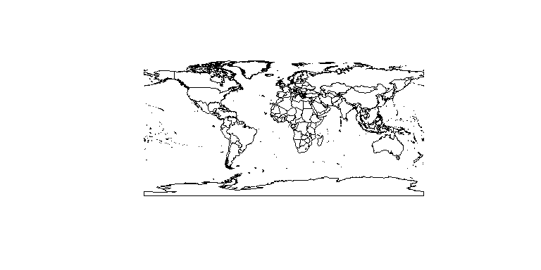<!-- -->


## [Daten zum Gini Index](https://datahub.io/core/gini-index#data)

- Daten von [**datahub.io**](https://datahub.io/core/gini-index#data)
- Statistisches Maß zur Darstellung von [Ungleichverteilungen](https://de.wikipedia.org/wiki/Gini-Koeffizient)


```r
link<-"https://raw.githubusercontent.com/Japhilko/geocourse/
master/data/gini-index_csv.csv"
gini <- read.csv(link)
```


Country.Name   Country.Code    Year   Value
-------------  -------------  -----  ------
Albania        ALB             1996    27.0
Albania        ALB             2002    31.7
Albania        ALB             2005    30.6
Albania        ALB             2008    30.0
Albania        ALB             2012    29.0
Algeria        DZA             1988    40.2

## Der Gini Index im Jahr 2012

- Für das Jahr 2012 sind am meisten Beobachtungen vorhanden. 


```r
gini12 <- gini[gini$Year==2012,]
summary(gini12$Value)
```

```
##    Min. 1st Qu.  Median    Mean 3rd Qu.    Max. 
##   24.70   29.80   35.10   36.15   41.40   57.40
```


## Die Daten matchen

- WIr matchen die Gini-Daten mit den Kartendaten


```r
ind <- match(gini12$Country.Code,wrld_simpl$ISO3)
```

- Wir nehmen die Länder raus, für die keine Daten vorhanden sind:


```r
ind2 <- ind[!is.na(ind)]
```

- Eine neue Karte wird erstellt:


```r
ginimap <- wrld_simpl[ind2,]
```

- Die Gini-Daten werden in den Datenslot geschrieben


```r
ginimap@data$gini12 <- gini12$Value[!is.na(ind)]
```


## Die Daten plotten


```r
library(sp)
spplot(ginimap,"gini12")
```

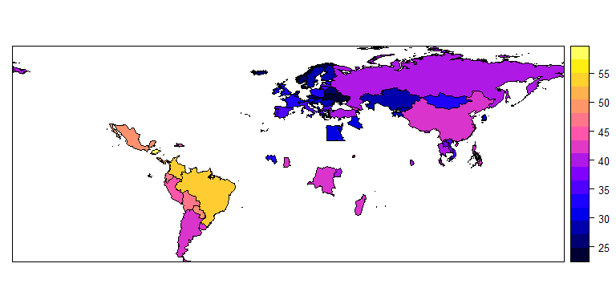<!-- -->

## Das Paket `colorRamps` verwenden


```r
library(colorRamps)
spplot(ginimap,"gini12",col.regions=matlab.like(100))
```

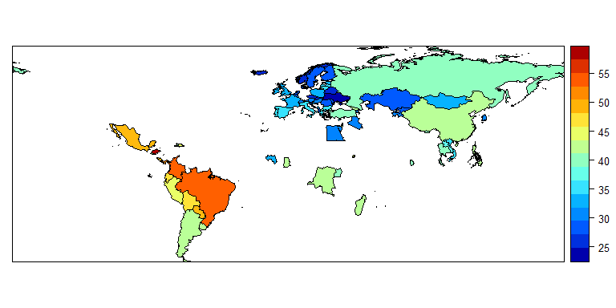<!-- -->


## Aufgabe A4A - Eine Choroplethenkarte erzeugen

- Lade Datensatz [**Unemployment Datensatz**](https://raw.githubusercontent.com/Japhilko/GeoData/master/2015/data/Unemployment.csv) herunter
- Matche die Daten mit einer passenden Karte
- Erzeuge mit der (Variable `X2014M10`) folgende Karte:


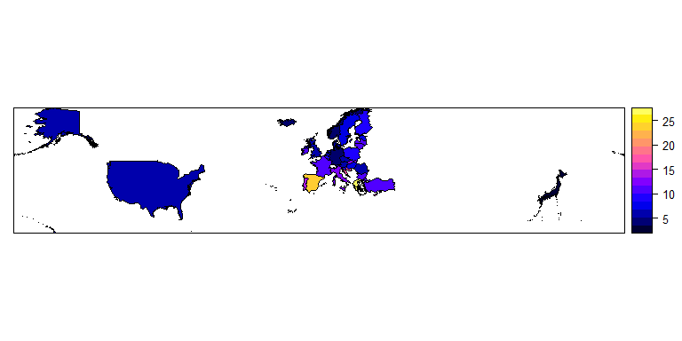<!-- -->


## Das Paket `choroplethr`

### Paket von [**Ari Lamstein**](http://www.arilamstein.com/) - [**`choroplethr`**](https://cran.r-project.org/web/packages/choroplethr/index.html) 

- Vereinfachung der Erstellung von Choroplethen in R

- World Development Indicators [**`WDI`**](https://cran.r-project.org/web/packages/WDI/index.html) (World Bank)

- Die folgenden Beispiele basieren auf der [**Vignette**](https://cran.r-project.org/web/packages/choroplethr/index.html) des `choroplethr`-Paketes


```r
install.packages("choroplethr")
```


## Bevölkerungsschätzungen für den US-Staaten

### US Amerikanischer Community Survey


```r
library("choroplethr")
data(df_pop_state)
```

`df_pop_state` ist ein Datensatz , der in dem Paket `choroplethr` enthalten ist, es enthält Schätzungen zu den US-Staaten für das Jahr 2012.


region           value
-----------  ---------
alabama        4777326
alaska          711139
arizona        6410979
arkansas       2916372
california    37325068
colorado       5042853

## `choroplethr` - [Hallo Welt](http://mirrors.softliste.de/cran/web/packages/choroplethr/vignettes/a-introduction.html) 

Die Karte zeigt die US Bevölkerungsschätzung für die US-Staaten und das Jahr 2012:

Wir bekommen eine Choroplethenkarte mit nur einem Argument:


```r
state_choropleth(df_pop_state)
```

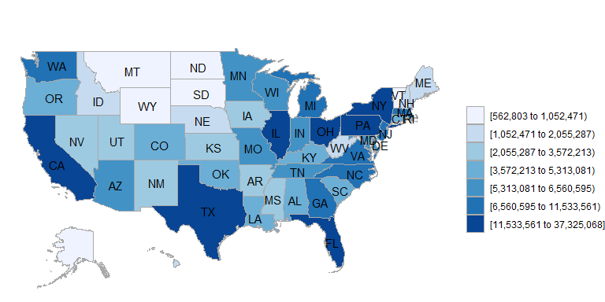<!-- -->


Aber wir können auch einen Titel erstellen und die Legende benennen:


```r
state_choropleth(df_pop_state, title="2012 US State Population Estimates", legend="Population")
```

<!-- -->

## [Nur drei Staaten darstellen](http://mirrors.softliste.de/cran/web/packages/choroplethr/vignettes/b-state-choropleth.html)


```r
state_choropleth(df_pop_state,
                 title= "2012 Population Estimates",
                 legend= "Population", num_colors = 1,
                 zoom=c("california","washington","oregon"))
```

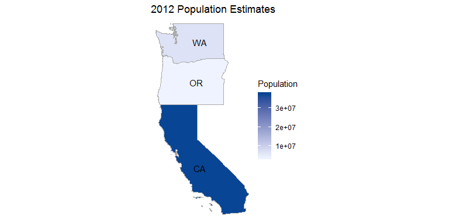<!-- -->


## US County Chroplethen

### [Choroplethen der US Counties](http://mirrors.softliste.de/cran/web/packages/choroplethr/vignettes/c-county-choropleth.html)

- [**Vignette des Pakets**](http://mirrors.softliste.de/cran/web/packages/choroplethr/vignettes/c-county-choropleth.html)


```r
# A data.frame containing population estimates for US Counties in 2012.
?df_pop_county

# Create a choropleth of US Counties
?county_choropleth
```

## Eine Karte der US Counties


```r
data(df_pop_county)
county_choropleth(df_pop_county)
```

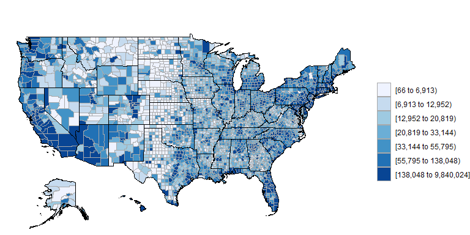<!-- -->


## [Choroplethen Länder](http://mirrors.softliste.de/cran/web/packages/choroplethr/vignettes/d-country-choropleth.html)


```r
data(df_pop_country)
country_choropleth(df_pop_country,
              title      = "2012 Population Estimates",
              legend     = "Population",
              num_colors = 1,
              zoom       = c("united states of america",
                             "mexico", "canada"))
```

## [Choroplethen Länder](http://mirrors.softliste.de/cran/web/packages/choroplethr/vignettes/d-country-choropleth.html)

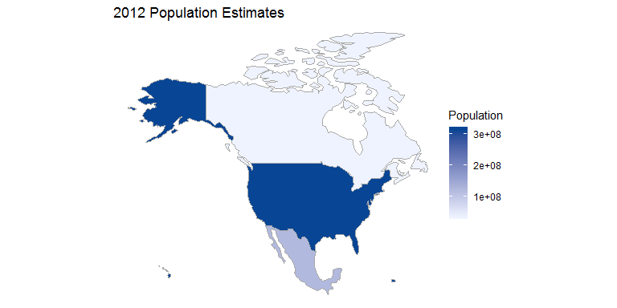<!-- -->


## Weltbank Daten


```r
library(WDI) 
choroplethr_wdi(code="SP.POP.TOTL", year=2012, 
                title="2012 Population", 
                num_colors=1)
```

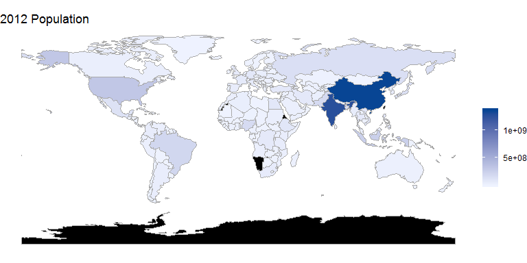<!-- -->

## [Lebenserwartung](http://mirrors.softliste.de/cran/web/packages/choroplethr/vignettes/f-world-bank-data.html)


```r
choroplethr_wdi(code="SP.DYN.LE00.IN", year=2012,
                title="2012 Life Expectancy")
```

<!-- -->


## Ein weiterer Datensatz

> A data.frame containing all US presdiential election results from 1789 to 2012


```r
data(df_president_ts)
```

<!--
Mit dem Fragezeichen bekommen wir Hilfe


```r
?df_president_ts
```

-->


D = Democratic; R = Republican; PR = Progressive; 


     region         1908   1912   1916   1920   1924   1928   1932 
---  -------------  -----  -----  -----  -----  -----  -----  -----
42   south dakota   R      PR     R      R      R      R      D    
43   tennessee      D      D      D      R      D      R      D    
44   texas          D      D      D      D      D      R      D    
45   utah           R      R      D      R      R      R      D    
46   vermont        R      R      R      R      R      R      R    
47   virginia       D      D      D      D      D      R      D    
48   washington     R      PR     D      R      R      R      D    

<!--
R = Republican; 
D = Democratic; 
DR = Democratic-Republican; 
W = Whig;
F = Federalist;
GW = George Washington;
NR = National Republican;
SD = Southern Democrat;
PR = Progressive; 
AI = American Independent;
SR = States' Rights; 
PO = Populist; 
CU = Constitutional Union; 
I = Independent; 
ND = Northern Democrat; 
KN = Know Nothing;
AM = Anti-Masonic;
N = Nullifier; 
SP = Split evenly
-->


```r
# install.packages("choroplethrMaps")
library("choroplethrMaps")
```


## Das R-Paket `choroplethrMaps`


```r
library(ggplot2);library(choroplethrMaps)
data(country.map)
ggplot(country.map, aes(long, lat, group=group))+ 
  geom_polygon()
```

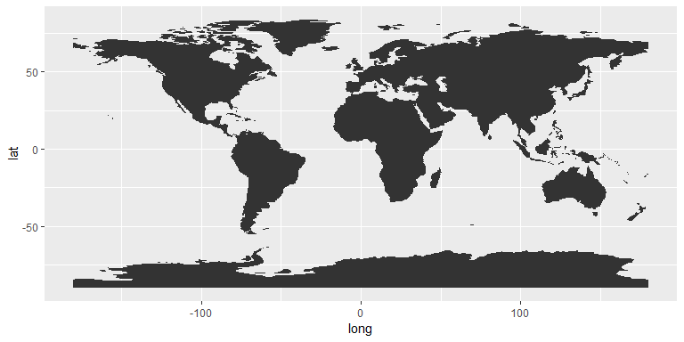<!-- -->

## Eine Karte für die USA


```r
data(state.map)
ggplot(state.map,aes(long,lat,group=group))+geom_polygon()
```

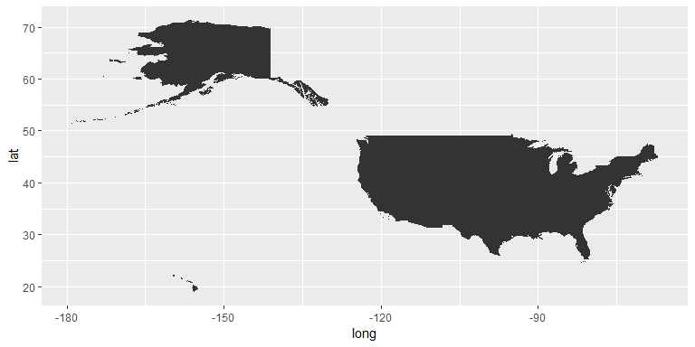<!-- -->


## Resourcen


```r
citation("choroplethr")
```

```
## 
## To cite package 'choroplethr' in publications use:
## 
##   Ari Lamstein (2018). choroplethr: Simplify the Creation of
##   Choropleth Maps in R. R package version 3.6.3.
##   https://CRAN.R-project.org/package=choroplethr
## 
## A BibTeX entry for LaTeX users is
## 
##   @Manual{,
##     title = {choroplethr: Simplify the Creation of Choropleth Maps in R},
##     author = {Ari Lamstein},
##     year = {2018},
##     note = {R package version 3.6.3},
##     url = {https://CRAN.R-project.org/package=choroplethr},
##   }
```

## Resources / Links

- [**Einführung - Was sind Choroplethen**](https://cran.r-project.org/web/packages/choroplethr/vignettes/a-introduction.html)


- [**Beschreibung**](http://radar.oreilly.com/2014/01/new-choropleth-package-in-r.html) der Nutzung des  `choroplethr` Paketes

- Die [**US Staaten**](https://cran.r-project.org/web/packages/choroplethr/vignettes/b-state-choropleth.html) plotten mit `choroplethr`

- [**Weltbankdaten in Karten darstellen**](https://cran.r-project.org/web/packages/choroplethr/vignettes/f-world-bank-data.html) mit `choroplethr`


- [**Revolutions-Blog**](http://blog.revolutionanalytics.com/2014/01/easy-data-maps-with-r-the-choroplethr-package-.html) über das `choroplethr` Paket


- [**trulia**](http://www.trulia.com/tech/2014/01/15/the-choroplethr-package-for-r/)-blog über das `choroplethr` Paket

- [**Präsentation von Ari Lamstein**](http://www.r-bloggers.com/slides-for-my-upcoming-talk-mapping-census-data-in-r/) über das `choroplethr` Paket
