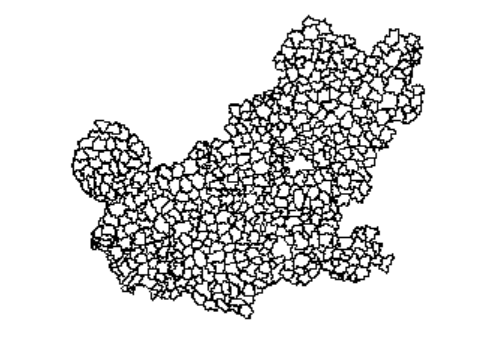
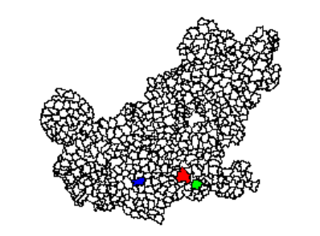
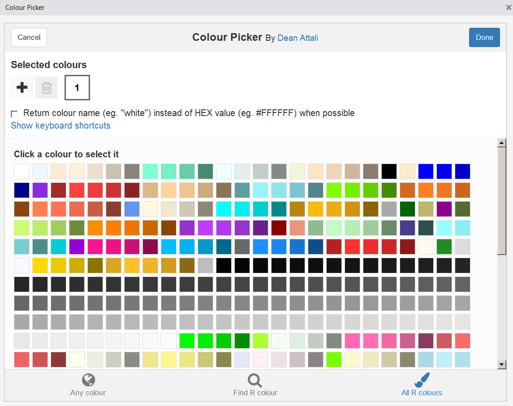
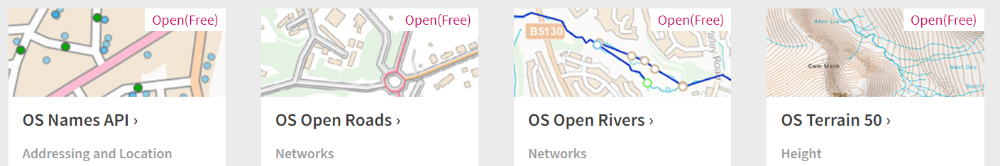

## Worum geht es in diesem Abschnitt

- Was sind Shapefiles?
- Wie kann man Shapefiles (`.shp`) in R importieren?
- Der Import von Shapefiles wird anhand von Vorwahl- und PLZ-Bereichen gezeigt.
- Wie kann man einzelne Polygonzüge zusammenfassen?


## Ein kleines Quizz


## Das shapefile Format ... 

- ... ist ein beliebtes Format räumlicher Vektordaten für geographisches Informationssysteme (GIS).
- Das Dateiformat Shapefile ist ein ursprünglich für die Software ArcView der Firma ESRI entwickeltes Format für Geodaten. (Quelle: [**Wikipedia**](https://de.wikipedia.org/wiki/Shapefile))

- Es wurde entwickelt und reguliert von [**ESRI**](http://www.esri.com/)

- (meist) offene Spezifikation um Daten Interoperabilität zwischen Esri und anderen Formaten zu sichern. 

- Es können Punkte, Linien und Polygone beschrieben werden

- Jedes Element hat Attribute, wie bspw. Name oder Temperatur die es beschreiben.

Quelle: <https://en.wikipedia.org/wiki/Shapefile>


## Der R Befehl readShapePoly

Um Shape-Dateien zu lesen, ist es notwendig, 
die drei Dateien mit den folgenden Dateierweiterungen im gleichen Verzeichnis zu haben:

- .shp
- .dbf
- .shx


## [**Vorwahlbereiche in Deutschland**](http://www.bundesnetzagentur.de/SharedDocs/Downloads/DE/Sachgebiete/Telekommunikation/Unternehmen_Institutionen/Nummerierung/Rufnummern/ONVerzeichnisse/ONBGrenzen/ONB_Grenzen.html)

### Quelle Ortsnetzbereiche: [**Bundesnetzagentur**](http://www.bundesnetzagentur.de/DE/Sachgebiete/Telekommunikation/Unternehmen_Institutionen/Nummerierung/Rufnummern/ONVerzeichnisse/GISDaten_ONBGrenzen/ONBGrenzen_Basepage.html)


- Wir verwenden das Paket `maptools` um die Daten einzulesen:


```r
setwd(geodata_path)
library(maptools)
onb <- readShapePoly("onb_grenzen.shp")
```


## Die Karte zeichnen


```r
plot(onb)
```


<!--

-->

## Der Datenslot


```r
kable(head(onb@data))
```

     VORWAHL   NAME                   KENNUNG 
---  --------  ---------------------  --------
0    04651     Sylt                   NA      
1    04668     Klanxbüll              NA      
2    04664     Neukirchen b Niebüll   NA      
3    04663     Süderlügum             NA      
4    04666     Ladelund               NA      
5    04631     Glücksburg Ostsee      NA      

<!--
|   |VORWAHL |NAME                 |KENNUNG |
|:--|:-------|:--------------------|:-------|
|0  |04651   |Sylt                 |NA      |
|1  |04668   |Klanxbüll            |NA      |
|2  |04664   |Neukirchen b Niebüll |NA      |
|3  |04663   |Süderlügum           |NA      |
|4  |04666   |Ladelund             |NA      |
|5  |04631   |Glücksburg Ostsee    |NA      |
-->

## Einen Vorwahlbereich ausschneiden


```r
vwb <- onb@data$VORWAHL
vwb2 <- substr(vwb, 1,2)
```


```r
library(lattice)
barchart(table(vwb2),col="royalblue",
         xlab="Häufigkeit")
```

<!-- -->

<!--

-->

## Vorwahlbereich ausschneiden


```r
vwb6 <- onb[vwb2=="06",]
plot(vwb6)
```

<!-- -->

<!--

-->
## Shapefiles zusammenfassen


```r
vwb6c <- unionSpatialPolygons(vwb6,
              rep(1,length(vwb6)))
plot(vwb6c,col="royalblue")
```

<!-- -->

<!--

-->


## Wo ist Mannheim?


```r
Com <- vwb6@data$NAME
plot(vwb6)
plot(vwb6[Com=="Mannheim",],col="red",add=T)
plot(vwb6[Com=="Heidelberg",],col="green",add=T)
plot(vwb6[Com=="Kaiserslautern",],col="blue",add=T)
```

<!-- -->

<!--

-->

## Paket `rgdal` - PLZ Datensatz einlesen

### [**Quelle**](http://arnulf.us/PLZ) für PLZ Shapefiles


```r
library(rgdal)
```


```r
setwd(data_path)
plz <- readOGR ("post_pl.shp","post_pl")
```

```
## OGR data source with driver: ESRI Shapefile 
## Source: "D:\GESIS\data\post_pl.shp", layer: "post_pl"
## with 8270 features
## It has 3 fields
```

## Die Daten plotten


```r
plzbereich <- substr(plz@data$PLZ99,1,2)
plot(plz[plzbereich=="68",])
```

<!-- -->


## Die Grenze von Mannheim


```r
ma_map <- plz[plz$PLZORT99=="Mannheim",]
plot(ma_map)
```

<!-- -->

## Die PLZ-Bereiche von Mannheim zusammenfassen

- Wir nutzen den Befehl `unionSpatialPolygons` im Paket `maptools`


```r
library(maptools)
ma_map2 <- unionSpatialPolygons(SpP = ma_map,
                                IDs = rep(1,length(ma_map)))
plot(ma_map2)
```

<!-- -->


## Exkurs: der Befehl `agrep`


```r
agrep("Freiburg",plz@data$PLZORT99)
```

```
##  [1]  363  660  661 1349 5074 5798 5799 5800 5801 5802 5803 5804 5805 5806
## [15] 5807 5808 5809
```


```r
agrep("Freiburg",plz@data$PLZORT99,value=T)
```

```
##  [1] "Freyburg/ Unstrut"    "Freiberg"             "Freiberg"            
##  [4] "Freiburg (Elbe)"      "Freiberg am Neckar"   "Freiburg im Breisgau"
##  [7] "Freiburg im Breisgau" "Freiburg im Breisgau" "Freiburg im Breisgau"
## [10] "Freiburg im Breisgau" "Freiburg im Breisgau" "Freiburg im Breisgau"
## [13] "Freiburg im Breisgau" "Freiburg im Breisgau" "Freiburg im Breisgau"
## [16] "Freiburg im Breisgau" "Freiburg im Breisgau"
```

## Die Funktion `grep`

### Der exakte match


```r
grep("Freiburg",plz@data$PLZORT99,value=T)
```

```
##  [1] "Freiburg (Elbe)"      "Freiburg im Breisgau" "Freiburg im Breisgau"
##  [4] "Freiburg im Breisgau" "Freiburg im Breisgau" "Freiburg im Breisgau"
##  [7] "Freiburg im Breisgau" "Freiburg im Breisgau" "Freiburg im Breisgau"
## [10] "Freiburg im Breisgau" "Freiburg im Breisgau" "Freiburg im Breisgau"
## [13] "Freiburg im Breisgau"
```


```r
agrep("Freiburg",plz@data$PLZORT99,value=T,
      max.distance = 0.2)
```

```
##  [1] "Frohburg"             "Freyburg/ Unstrut"    "Freiberg"            
##  [4] "Freiberg"             "Freiburg (Elbe)"      "Ehrenburg"           
##  [7] "Gnarrenburg"          "Bad Driburg"          "Derenburg"           
## [10] "Freiberg am Neckar"   "Freiburg im Breisgau" "Freiburg im Breisgau"
## [13] "Freiburg im Breisgau" "Freiburg im Breisgau" "Freiburg im Breisgau"
## [16] "Freiburg im Breisgau" "Freiburg im Breisgau" "Freiburg im Breisgau"
## [19] "Freiburg im Breisgau" "Freiburg im Breisgau" "Freiburg im Breisgau"
## [22] "Freiburg im Breisgau" "Waldkraiburg"         "Kraiburg a. Inn"     
## [25] "Freihung"
```


## A6A Übung - PLZ Bereiche herunterladen

- Lade den Shapefile mit den PLZ-Bereichen [**hier**](http://arnulf.us/PLZ) herunter.
- Importiere den Shapefile in R mit einem geeigneten Befehl. 
- Erzeuge einen Datensatz mit den PLZ-Bereichen von Berlin.
- Speichere den Datensatz als `.RData` Datei ab. 


## Global Adminastrative Boundaries - [GADM](http://www.gadm.org/) - NUTS level 1

- Für Polygonzüge unterhalb der Staatsgrenzen ist [**Global Administrative Boundaries**](http://www.gadm.org/) eine gute Quelle.
- Vor allem wegen API, die man Paket `raster` nutzen kann.


```r
library(raster)
LUX1 <- getData('GADM', country='LUX', level=1)
plot(LUX1)
```

<!-- -->


## Ein Blick auf die Daten


Koordinaten im polygon slot

```r
LUX1@polygons[[1]]@Polygons[[1]]@coords
```


```
##          [,1]     [,2]
## [1,] 6.026519 50.17767
## [2,] 6.031361 50.16563
## [3,] 6.035646 50.16410
## [4,] 6.042747 50.16157
## [5,] 6.043894 50.16116
## [6,] 6.048243 50.16008
```

## Der Datenslot


```r
head(LUX1@data)
```

```
##   OBJECTID ID_0 ISO     NAME_0 ID_1       NAME_1 HASC_1 CCN_1 CCA_1
## 1        1  131 LUX Luxembourg    1     Diekirch  LU.DI    NA      
## 2        2  131 LUX Luxembourg    2 Grevenmacher  LU.GR    NA      
## 3        3  131 LUX Luxembourg    3   Luxembourg  LU.LU    NA      
##     TYPE_1 ENGTYPE_1 NL_NAME_1            VARNAME_1
## 1 District  District               Dikrech|Dikkrich
## 2 District  District                  Gréivemaacher
## 3 District  District           Lëtzebuerg|Luxemburg
```


## [GADM](http://www.gadm.org/)- NUTS level 3


```r
LUX3 <- getData('GADM', country='LUX', level=3)
plot(LUX3)
```

<!-- -->

## [GADM](http://www.gadm.org/)- NUTS level 4


```r
LUX4 <- getData('GADM', country='LUX', level=4)
plot(LUX4)
```

<!-- -->

## [GADM](http://www.gadm.org/)- NUTS level 3


```r
DEU3 <- getData('GADM', country='DEU', level=3)
plot(DEU3)
```


## Gemeinden in Deutschland

[Bundesamt für Kartographie und Geodäsie (BKG)](http://www.geodatenzentrum.de/geodaten/gdz_rahmen.gdz_div?gdz_spr=deu&gdz_akt_zeile=5&gdz_anz_zeile=1&gdz_unt_zeile=15&gdz_user_id=0)


```r
krs <- maptools::readShapePoly("vg250_krs.shp")
plot(krs)
```


## A6A Aufgabe: Download von Shapefiles für die Gemeinden Deutschlands

- Lade die Shapefiles Datei (UTM32 Kompakt) von [**hier**](http://www.geodatenzentrum.de/geodaten/gdz_rahmen.gdz_div?gdz_spr=deu&gdz_akt_zeile=5&gdz_anz_zeile=1&gdz_unt_zeile=15&gdz_user_id=0) herunter. 
- Entpacke den zip-Ordner und importiere den Shapefile (`VG250_F.shp`) mit den Gemeinden, mit einer geeigneten Funktion.


## Kreise eines Bundeslandes


```r
fds <- substr(krs@data$AGS,1,2)
plot(krs[fds=="05",])
```


## A6B Aufgabe: Eine Karte für das Saarland erzeugen

- Schränke die Daten auf das Saarland ein, und zeichne eine Karte vom Saarland.


- Speichere den Datensatz in geeigneter Form ab.


## Andere Quellen

- [**World Port Index**](http://msi.nga.mil/NGAPortal/MSI.portal?_nfpb=true&_pageLabel=msi_portal_page_62&pubCode=0015)


```r
library(rgdal)
WPI <- readOGR ("WPI.shp","WPI")
plot(WPI)
```


Datenbanken für Karten


```r
library(mapdata)
```


## Das Paket `maps` - Mehr Information

- Nur für manche Staaten bekommt man mit dem Paket `maps` Umkreise für Einheiten unterhalb der Staatsgrenze (bspw. Frankreich, USA). 


```r
library(maps)
data(world.cities)
map("france")
map.cities(world.cities,col="blue")
```

<!-- -->

## Die Funktion `rgb`


```r
map.cities(world.cities,col=rgb(0,0,1,.2),pch=20,cex=4)
```


## Das Rstudio Addin `colourpicker`


```r
install.packages("colourpicker")
```




## Weitere Quelle - [Shapefiles für Wahlkreise](https://www.bundeswahlleiter.de/bundestagswahlen/2017/wahlkreiseinteilung/downloads.html)


## [Shapefiles bei Eurostat](http://ec.europa.eu/eurostat/de/web/gisco/geodata/reference-data/administrative-units-statistical-units)

- [**Eurostat Karten**](http://epp.eurostat.ec.europa.eu/portal/page/portal/gisco_Geographical_information_maps/popups/
references/administrative_units_statistical_units_1) - in der Regel die Europäischen Mitgliedsstaaten


## Weitere Quellen für Shapefiles


- [**Open linked data**](https://www.ordnancesurvey.co.uk/business-and-government/products/opendata-products-grid.html) - Ordnance Survey (GB)



- [**World Borders Datensatz**](http://thematicmapping.org/downloads/world_borders.php)

- [**National Historical Information System**](https://www.nhgis.org/)

- [**Freie Polygon-Daten für die USA**](http://www.freemapdata.com/html/free_polygon_data.html)

- Überblick über - [**Spatial Data in R**](https://science.nature.nps.gov/im/datamgmt/statistics/r/advanced/spatial.cfm)

<!--
- [ggmap und shapefiles](http://www.r-bloggers.com/shapefile-polygons-plotted-on-google-maps-using-ggmap-in-r-throw-some-throw-some-stats-on-that-mappart-2/)
-->
