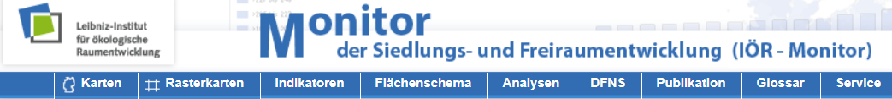

```{r setup, include=FALSE}
knitr::opts_chunk$set(echo = T)
```


## [Manipulation von Rasterdaten](http://rspatial.org/spatial/rst/8-rastermanip.html)

```{r}
library(raster)
x <- raster()
x
```

## Andere Parameter wählen

```{r}
x1 <- raster(ncol=36, nrow=18, xmn=-1000, xmx=1000, ymn=-100, ymx=900)
x1
```


## Den Zellen Werte zuordnen

```{r}
r <- raster(ncol=10, nrow=10)
ncell(r)
hasValues(r)
```

```{r}
values(r) <- runif(ncell(r))
hasValues(r)
```

## Das Ergebnis visualisieren


```{r}
plot(r, main='Raster with 100 cells')
```

<!--
##  Ein Beispieldatensatz

```{r eval=FALSE, include=FALSE}
install.packages("rnaturalearth")
```


```{r}
library(rnaturalearth)
usa <- ne_countries(country = "United States of America") # United States borders
class(usa)
```

## [](https://geocompr.robinlovelace.net/read-write.html)

```{r}
library(sf)
usa_sf <- st_as_sf(usa)
plot(usa_sf)
```
-->


## Import von Beispieldaten

```{r,eval=F}
link<-"https://raw.githubusercontent.com/GeoScripting-WUR/IntroToRaster/gh-pages/data/gewata.zip"
```

```{r,echo=F}
link<-"https://raw.githubusercontent.com/GeoScripting-WUR/
IntroToRaster/gh-pages/data/gewata.zip"
```

```{r,eval=F}
download.file(url = link, destfile = 'gewata.zip', method = 'auto')
unzip('gewata.zip')
```


```{r}
list.files(pattern = glob2rx('*.tif'))
```

## [Import von Rasterdaten - `.tif` file](https://geoscripting-wur.github.io/IntroToRaster/)

```{r}
gewata <- raster::brick('../data/LE71700552001036SGS00_SR_Gewata_INT1U.tif')
```

## Erste plots erstellen

```{r}
plot(gewata)
```

```{r}
gewata@data
```


<!--
## [Indikatoren vom Institut für ökologische Raumforschung (IÖR)](http://www.ioer-monitor.de/)

-->

<!--
http://www.ioer-monitor.de/indikatoren/#c1793
https://monitor.ioer.de/frontend/data/anleitung_import_qgis.pdf
https://monitor.ioer.de/?raeumliche_gliederung=raster&klassenanzahl=7&opacity=0.8&zoom=6&lat=51.33061163769853&lng=10.458984375000002&ind=B02DT&baselayer=webatlas&time=2011&raumgl=bld&klassifizierung=haeufigkeit&darstellung=auto&ags_array=&glaettung=0&rasterweite=0&
http://www.ioer-monitor.de/indikatoren/#c1793
-->


## Links

- Neon - [**Intro to Raster Data in R**](https://www.neonscience.org/dc-raster-data-r)