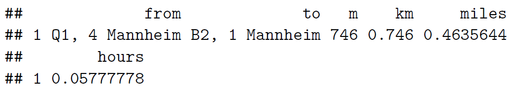
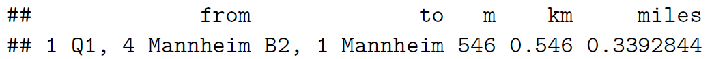
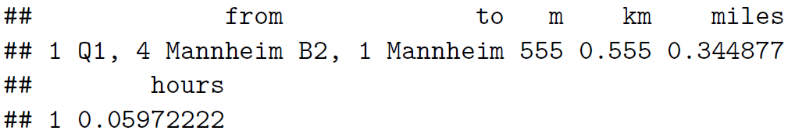
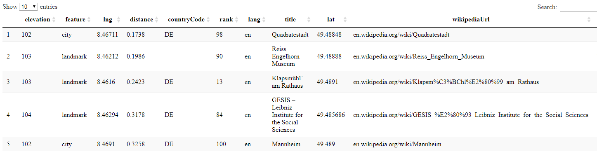

## Inhalt dieses Abschnitts

- Das Konzept der Geokoordinaten erklären
- Möglichkeiten vorstellen, die Geokodierung mit R durchzuführen
- Nutzung der Nominatim API

## Geokodierung

### [Wikipedia - Geocoding](https://github.com/adam-p/markdown-here/wiki/Markdown-Cheatsheet#blockquotes)


> Geocoding (...) uses a description of a location, most typically a postal address or place name, to find geographic coordinates from spatial reference data ... 


## Geokodierung mit dem Paket `ggmap`

- Einer der ersten Ansätze Geokodierung mit R durchzuführen
- Wenn Geokodierung mit R durchgeführt wird dieses Paket wohl am häufigsten verwendet. 
- Das führt auch dazu, dass im Internet zahlreiche Anwendungsbeispiele zu finden sind. 


```r
library(ggmap)
geocode("Heidelberg")
```

```
Information from URL : http://maps.googleapis.com/maps/api/geocode/json?address=Heidelberg&sensor=false
       lon      lat
1 8.672434 49.39875
```


## Latitude und Longitude


[http://modernsurvivalblog.com](http://modernsurvivalblog.com/survival-skills/basic-map-reading-latitude-longitude/)


## Distanzen für verschiedene Verkehrsmittel


```r
mapdist("Q1, 4 Mannheim","B2, 1 Mannheim")
```




```r
mapdist("Q1, 4 Mannheim","B2, 1 Mannheim",mode="walking")
```




```r
mapdist("Q1, 4 Mannheim","B2, 1 Mannheim",mode="bicycling")
```



## Geokodierung mit dem Paket `tmaptools`

- Beim Paket `tmaptools` wird die Nominatim API zur Geokodierung verwendet.
- Diese Funktion hat den Vorteil, dass eine Projektion ausgewählt werden kann, in der die Geokodierungen zurück gegeben werden. 


```r
library("tmaptools")
```


```r
?geocode_OSM
```


## Koordinaten verschiedener Orte in Deutschland

### Geokodierung mit einer Schleife


```r
cities <- c("Hamburg","Koeln","Dresden","Muenchen")

lat <- vector()
lon <- vector()
for (i in 1:length(cities)){
  gc <- geocode_OSM(cities[i])
  lat[i] <- gc$coords[1]
  lon[i] <- gc$coords[2]
}
```

## Welche Koordinaten hat der Norden


```r
Dat <- data.frame(cities,lon,lat)
kable(Dat)
```


cities           lon         lat
---------  ---------  ----------
Hamburg     53.55034   10.000654
Koeln       50.93836    6.959974
Dresden     51.04933   13.738144
Muenchen    48.13711   11.575382

<!--
## Geokodierung - verschiedene Punkte von Interesse


```r
POI1 <- geocode_OSM("B2, 1 Mannheim")
POI2 <- geocode_OSM("Hbf Mannheim")
POI3 <- geocode_OSM("Mannheim, Friedrichsplatz")
ListPOI <-data.frame(rbind(POI1$coords,POI2$coords,
                           POI3$coords))
ListPOI
```


## Punkte in der Karte


```r
MA_map <- qmap("Mannheim")
```


```r
MA_map +
geom_point(aes(x = x, y = y),
data = ListPOI)
```

## Punkte in der Karte


```r
MA_map +
geom_point(aes(x = x, y = y),col="red",
data = ListPOI)
```
-->


## Reverse Geokodierung

> Reverse geocoding is the process of back (reverse) coding of a point location (latitude, longitude) to a readable address or place name. This permits the identification of nearby street addresses, places, and/or areal subdivisions such as neighbourhoods, county, state, or country.

Quelle: [Wikipedia](https://en.wikipedia.org/wiki/Reverse_geocoding)


```r
revgeocode(c(48,8))
```


## Daten einlesen

- Hier wird ein Beispieldatensatz eingelesen, den ich über räumliche Stichproben und reverse geocoding erzeugt habe. 


```r
load("../data/addr_list_t_68239.RData")
head(addr_list_t)
```

```
## [1] "Lilienstraße 32A, 68535 Edingen-Neckarhausen, Germany"
## [2] "Waldspitze 6, 68239 Mannheim, Germany"                
## [3] "Holzweg 51, 68239 Mannheim, Germany"                  
## [4] "Kloppenheimer Str. 247, 68239 Mannheim, Germany"      
## [5] "Mallaustraße 121, 68219 Mannheim, Germany"            
## [6] "Holzweg 33A, 68239 Mannheim, Germany"
```


## Die erste Adressen geokodieren


```r
geocode_OSM(addr_list_t[1])
```

```
## $query
## [1] "Lilienstraße 32A, 68535 Edingen-Neckarhausen, Germany"
## 
## $coords
##         x         y 
##  8.584601 49.445360 
## 
## $bbox
##         min       max
## x  8.584494  8.584708
## y 49.445276 49.445443
```

## Alle Adressen geokodieren

- im Objekt `gc_list` werden die Ergebnisse gespeichert.


```r
gc_list <- list()

for (i in 1:length(addr_list_t)){
  gc_list[[i]] <- geocode_OSM(addr_list_t[i])
}
```

## Geokodierung mit dem R-Paket `opencage`

- Um dieses Paket zu nutzen muss man sich vorher bei der API registrieren


```r
library(opencage)
```


```r
gc_info<-opencage_forward(placename = 
                              "Amsterdam, Van Woustraat")
```

- Hinweise, wie das Paket genutzt erden kann sind im [**opencage Tutorial**](https://ropensci.org/tutorials/opencage_tutorial/) zu finden. 

## Das Paket [`geonames`](https://github.com/ropensci/geonames)

<!--
https://cran.r-project.org/web/packages/geonames/README.html
-->


### Nutzung des `geonames` Paketes

- Ein Account ist notwendig um die meisten Funktionen des Paketes `geonames`zu nutzen.


```r
library(geonames)
```


```r
options(geonamesUsername="myusername")
```


```r
MAwiki<-GNfindNearbyWikipedia(postalcode=68239,country="DE",
                              radius=10)
```


## Beispiel Geonames 

### Wikipediaeinträge in der Nähe


- [**Login**](http://www.geonames.org/login) für die Nutzung des Web-Services Geonames.

- [**Hier**](http://www.geonames.org/enablefreewebservice) kann man das Arbeiten mit dem Webservice starten.

- [**Informationen zum Download bei Geonames**](http://www.geonames.org/export/ws-overview.html)




## Eine Bounding Box erstellen 


```r
library(osmdata)
bbox <- getbb("Mannheim")
```

<!--
x -lon - ost-West Richtung
-->


```r
erg <- geonames::GNcities(49.649591,8.627236,
                          49.329591,8.307236)
```

<!--
https://cengel.github.io/rspatial/5_Geocoding.nb.html
http://www.datasciencetoolkit.org/

https://github.com/cengel/ArcGIS_geocoding
-->


## Geokodieren mit der API Nominatim

### Zunächst muss der Link erzeugt werden


```r
library("RJSONIO")
api_adress <- "http://nominatim.openstreetmap.org/search?format="
file_format <- "json"
search_query <- "&addressdetails=1&extratags=1&q="
adress <- "Amsterdam+Niederlande+Rozengracht+1"

link <- paste0(api_adress,file_format,search_query,adress)
link
```

```
## [1] "http://nominatim.openstreetmap.org/search?format=json&addressdetails=1&extratags=1&q=Amsterdam+Niederlande+Rozengracht+1"
```

## Der Download mit Nominatim


```r
con <- url(link)
geoc <- fromJSON(paste(readLines(con,warn=F), 
                       collapse = ''))
close(con)
```


## So sieht das Ergebnis aus


```r
names(geoc[[1]])
```

```
##  [1] "place_id"     "licence"      "osm_type"     "osm_id"      
##  [5] "boundingbox"  "lat"          "lon"          "display_name"
##  [9] "class"        "type"         "importance"   "address"     
## [13] "extratags"
```


```r
geoc[[1]]$address
```

```
##    house_number            road     residential          suburb 
##             "1"   "Rozengracht"       "Jordaan"     "Amsterdam" 
##   city_district            city           state        postcode 
##       "Centrum"     "Amsterdam" "Noord-Holland"        "1016LP" 
##         country    country_code 
##     "Nederland"            "nl"
```

## Das Paket `jsonlite` nutzen


```r
con <- url("http://nominatim.openstreetmap.org/search?format=json&
           addressdetails=1&extratags=1&q=Amsterdam+Niederlande+Rozengracht+1")
geoc2 <- jsonlite::fromJSON(con)

geoc2df <- with(geoc2,data.frame(osm_id,lat,lon))
geoc2df$house_number <-  geoc2$address$house_number
```


Wir erhalten nun Daten für mehrere Anschriften:


osm_id       lat          lon         house_number 
-----------  -----------  ----------  -------------
2721815875   52.3737223   4.8826404   1            
2743624072   52.3719482   4.8755534   237-1        
2721830930   52.3736673   4.8823914   7-1          
2721827922   52.3734021   4.8813371   53-1         
2721824637   52.372232    4.8767542   231-1        
2721823434   52.3724786   4.8776618   187-1        
2721820122   52.3727335   4.8786657   137-1        
2721816644   52.3729874   4.8797588   105E-1       
2720971311   52.3727658   4.8775263   194-1        
2720971056   52.3728019   4.8775994   184-1        


## Das Paket `googleway`

> Accesses Google Maps APIs to Retrieve Data and Plot Maps


```r
library(googleway)
```

- Ein API Schlüssel ist notwendig um die meisten Funktionen des Paketes zu nutzen. 


<!--
Abschnitt zu Geocoding in diesem Task View:

https://cran.r-project.org/web/views/WebTechnologies.html
-->


## Das Paket `bbox` 

- Das Paket `bbox` ist auf github zu finden.


- Beispieldatensatz laden:


```r
load("../data/ddat.RData")
```

- Rahmen für das räumliche Objekt bestimmen:


```r
library(bbox)
b_box(ddat)
```

```
## [1]  5.866286 47.273602 15.048632 55.058262
```


```r
citation("bbox")
```


<!--
https://github.com/ropensci/bbox
-->


## Links

- Überblick von Jesse Sadler zur [**Geokodierung mit R**](https://www.jessesadler.com/post/geocoding-with-r/)
- Ein Schummelzettel für [**`ggmap`**](https://www.nceas.ucsb.edu/~frazier/RSpatialGuides/ggmap/ggmapCheatsheet.pdf)
- Die Vignette zum Paket `tmap` - [**tmap: get started**](https://cran.r-project.org/web/packages/tmap/vignettes/tmap-getstarted.html)

- [**latlong.net**](https://www.latlong.net/place/hamburg-germany-8766.html) - eine Homepage um Koordinaaten zu bestimmen.
