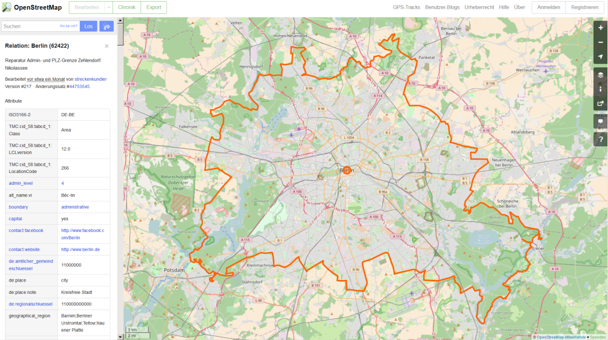
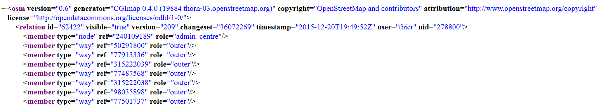
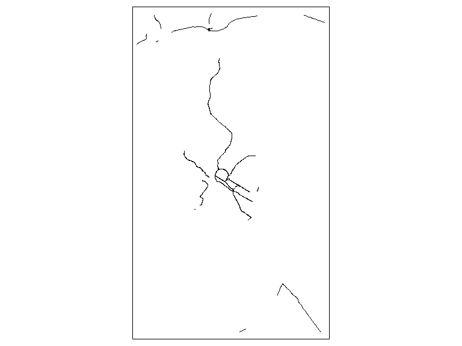

## [OSM Ausschnitte herunterladen](http://www.openstreetmap.org/export)

<www.openstreetmap.org/export>


## Das R-Paket `XML` - Gaston Sanchez


```r
library("XML")
```

### Gaston Sanchez - Dataflow


Seine Arbeit sieht man [**hier**](http://gastonsanchez.com/).


## [Das Arbeiten mit XML Daten](https://github.com/gastonstat/tutorial-R-web-data/blob/master/04-parsing-xml/04-parsing-xml.pdf)


## Funktionen im XML Paket


Function         Description                              
---------------  -----------------------------------------
xmlName()        name of the node                         
xmlSize()        number of subnodes                       
xmlAttrs()       named character vector of all attributes 
xmlGetAttr()     value of a single attribute              
xmlValue()       contents of a leaf node                  
xmlParent()      name of parent node                      
xmlAncestors()   name of ancestor nodes                   
getSibling()     siblings to the right or to the left     
xmlNamespace()   the namespace (if there’s one)           


## [Einzelne Objekte finden](http://www.openstreetmap.org/export)

<www.openstreetmap.org/export>




## Beispiel: administrative Grenzen Berlin

[Administrative Grenzen für Deutschland](http://wiki.openstreetmap.org/wiki/DE:Grenze#Bundesl.C3.A4ndergrenze_-_admin_level.3D4)


```r
url <- "https://api.openstreetmap.org/api/0.6/relation/62422"
```


```r
BE <- xmlParse(url)
```


```r
BE <- xmlParse("../data/62422.xml")
```




## Das XML analysieren

- [Tobi Bosede - Working with XML Data in R](http://www.informit.com/articles/article.aspx?p=2215520)


```r
xmltop = xmlRoot(BE)
class(xmltop)
```

```
## [1] "XMLInternalElementNode" "XMLInternalNode"       
## [3] "XMLAbstractNode"
```

```r
xmlSize(xmltop)
```

```
## [1] 1
```

```r
xmlSize(xmltop[[1]])
```

```
## [1] 337
```


## Nutzung von Xpath

> [Xpath](https://de.wikipedia.org/wiki/XPath), the XML Path Language, is a query language for selecting nodes from an XML document. 


```r
xpathApply(BE,"//tag[@k = 'population']")
```

```
## [[1]]
## <tag k="population" v="3440441"/> 
## 
## attr(,"class")
## [1] "XMLNodeSet"
```


## Quelle für die Bevölkerungsgröße


```r
xpathApply(BE,"//tag[@k = 'source:population']")
```

```
## [[1]]
## <tag k="source:population" v="http://www.statistik-berlin-brandenburg.de/Publikationen/Stat_Berichte/2010/SB_A1-1_A2-4_q01-10_BE.pdf 2010-10-01"/> 
## 
## attr(,"class")
## [1] "XMLNodeSet"
```

-[**Statistik Berlin Brandenburg**](https://www.statistik-berlin-brandenburg.de/datenbank/inhalt-datenbank.asp)

## Etwas überraschend: 


```r
xpathApply(BE,"//tag[@k = 'name:ta']")
```

```
## [[1]]
## <tag k="name:ta" v="<U+0BAA><U+0BC6><U+0BB0><U+0BCD><U+0BB2><U+0BBF><U+0BA9><U+0BCD>"/> 
## 
## attr(,"class")
## [1] "XMLNodeSet"
```


## Geographische Region


```r
region <- xpathApply(BE,
  "//tag[@k = 'geographical_region']")
# regular expressions
region[[1]]
```

```
## <tag k="geographical_region" v="Barnim;Berliner Urstromtal;Teltow;Nauener Platte"/>
```

```
<tag k="geographical_region" 
  v="Barnim;Berliner Urstromtal;
  Teltow;Nauener Platte"/>
```

## Landkreis


## Weiteres Beispiel


```r
url2<-"http://api.openstreetmap.org/api/0.6/node/25113879"
obj2<-xmlParse(url2)
obj_amenity<-xpathApply(obj2,"//tag[@k = 'amenity']")[[1]]
obj_amenity
```


```
## <tag k="amenity" v="university"/>
```


## Wikipedia Artikel


```r
xpathApply(obj2,"//tag[@k = 'wikipedia']")[[1]]
```

```
## <tag k="wikipedia" v="de:Universität Mannheim"/>
```


```r
xpathApply(obj2,"//tag[@k = 'wheelchair']")[[1]]
```


```r
xpathApply(obj2,"//tag[@k = 'name']")[[1]]
```


## Das C und das A


```r
url3<-"http://api.openstreetmap.org/api/0.6/node/303550876"
obj3 <- xmlParse(url3)
xpathApply(obj3,"//tag[@k = 'opening_hours']")[[1]]
```


```
## <tag k="opening_hours" v="Mo-Sa 09:00-20:00; Su,PH off"/>
```


## Hin und weg


```r
url4<-"http://api.openstreetmap.org/api/0.6/node/25439439"
obj4 <- xmlParse(url4)
xpathApply(obj4,"//tag[@k = 'railway:station_category']")[[1]]
```


```
## <tag k="railway:station_category" v="2"/>
```


- [**Wikipedia Artikel Bahnhofskategorien**](https://de.wikipedia.org/wiki/Bahnhofskategorie)


## Exkurs: Bahnhofskategorien

- [**rvest: Easily Harvest (Scrape) Web Pages**](https://cran.r-project.org/web/packages/rvest/index.html)


```r
library(rvest)
```

```
## Loading required package: xml2
```

```
## 
## Attaching package: 'rvest'
```

```
## The following object is masked from 'package:XML':
## 
##     xml
```

```r
bhfkat<-read_html(
  "https://de.wikipedia.org/wiki/Bahnhofskategorie")
df_html_bhfkat<-html_table(
  html_nodes(bhfkat, "table")[[2]],fill = TRUE)
```

## Bahnhofskategorien Übersicht


Stufe        Bahnsteigkanten   Bahnsteiglänge[Anm 1]   Reisende/Tag        Zughalte/Tag   Service[Anm 2]   Stufenfreiheit[Anm 3] 
-----------  ----------------  ----------------------  ------------------  -------------  ---------------  ----------------------
(0)          —                 —                       —                   —              Nein             Nein                  
1            01                > 000 bis 090 m         00.000 bis 00.049   000 bis 0010   Ja               Ja                    
2            02                > 090 bis 140 m         00.050 bis 00.299   011 bis 0050   —                —                     
3            03 bis 04         > 140 bis 170 m         00.300 bis 0.0999   051 bis 0100   —                —                     
4            05 bis 09         > 170 bis 210 m         01.000 bis 09.999   101 bis 0500   —                —                     
5            10 bis 14         > 210 bis 280 m         10.000 bis 49.999   501 bis 1000   —                —                     
6            00i ab 15         > 280 m bis 000         000000 ab 50.000    000i ab 1001   —                —                     
Gewichtung   20 %              20 %                    20 %                20 %           15 %             5 %                   

## Nur fliegen ist schöner


```r
url5<-"http://api.openstreetmap.org/api/0.6/way/162149882"
obj5<-xmlParse(url5)
xpathApply(obj5,"//tag[@k = 'name']")[[1]]
```


```
## <tag k="name" v="City-Airport Mannheim"/>
```


```r
xpathApply(obj5,"//tag[@k = 'website']")[[1]]
```

```
## <tag k="website" v="http://www.flugplatz-mannheim.de/"/>
```


```r
xpathApply(obj5,"//tag[@k = 'iata']")[[1]]
```

```
## <tag k="iata" v="MHG"/>
```

## Das Paket `osmar` benutzen


```r
library("osmar")
```

```
## Loading required package: RCurl
```

```
## Loading required package: bitops
```

```
## Loading required package: geosphere
```

```
## 
## Attaching package: 'osmar'
```

```
## The following object is masked from 'package:utils':
## 
##     find
```

```r
node_ <- xmlParse("../data/162149882.xml")
node_osmar <- as_osmar(node_)
node_osmar
```

```
## osmar object
## 0 nodes, 1 ways, 0 relations
```

## [Drei Typen von Vektorobjekten](https://www.earthdatascience.org/courses/earth-analytics/spatial-data-r/intro-vector-data-r/)

<!--
https://www.earthdatascience.org/courses/earth-analytics/spatial-data-r/intro-vector-data-r/
-->


## Die Ausdehnung


## [Import mit dem Paket `sf`](https://cran.r-project.org/web/packages/sf/vignettes/sf2.html)


```r
library(sf)
```

```
## Linking to GEOS 3.6.1, GDAL 2.2.3, proj.4 4.9.3
```

- Mit dem Befehl `st_layers` kann man sehen, welche Layer verfügbar sind:


```r
st_layers("../data/Amsterdam_highway_primary.osm")
```

```
## Driver: OSM 
## Available layers:
##         layer_name       geometry_type features fields
## 1           points               Point       NA     10
## 2            lines         Line String       NA      9
## 3 multilinestrings   Multi Line String       NA      4
## 4    multipolygons       Multi Polygon       NA     25
## 5  other_relations Geometry Collection       NA      4
```

## Import von Layer `lines`


```r
dat <- st_read("../data/Amsterdam_highway_primary.osm",
               "lines")
```

```
## Reading layer `lines' from data source `D:\github\geocourse\data\Amsterdam_highway_primary.osm' using driver `OSM'
## Simple feature collection with 1464 features and 9 fields
## geometry type:  LINESTRING
## dimension:      XY
## bbox:           xmin: 8.333102 ymin: 49.32801 xmax: 8.627991 ymax: 49.65208
## epsg (SRID):    4326
## proj4string:    +proj=longlat +datum=WGS84 +no_defs
```

## Den Layer plotten


```r
plot(dat$geometry)
```

<!-- -->


## Import von Layer `points`


```r
datp <- st_read("../data/Amsterdam_highway_primary.osm",
                "points")
```

```
## Reading layer `points' from data source `D:\github\geocourse\data\Amsterdam_highway_primary.osm' using driver `OSM'
## Simple feature collection with 800 features and 10 fields
## geometry type:  POINT
## dimension:      XY
## bbox:           xmin: 8.33654 ymin: 49.32801 xmax: 8.626969 ymax: 49.65208
## epsg (SRID):    4326
## proj4string:    +proj=longlat +datum=WGS84 +no_defs
```

## Den Layer `points` plotten


```r
plot(dat$geometry,pch=20,col=rgb(0,0,1,.1))
```

<!-- -->


## Mit einem anderen Paket plotten


```r
library(tmap)
```

```
## Warning: package 'tmap' was built under R version 3.5.1
```

```r
qtm(dat$geometry)
```

<!-- -->

## 


```r
st_layers("../data/ams_centraal.osm")
```

```
## Driver: OSM 
## Available layers:
##         layer_name       geometry_type features fields
## 1           points               Point       NA     10
## 2            lines         Line String       NA      9
## 3 multilinestrings   Multi Line String       NA      4
## 4    multipolygons       Multi Polygon       NA     25
## 5  other_relations Geometry Collection       NA      4
```


```r
datm <- st_read("../data/ams_centraal.osm","multipolygons")
```

```
## Reading layer `multipolygons' from data source `D:\github\geocourse\data\ams_centraal.osm' using driver `OSM'
## Simple feature collection with 2796 features and 25 fields
## geometry type:  MULTIPOLYGON
## dimension:      XY
## bbox:           xmin: 4.874776 ymin: 52.36088 xmax: 4.929755 ymax: 52.39393
## epsg (SRID):    4326
## proj4string:    +proj=longlat +datum=WGS84 +no_defs
```

```r
sp::plot(datm$geometry)
```

<!-- -->


## Mehr Beispiele, wie man mit XML Daten umgeht:

- Deborah Nolan - [**Extracting data from XML**](http://www.stat.berkeley.edu/~statcur/Workshop2/Presentations/XML.pdf)


- Duncan Temple Lang - [**A Short Introduction to the XML package for R**](http://www.omegahat.net/RSXML/shortIntro.pdf)


### Noch mehr Informationen

- [**Web Daten manipulieren**](http://www.di.fc.ul.pt/~jpn/r/web/index.html#parsing-xml)

- [**Tutorial zu xquery**](http://www.w3schools.com/xml/xquery_intro.asp)

- [**R und das Web (für Anfänger), Teil II: XML und R**](http://giventhedata.blogspot.de/2012/06/r-and-web-for-beginners-part-ii-xml-in.html)

- Gaston Sanchez - [**String Manipulation**](http://gastonsanchez.com/Handling_and_Processing_Strings_in_R.pdf)

- [**Nutzung, Vor- und Nachteile OSM**](https://www.e-education.psu.edu/geog585/node/738)

- [**Forschungsprojekte im Zusammenhang mit OpenStreetMap**](http://wiki.openstreetmap.org/wiki/Research)

## Referenzen


```r
citation("XML")
```

```
## 
## To cite package 'XML' in publications use:
## 
##   Duncan Temple Lang and the CRAN Team (2018). XML: Tools for
##   Parsing and Generating XML Within R and S-Plus. R package
##   version 3.98-1.11. https://CRAN.R-project.org/package=XML
## 
## A BibTeX entry for LaTeX users is
## 
##   @Manual{,
##     title = {XML: Tools for Parsing and Generating XML Within R and S-Plus},
##     author = {Duncan Temple Lang and the CRAN Team},
##     year = {2018},
##     note = {R package version 3.98-1.11},
##     url = {https://CRAN.R-project.org/package=XML},
##   }
## 
## ATTENTION: This citation information has been auto-generated from
## the package DESCRIPTION file and may need manual editing, see
## 'help("citation")'.
```

## Das neuere Paket


```r
citation("xml2")
```

```
## 
## To cite package 'xml2' in publications use:
## 
##   Hadley Wickham, James Hester and Jeroen Ooms (2018). xml2: Parse
##   XML. R package version 1.2.0.
##   https://CRAN.R-project.org/package=xml2
## 
## A BibTeX entry for LaTeX users is
## 
##   @Manual{,
##     title = {xml2: Parse XML},
##     author = {Hadley Wickham and James Hester and Jeroen Ooms},
##     year = {2018},
##     note = {R package version 1.2.0},
##     url = {https://CRAN.R-project.org/package=xml2},
##   }
```


<!--
https://cran.r-project.org/web/packages/XML2R/XML2R.pdf
-->


