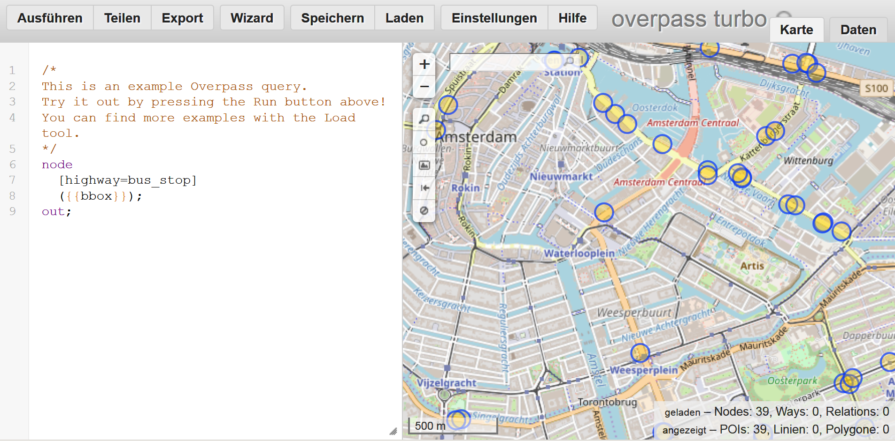
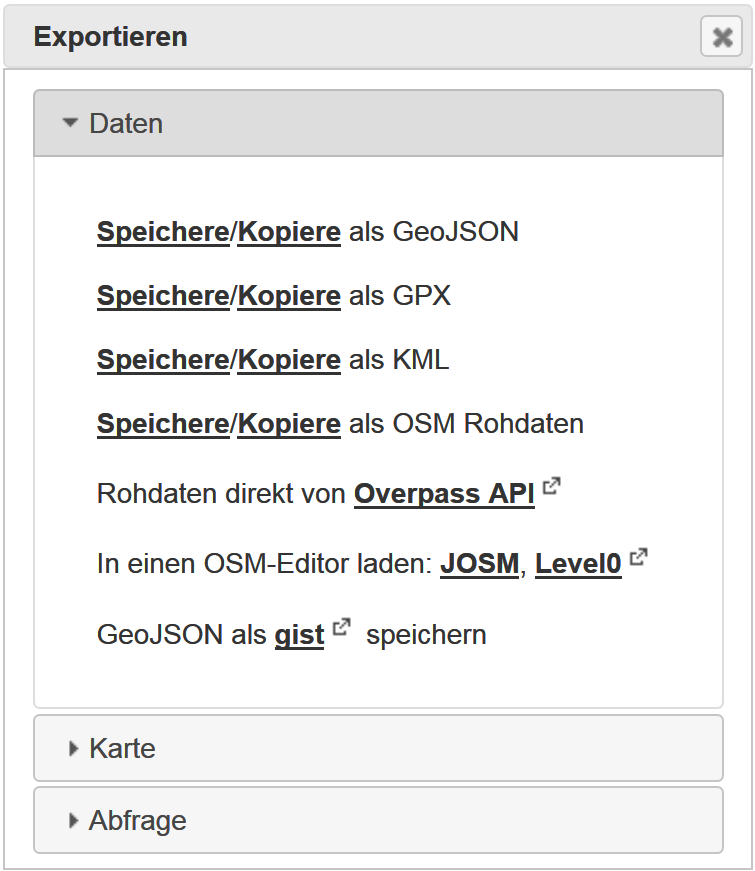
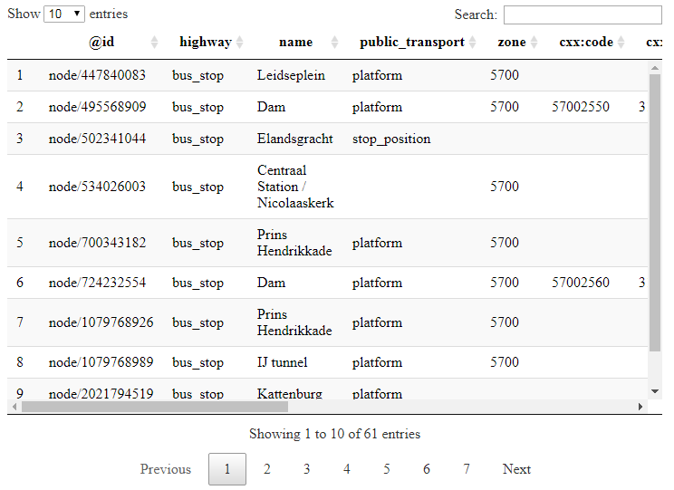

```{r setup, include=FALSE}
knitr::opts_chunk$set(echo = TRUE)
library(knitr)
```

## Themen dieses Abschnitts

- Die [**Overpass API**](https://wiki.openstreetmap.org/wiki/Overpass_API) von Roland Olbricht wird vorgestellt.
- Die API [**Overpass Turbo**](https://overpass-turbo.eu/)
- Wie man die OSM Daten graphisch darstellen kann.


## Die Overpass API

<!--
This API is perfect to download data on very particular topics.

Wenn man beispielsweise nach speziellen Map Features sucht.
-->

- Die von Roland Olbricht geschriebene Overpass API ermöglicht es Entwicklern, kleine Auszüge von benutzergenerierten Inhalten von Openstreetmap nach vorgegebenen Kriterien herunterzuladen.
- Overpass ist eine read-only API, die durch den Benutzer ausgewählte Teile der OSM-Daten bereitstellt. 
- Overpass kann als eine Datenbank über das Internet verstanden werden.
- Die API eignet sich besonders gut, wenn man nach ganz speziellen Map Features sucht. 

<!--
Overpass is a read-only API that provides custom selected parts of the OSM data. 
It can be understood as a database over the web, it uses the fact that OSM is enriched with additional information ranging from city names to e.g. locations of street lamps or energy generators \citep{schmidt2013extraction}.
If it is the target, to get all bus stops in Amsterdam, then it is possible to download the information from Overpass Turbo (\url{https://overpass-turbo.eu/}), using the key highway and the value bus\_stop.
-->


## [Overpass Turbo](https://overpass-turbo.eu/)




## Query Overpass

- In der folgenden Abfrage wird bei Overpass Turbo nach Bars im ausgewählten Fenster gesucht. 

```
node
  [amenity=bar]
  ({{bbox}});
out;
```

## Export bei Overpass




## Speicherformate 

### Bei Export von Overpass

- GeoJSON
- GPX
- KML
- OSM Rohdaten

## Import von Daten

```{r}
library(XML)
dat <- xmlParse("../data/bus_stop_amsterdam.kml")
```

```{r}
xmltop <- xmlRoot(dat)
xmltop[[1]][[1]]
```

## Xpath Abfragesprache

### Beispiel: [xpath wikipedia](https://de.wikipedia.org/wiki/XPath)


```{r,echo=T}
xpathApply(dat,"Document")
```


## JSON importieren


```{r,eval=F}
install.packages("rjson")
library(rjson)
```

```{r}
library(jsonlite)
dat<-jsonlite::fromJSON("../data/amsterdam_busstop.geojson")
typeof(dat)
names(dat)
```

## Wie sehen die Daten aus


```{r,echo=F,eval=F}
kable(dat$features$properties[1:10,c(1,3:5)])
```

```{r,eval=F}
DT::datatable(dat$features$properties)
```



## GPX file importieren

```{r import_gpx, eval=FALSE, message=FALSE, warning=FALSE, include=FALSE}
install.packages("plotKML")
```

```{r}
library(plotKML)
dat_gpx <- readGPX("../data/Amsterdam_busstop.gpx")
head(dat_gpx$waypoints)
```

