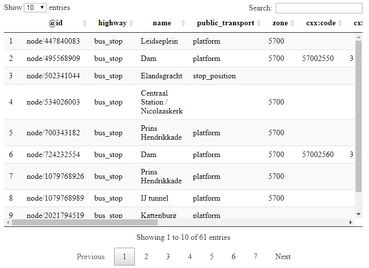
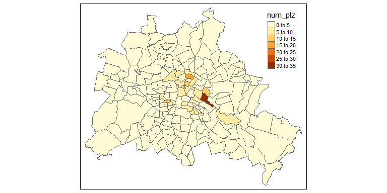
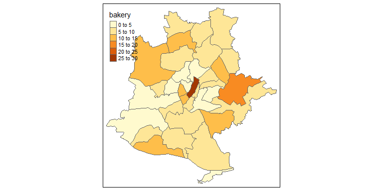

## Themen dieses Abschnitts

- Die [**Overpass API**](https://wiki.openstreetmap.org/wiki/Overpass_API) von Roland Olbricht wird vorgestellt.
- Die API [**Overpass Turbo**](https://overpass-turbo.eu/)
- Wie man die OSM Daten graphisch darstellen kann.


## Die Overpass API

<!--
This API is perfect to download data on very particular topics.

Wenn man beispielsweise nach speziellen Map Features sucht.
-->

- Die von Roland Olbricht geschriebene Overpass API ermöglicht es Entwicklern, kleine Auszüge von benutzergenerierten Inhalten von Openstreetmap nach vorgegebenen Kriterien herunterzuladen.
- Overpass ist eine read-only API, die durch den Benutzer ausgewählte Teile der OSM-Daten bereitstellt. 
- Overpass kann als eine Datenbank über das Internet verstanden werden.
- Die API eignet sich besonders gut, wenn man nach ganz speziellen Map Features sucht. 

<!--
Overpass is a read-only API that provides custom selected parts of the OSM data. 
It can be understood as a database over the web, it uses the fact that OSM is enriched with additional information ranging from city names to e.g. locations of street lamps or energy generators \citep{schmidt2013extraction}.
If it is the target, to get all bus stops in Amsterdam, then it is possible to download the information from Overpass Turbo (\url{https://overpass-turbo.eu/}), using the key highway and the value bus\_stop.
-->


## [Overpass Turbo](https://overpass-turbo.eu/)


## Query Overpass

- In der folgenden Abfrage wird bei Overpass Turbo nach Bars im ausgewählten Fenster gesucht. 

```
node
  [amenity=bar]
  ({{bbox}});
out;
```

## Export bei Overpass


## Speicherformate 

### Bei Export von Overpass

- GeoJSON
- GPX
- KML
- OSM Rohdaten

## Import von Daten


```r
library(XML)
dat <- xmlParse("../data/bus_stop_amsterdam.kml")
```


```r
xmltop <- xmlRoot(dat)
xmltop[[1]][[1]]
```

```
## <name>overpass-turbo.eu export</name>
```

## Xpath Abfragesprache

### Beispiel: [xpath wikipedia](https://de.wikipedia.org/wiki/XPath)


```r
xpathApply(dat,"Document")
```

```
## list()
## attr(,"class")
## [1] "XMLNodeSet"
```


## JSON importieren


```r
install.packages("rjson")
library(rjson)
```


```r
library(jsonlite)
dat<-jsonlite::fromJSON("../data/amsterdam_busstop.geojson")
typeof(dat)
```

```
## [1] "list"
```

```r
names(dat)
```

```
## [1] "type"      "generator" "copyright" "timestamp" "features"
```

## Wie sehen die Daten aus


```r
DT::datatable(dat$features$properties)
```



## GPX file importieren


```r
library(plotKML)
```

```
## plotKML version 0.5-8 (2017-05-12)
```

```
## URL: http://plotkml.r-forge.r-project.org/
```

```r
dat_gpx <- readGPX("../data/Amsterdam_busstop.gpx")
head(dat_gpx$waypoints)
```

```
##        lon      lat                            name
## 1 4.880870 52.36213                     Leidseplein
## 2 4.891237 52.37438                             Dam
## 3 4.877558 52.36953                    Elandsgracht
## 4 4.900331 52.37670 Centraal Station / Nicolaaskerk
## 5 4.905498 52.37395               Prins Hendrikkade
## 6 4.890181 52.37310                             Dam
##                                                                                                                            desc
## 1                                                      highway=bus_stop\nname=Leidseplein\npublic_transport=platform\nzone=5700
## 2                 cxx:code=57002550\ncxx:id=31843\nhighway=bus_stop\nname=Dam\npublic_transport=platform\nsource=CXX\nzone=5700
## 3                     bus=yes\nhighway=bus_stop\nname=Elandsgracht\npublic_transport=stop_position\nrailway=tram_stop\ntram=yes
## 4                            bench=yes\nbin=yes\nhighway=bus_stop\nname=Centraal Station / Nicolaaskerk\nshelter=yes\nzone=5700
## 5 bench=yes\nbin=yes\nhighway=bus_stop\nname=Prins Hendrikkade\noperator=GVB\npublic_transport=platform\nshelter=yes\nzone=5700
## 6        bus=yes\ncxx:code=57002560\ncxx:id=31844\nhighway=bus_stop\nname=Dam\npublic_transport=platform\nsource=CXX\nzone=5700
##   link
## 1     
## 2     
## 3     
## 4     
## 5     
## 6
```


## Daten verbinden - Beispiel Bäckereien in Berlin

- Quelle für die folgenden Daten ist: 


<!--
http://wiki.openstreetmap.org/wiki/DE:Datenherkunft_richtig_angeben
-->

## OSM als Datenquelle

- Zum Download habe ich die [**Overpass API**](http://wiki.openstreetmap.org/wiki/Overpass_API) verwendet


```r
load("../data/info_bar_Berlin.RData")
```


            addr.postcode   addr.street            name                       lat        lon
----------  --------------  ---------------------  -------------------  ---------  ---------
79675952    13405           Scharnweberstraße     Albert's              52.56382   13.32885
86005430    NA              NA                     Newton Bar            52.51293   13.39123
111644760   NA              NA                     No Limit Shishabar    52.56556   13.32093
149607257   NA              NA                     en passant            52.54420   13.41298
248651127   10115           Bergstraße            Z-Bar                 52.52953   13.39564
267780050   10405           Christburger Straße   Immertreu             52.53637   13.42509


## Verwendung des Pakets `gosmd`


```r
devtools::install_github("Japhilko/gosmd")
```


```r
library("gosmd")
pg_MA <- get_osm_nodes(object="leisure=playground","Mannheim")
pg_MA <- extract_osm_nodes(pg_MA,value='playground')
```


## Matching


```r
tab_plz <- table(info_be$addr.postcode)
```


```r
load("../data/BE.RData")
```


```r
ind <- match(BE@data$PLZ99_N,names(tab_plz))
ind
```

```
##   [1]  1  2  3  4  5  6  7  8 NA  9 NA NA NA NA NA 10 11 12 NA 13 14 15 16
##  [24] 17 18 19 20 21 22 23 24 25 NA 26 27 28 29 NA NA NA NA 30 NA 31 32 33
##  [47] 34 35 NA NA 36 37 38 39 40 41 42 43 44 45 46 47 48 49 50 51 NA 52 53
##  [70] NA 54 55 NA NA NA 56 57 58 59 60 NA NA NA NA NA 61 NA NA NA 62 NA NA
##  [93] NA NA NA NA NA NA NA 63 NA NA 64 NA 65 NA NA NA 66 NA NA NA NA 67 NA
## [116] NA 68 NA NA NA NA NA NA NA NA NA NA NA NA NA NA NA NA NA NA NA NA NA
## [139] NA 69 70 NA 71 72 73 74 75 NA 76 NA NA NA NA NA NA NA NA NA NA NA NA
## [162] 77 NA 78 79 NA NA NA NA 80 NA NA NA NA 81 NA 82 83 84 NA NA NA NA NA
## [185] NA NA NA 85 NA NA
```

## Daten anspielen


```r
BE@data$num_plz <- tab_plz[ind]
```


## Eine Karte von Berlin mit dem Paket `tmap`


```r
BE@data$num_plz[is.na(BE@data$num_plz)] <- 0
tmap::qtm(BE,fill = "num_plz")
```

```
## Linking to GEOS 3.6.1, GDAL 2.2.3, proj.4 4.9.3
```

<!-- -->

## Mehr Informationen einbinden

- Der folgende Datensatz ist eine Kombination aus den vorgestellten PLZ-Shapefiles und OSM-Daten die über Overpass heruntergeladen wurden:


```r
load("../data/osmsa_PLZ_14.RData")
```


## OSM-Daten - Bäckereien in Stuttgart


```r
tmap::qtm(PLZ_SG,fill="bakery")
```

<!-- -->


## [Das R-Paket `RDSTK`](http://www.datasciencetoolkit.org/)


- Data Science Toolkit API


```r
library("RDSTK")
```

## Die Daten für Stuttgart


Type_landcover                              Freq
-----------------------------------------  -----
Artificial surfaces and associated areas      26
Cultivated and managed areas                   8
Tree Cover, needle-leaved, evergreen           1


## Eine Karte der Flächenbedeckung erstellen

- Daten von [European Commission Land Resource Management Unit Global Land Cover 2000.](http://bioval.jrc.ec.europa.eu/products/glc2000/products.php)


```r
tmap::qtm(PLZ_SG,fill="land_cover.value")
```

```
## Legend labels were too wide. The labels have been resized to 0.41, 0.52, 0.43. Increase legend.width (argument of tm_layout) to make the legend wider and therefore the labels larger.
```

<!-- -->

## Die Höhe in Stuttgart

- Daten von [**NASA and the CGIAR Consortium for Spatial Information **](http://srtm.csi.cgiar.org/)


```r
tmap::qtm(PLZ_SG,fill="elevation.value")
```

<!-- -->

<!--
man könnte hier noch zeigen, wie man einen Punkt hinzufügen kann
-->
