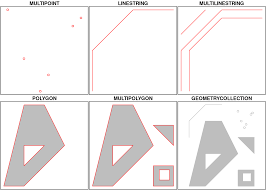
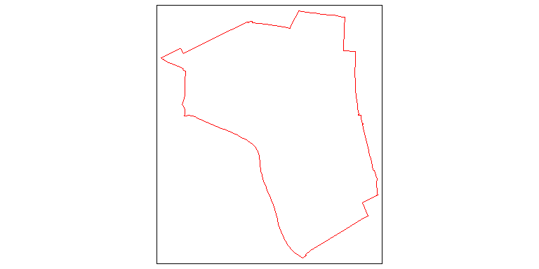
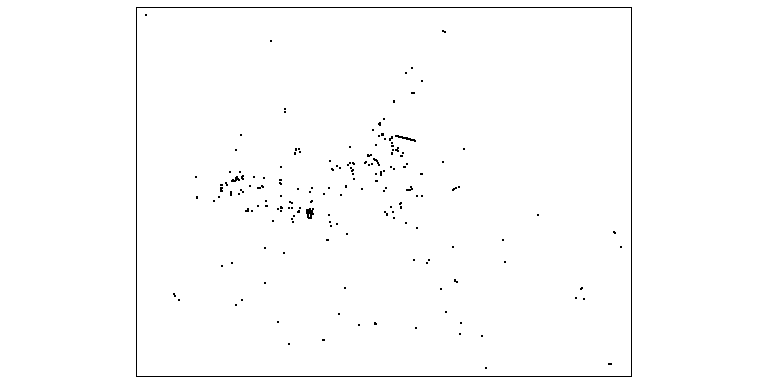

## Themen dieses Abschnitts

- Das R-Paket `osmdata` mit dem man OSM-Daten herunterladen kann und das auf der [**Overpass API**](https://wiki.openstreetmap.org/wiki/Overpass_API) beruht. 

- Das Paket `osmplotr`


## [Das `osmdata` Paket](https://github.com/ropensci/osmdata)


> Mark Padgham - Import 'OpenStreetMap' Data as Simple Features or Spatial
        Objects

## Das `osmdata` Paket

- Mit dem Paket kann man Daten von OpenStreetMap importieren
- Die OSM Daten sind unter [**ODbL licence**](https://www.openstreetmap.org/copyright) zu haben 


```r
install.packages("osmdata")
```


```r
library(osmdata)
```


```r
citation("osmdata")
```


## Das Paket `osmplotr`


```r
library("osmplotr")
library("osmdata")
```

## Beispiel Kindergärten in Mannheim


```r
bbox <- getbb("Mannheim")
dat_osm <- extract_osm_objects(key='building', 
                              value="kindergarten",
                              bbox=bbox)
```


## Einen Rahmen definieren um Daten zu bekommen

- Der Rahmen kann entweder erstellt werden, indem die Koordinaten angegeben werden:


```r
q <- opq(bbox = c(52.3, 4.7, 52.4, 5.1))
```

- oder indem man den Befehl `getbb` verwendet:


```r
bb <- getbb('Ladenburg')
```

- In `bb` sind nun vier Werte gespeichert, die den Rahmen definieren

- Befehl `opq` - eine Overpass Anfrage erstellen


```r
q <- opq(bbox = bb)
```

<!--
- Als Ergebnis bekommt man aber noch keine Daten
-->

## Die Grenze von Mannheim 

- Erst mit dem Argument `format_out=polygon` Befehl `getbb` erhält man das Polygon:


```r
bb_poly <- getbb(place_name = "Ladenburg", 
                 format_out = "polygon")
```

- Das Ergebnis ist sind zwei Vektoren mit den Longitude und Latitude Koordinaten.


```
##          [,1]     [,2]
## [1,] 8.569720 49.49107
## [2,] 8.569858 49.49101
## [3,] 8.569999 49.49096
## [4,] 8.570342 49.49085
```


## Das Paket für simple feature (`sf`) 

> Simple Features for R

- Das Paket `sf` ist ein Paket um geometrische Operationen durchzuführen. 


```r
library(sf)
```

- [**Vignette für das Paket `sf`**](https://cran.r-project.org/web/packages/sf/vignettes/sf3.html)



## Die Funktion `st_linestring`

> Create simple feature from a numeric vector, matrix or list


```r
library(sf)
ls <- st_linestring(bb_poly)
sfc <- st_sfc(ls)
```


## Den `linestring` plotten


```r
library(tmap)
qtm(sfc)
```

<!-- -->


## Einrichtungen (amenity)


### [**OSM map features**](https://wiki.openstreetmap.org/wiki/Map_Features)

- Alle benannten Objekte findet man, wenn man OSM map features in eine Suchmaschine eingibt. 

- Achtung, wenn man bspw. alle Objekte mit dem Schlüssel `amenity` für eine Stadt heraussucht, bekommt man einen recht großen Datensatz


```r
q <- add_osm_feature (q, key = 'amenity')
osmdata_xml(q, '../data/Ladenburg_amenity.osm')
```


## Was dahinter steckt


```r
dat <- sf::st_read ('../data/Ladenburg_amenity.osm', 
                    layer = 'points', 
                    quiet = TRUE)
```


```r
nrow(dat)
?osmdata_sf
```

## Die Funktion `osmdata_sf`

- Die Funktion `osmdata_sf` gibt ein `osmdata` ObjeKt im `sf` Format.


```r
library(magrittr)
dat1 <- opq(bbox = 'Ladenburg') %>%
    add_osm_feature(key = 'shop', value = 'bakery') %>%
    osmdata_sf ()
```


```r
unlist(lapply(dat1,nrow))
```

```
##        osm_points         osm_lines      osm_polygons    osm_multilines 
##                16                 0                 0                 0 
## osm_multipolygons 
##                 0
```

## Alles in eine Karte plotten

### [**Der Start mit dem Paket `tmap`](https://cran.r-project.org/web/packages/tmap/vignettes/tmap-getstarted.html)


```r
library(tmap)
tm_shape(sfc) 
tm_bubbles(dat, size=2)
```


## Beispiel Fahrradparkplätze

- [**OSM map features**](https://wiki.openstreetmap.org/wiki/Map_Features#Highway)


```r
q <- add_osm_feature (q, key = 'amenity',value = "bicycle_parking")
osmdata_xml(q, '../data/Amsterdam_amenity_bicycle_parking.osm')
```


```r
dat <- sf::st_read ('../data/Amsterdam_amenity_bicycle_parking.osm', 
                    layer = 'points', 
                    quiet = TRUE)
```

## Die Daten plotten


```r
library(tmap)
qtm(dat)
```

<!-- -->


## Sehen was dahinter steckt


```r
dat <- sf::st_read ('../data/Amsterdam_amenity.osm', 
                    layer = 'points', 
                    quiet = TRUE)
```


```r
nrow(dat)
names(dat)
```

## Bar`s in Mannheim


```r
?add_osm_feature
```


```r
q <- opq (bbox = 'Mannheim')
q <- add_osm_feature (q, key ="amenity",value = 'bar') 
osmdata_xml (q, 'data/Mannheim_bar.osm')
```


```r
dat_bar <- sf::st_read ('../data/Mannheim_bar.osm', 
                        layer = 'points', quiet = TRUE)
```

## Bus stations in Amsterdam


```r
q <- opq (bbox = 'Amsterdam')
q <- add_osm_feature (q, key ="amenity",
                      value = 'bus_station') 
osmdata_xml (q, 'data/Amsterdam_bus_station.osm')
```


```r
dat_bus <- sf::st_read ('../data/Amsterdam_bus_station.osm', 
                        layer = 'points', quiet = TRUE)
nrow(dat_bus)
```


```r
?sf::st_read
```


## An alternative

- [Main vignette `osmdata`](https://github.com/ropensci/osmdata/blob/master/vignettes/osmdata.Rmd)
- [OpenStreetMap Data Structure](https://cran.r-project.org/web/packages/osmdata/vignettes/osm-sf-translation.html)


```r
q <- opq (bbox = 'Amsterdam')
q <- add_osm_feature (q, key ="public_transport",
                      value = 'station') 
osmdata_xml (q, '../data/Amsterdam_bus_pubtrans.osm')
```


```r
dat_bus <- sf::st_read ('../data/Amsterdam_bus_pubtrans.osm', 
                        layer = 'points', quiet = TRUE)
nrow(dat_bus)
```

<!--
als layer getestet: area, polygon
-->

## Further information about public transport

### Stop area


<!--
dat_stoparea <- sf::st_read('data/Amsterdam_pubtrans_stoparea.osm', layer = 'points', quiet = TRUE)
-->


```r
dat3 <- opq(bbox = 'Amsterdam') %>%
    add_osm_feature(key = 'railway', 
                    value = 'tram_stop') %>%
    osmdata_sf ()
```


```r
dat3$osm_points$geometry
```

## Das Ergebnis graphisch darstellen


```r
# install.packages("osmplotr")
library("osmplotr")
bbox <- getbb("Amsterdam")
dat_pa <- extract_osm_objects(key='highway', 
                              value="primary",
                              bbox=bbox)
dat_sa <- extract_osm_objects(key='highway', 
                              value="secondary",
                              bbox=bbox)
dat_ta <- extract_osm_objects(key='highway', 
                              value="tertiary",
                              bbox=bbox)
```


## Die Graphik erzeugen


```r
map <- osm_basemap(bbox = bbox, bg = c("#F5F5DC"))
map <- add_osm_objects(map, dat_pa, col = c("#00008B"))
map <- add_osm_objects(map, dat_sa, col = "green")
map <- add_osm_objects(map, dat_ta, col = "lightblue")
map <- add_osm_objects(map, dat3$osm_points, col = c("red"))
print_osm_map(map)
```

<!--

-->

## Get an overview of the available features


```r
features <- available_features()
head(features,n=20)
```

```
##  [1] "4wd only"                "abandoned"              
##  [3] "abutters"                "access"                 
##  [5] "addr"                    "addr:city"              
##  [7] "addr:conscriptionnumber" "addr:country"           
##  [9] "addr:district"           "addr:flats"             
## [11] "addr:full"               "addr:hamlet"            
## [13] "addr:housename"          "addr:housenumber"       
## [15] "addr:inclusion"          "addr:interpolation"     
## [17] "addr:place"              "addr:postcode"          
## [19] "addr:province"           "addr:state"
```


## [Changing the API](https://github.com/ropensci/osmdata/issues/126)


```r
api_list <- c('http://overpass-api.de/api/interpreter',
              'https://lz4.overpass-api.de/api/interpreter',
              'https://z.overpass-api.de/api/interpreter',
              'https://overpass.kumi.systems/api/interpreter')

api_to_use <- sample(1:length(api_list), 1)

set_overpass_url(api_list[api_to_use]) 
```


## Die wichtigsten Funktionen im Paket `osmdata`


```r
# https://rdrr.io/cran/osmdata/man/osmdata_sp.html
?osmdata_sp
```


## Links

- [**Github Ordner für das `osmdata` Paket**](https://github.com/ropensci/osmdata)
- [**Vignette für das Paket `osmdata`**](https://cran.r-project.org/web/packages/osmdata/vignettes/osmdata.html) auf [**github**](https://github.com/ropensci/osmdata/blob/master/vignettes/osmdata.Rmd)
- [**osmdata Homepage**](https://ropensci.github.io/osmdata/)
- [**Overpass API - query form**](http://overpass-api.de/query_form.html)
- [**Overpass API/Language Guide**](https://wiki.openstreetmap.org/wiki/DE:Overpass_API/Language_Guide)
- [**Overpass Turbo**](https://wiki.openstreetmap.org/wiki/DE:Overpass_turbo)
<!--
https://cran.r-project.org/web/packages/osmdata/osmdata.pdf
-->


- [**`osmplotr` tutorial**](https://ropensci.org/tutorials/osmplotr_tutorial/)

- [**Geocomputation with R**](https://bookdown.org/robinlovelace/geocompr/)

- [**osmar - JOS**](https://www.theoj.org/joss-papers/joss.00305/10.21105.joss.00305.pdf)


<!--
https://www.r-bloggers.com/how-to-quickly-enrich-a-map-with-natural-and-anthropic-details/
https://www.maths.lancs.ac.uk/~rowlings/Teaching/UseR2012/introduction2Talk.html
https://geostat-course.org/aggregator/sources/3?page=1
https://gis.stackexchange.com/questions/115911/converting-osm-file-to-shapefile-or-data-frame-in-r
https://forum.osm.org/viewtopic.php?id=53336
https://hub.docker.com/r/robinlovelace/geocompr/

https://gis.stackexchange.com/questions/264380/getting-buildings-that-house-specific-amenities-using-r
-->


