## Themen dieses Abschnitts

- Der Import von Geodaten mit dem Paket simple features (`sf`).
- Die Verarbeitung der OSM-Daten mit dem Paket `sf`.
- Die Daten visualisieren mit `sf`


## Das Paket `sf`

> Simple Features for R 


```r
library(sf)
```

```
## Linking to GEOS 3.6.1, GDAL 2.2.3, proj.4 4.9.3
```

- Ein Demo ist im Paket `sf` integriert


```r
demo(sf::affine)
```


## [Shapefiles mit `sf` importieren](https://cran.r-project.org/web/packages/sf/vignettes/sf2.html)


```r
st_layers("../data/london_sport.shp")
```

```
## Driver: ESRI Shapefile 
## Available layers:
##     layer_name geometry_type features fields
## 1 london_sport       Polygon       33      4
```

```r
london <- st_read("../data/london_sport.shp")
```

```
## Reading layer `london_sport' from data source `D:\github\geocourse\data\london_sport.shp' using driver `ESRI Shapefile'
## Simple feature collection with 33 features and 4 fields
## geometry type:  POLYGON
## dimension:      XY
## bbox:           xmin: 503571.2 ymin: 155850.8 xmax: 561941.1 ymax: 200932.5
## epsg (SRID):    NA
## proj4string:    +proj=tmerc +lat_0=49 +lon_0=-2 +k=0.9996012717 +x_0=400000 +y_0=-100000 +ellps=airy +units=m +no_defs
```

## Das Shapefile plotten


```r
plot(london$geometry)
```

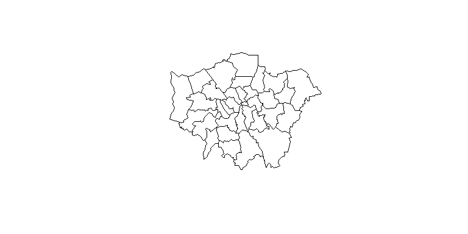<!-- -->


<!--
https://www.r-spatial.org/r/2018/01/08/sf-0.6-0.html
-->


## [Graphiken mit `sf`](https://r-spatial.github.io/sf/articles/sf5.html)


```r
plot(london)
```

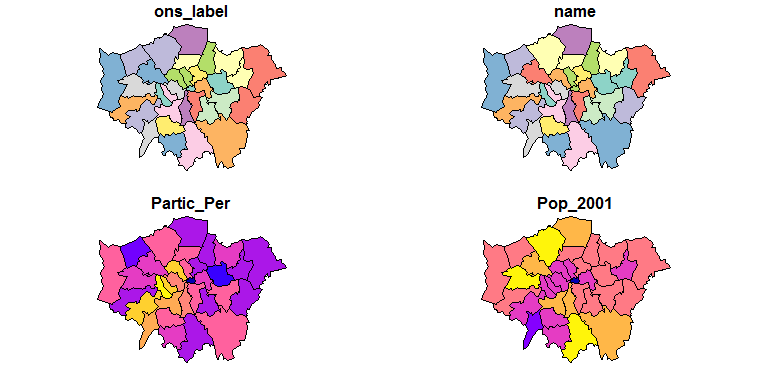<!-- -->

## Die Hilfe für die Funktion plot im `sf` Paket 


```r
?plot
```

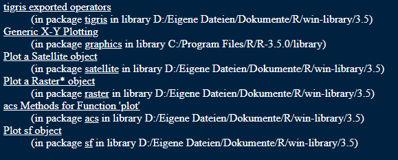


## Der `london` shapefile als Beispiel


```r
head(london)
```

```
## Simple feature collection with 6 features and 4 fields
## geometry type:  POLYGON
## dimension:      XY
## bbox:           xmin: 503571.2 ymin: 156480.8 xmax: 561941.1 ymax: 194889.3
## epsg (SRID):    NA
## proj4string:    +proj=tmerc +lat_0=49 +lon_0=-2 +k=0.9996012717 +x_0=400000 +y_0=-100000 +ellps=airy +units=m +no_defs
##   ons_label                 name Partic_Per Pop_2001
## 1      00AF              Bromley       21.7   295535
## 2      00BD Richmond upon Thames       26.6   172330
## 3      00AS           Hillingdon       21.5   243006
## 4      00AR             Havering       17.9   224262
## 5      00AX Kingston upon Thames       24.4   147271
## 6      00BF               Sutton       19.3   179767
##                         geometry
## 1 POLYGON ((541177.7 173555.7...
## 2 POLYGON ((522957.6 178071.3...
## 3 POLYGON ((505114.9 184625.1...
## 4 POLYGON ((552108.3 194151.8...
## 5 POLYGON ((519370.8 163657.4...
## 6 POLYGON ((525554.3 166815.8...
```

## Die Farben verändern


```r
plot(london,col=1:20)
```

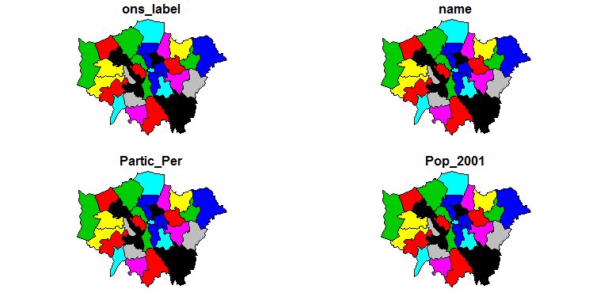<!-- -->

## Nur eine Karte 

### Beispiel Bevölkerung in London`s Stadtteilen


```r
london2 <- london[,-(1:3)]
plot(london2)
```

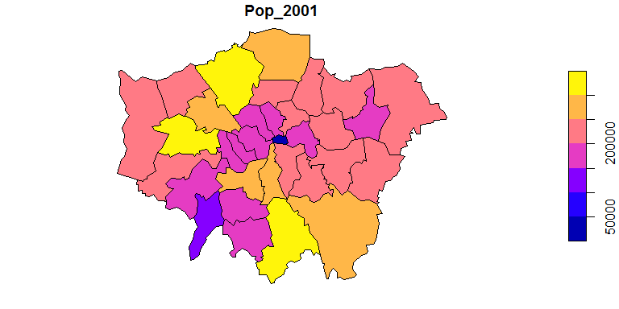<!-- -->


## Das Paket `colorRamps`verwenden

### Cheatsheet zum Thema [**Farbpaletten**](https://www.nceas.ucsb.edu/~frazier/RSpatialGuides/colorPaletteCheatsheet.pdf)


```r
library("colorRamps")
plot(london2,col=blue2yellow(10))
```

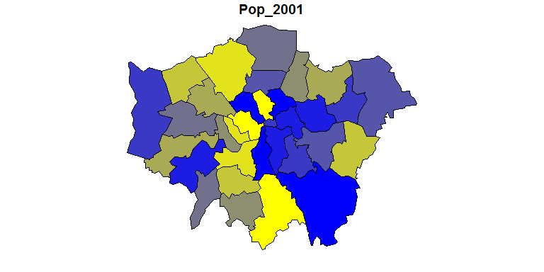<!-- -->


## Beispieldaten bekommen

<!--
https://cran.r-project.org/web/packages/sf/vignettes/sf1.html
-->


```r
library(osmdata)
```

```
## Data (c) OpenStreetMap contributors, ODbL 1.0. http://www.openstreetmap.org/copyright
```

```r
bb_poly <- getbb(place_name = "Amsterdam", 
                 format_out = "polygon")
```


```r
ls <- st_multilinestring(bb_poly)
```


```r
pol <- sf::st_polygon(bb_poly)
class(pol)
```

```
## [1] "XY"      "POLYGON" "sfg"
```


```r
bb_poly_ma<-getbb(place_name="Mannheim",format_out="polygon")
```

## Das Ergebnis plotten


```r
plot(bb_poly_ma,type="l")
```

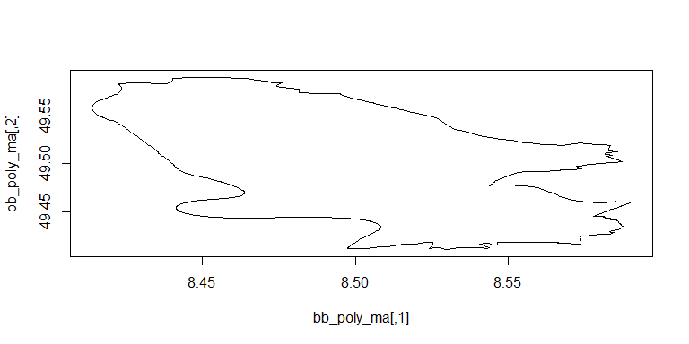<!-- -->

<!--
## Das Beispiel Heidelberg


```r
bb_poly_hd <- getbb(place_name = "Heidelberg", 
                 format_out = "polygon")
```
-->


<!--
Problem ist, dass man nichts sieht, wenn man das plottet

# folgendes funktioniert nicht
-->


## Eine `.osm` Datei importieren

- In einer `.osm` Datei sind verschiedene Layer vorhanden.
- Mit `st_layers` kann man sich anzeigen lassen, welche das sind. 


```r
st_layers("../data/ams_centraal.osm")
```

```
## Driver: OSM 
## Available layers:
##         layer_name       geometry_type features fields
## 1           points               Point       NA     10
## 2            lines         Line String       NA      9
## 3 multilinestrings   Multi Line String       NA      4
## 4    multipolygons       Multi Polygon       NA     25
## 5  other_relations Geometry Collection       NA      4
```


## Daten vom Amsterdam Beispiel

- Mit der Funktion `st_read` kann der gewünschte Layer importiert werden.


```r
datm <- st_read("../data/ams_centraal.osm","multipolygons")
```

```
## Reading layer `multipolygons' from data source `D:\github\geocourse\data\ams_centraal.osm' using driver `OSM'
## Simple feature collection with 2796 features and 25 fields
## geometry type:  MULTIPOLYGON
## dimension:      XY
## bbox:           xmin: 4.874776 ymin: 52.36088 xmax: 4.929755 ymax: 52.39393
## epsg (SRID):    4326
## proj4string:    +proj=longlat +datum=WGS84 +no_defs
```


## [Die Funktion `st_geometry`](https://cran.r-project.org/web/packages/sf/vignettes/sf3.html)

> Get, set, or replace geometry from an sf object


```r
?st_geometry
```


```r
geom_datm <- st_geometry(datm)
plot(geom_datm)
```

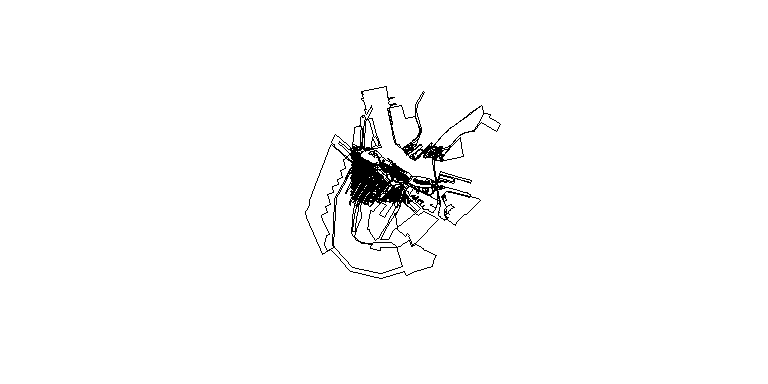<!-- -->


## Die Häuser auswählen


```r
library(dplyr)
buis <- datm %>% select(building)
plot(buis)
```

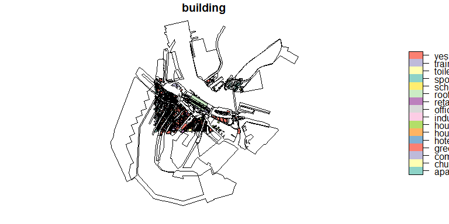<!-- -->

## Welche Häusertypen gibt es?


```r
buis2 <- datm %>% as.data.frame %>% select(building)
```


```r
datbuis <- datm[, "building", drop = TRUE]
plot(datbuis)
```

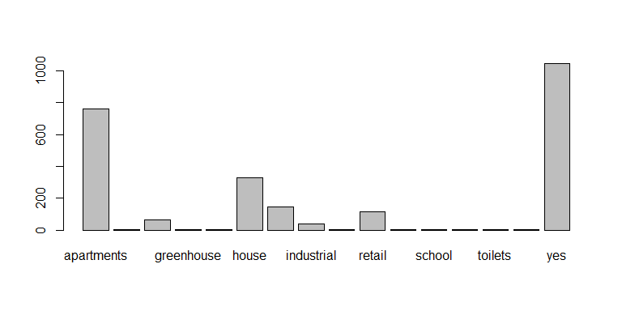<!-- -->

<!--
##


```r
houses <- datm[datm$building == "house",]
class(houses)
```

```
## [1] "sf"         "data.frame"
```

```r
## [1] "sf"         "data.frame"
dhous <- datm[houses,]
```

```
## although coordinates are longitude/latitude, st_intersects assumes that they are planar
```

```r
plot(dhous$geometry)
```

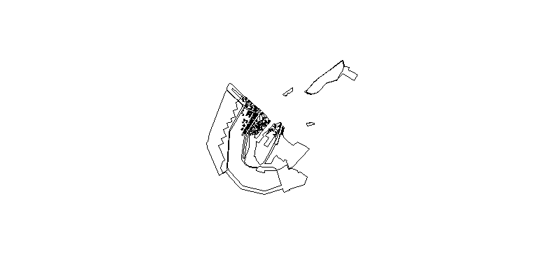<!-- -->


```r
plot(st_geometry(houses))
```

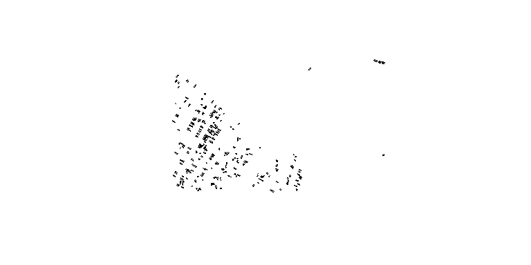<!-- -->
-->

## [Alle Häuser herausnehmen](https://cran.r-project.org/web/packages/sf/vignettes/sf4.html)


```r
houses <- datm[datm$building %in% c("house","yes",
                                    "apartments"),]
```

- Im ersten Teil des Objekts sind allgemeine Informationen zum Geometrietyp, zur Bounding Box und zum EPSG Code enthalten. 

```
Simple feature collection with 2131 features and 25 fields
geometry type:  MULTIPOLYGON
dimension:      XY
bbox:           xmin: 4.887275 ymin: 52.37334 xmax: 4.91342 ymax: 52.38366
epsg (SRID):    4326
proj4string:    +proj=longlat +datum=WGS84 +no_defs
```

## Zweiter Teil des Objekts `houses`

- Im zweiten Teil sind dann spezifische Informationen zu den einzelnen Features aufgelistet. 
- Es handelt sich beispielsweise um die OSM id und in der letzten Spalte die Geometrie, die wir später zum visualisieren brauchen. 

```
    osm_id osm_way_id name         type    building craft
5  3580102       <NA> <NA> multipolygon  apartments  <NA>
6  3580414       <NA> <NA> multipolygon         yes  <NA>
7  3580416       <NA> <NA> multipolygon  apartments  <NA>
8  3580417       <NA> <NA> multipolygon  apartments  <NA>
9  3580420       <NA> <NA> multipolygon  apartments  <NA>
10 3580421       <NA> <NA> multipolygon  apartments  <NA>
11 3580422       <NA> <NA> multipolygon  apartments  <NA>
12 3580423       <NA> <NA> multipolygon  apartments  <NA>
13 3580427       <NA> <NA> multipolygon  apartments  <NA>
14 3580428       <NA> <NA> multipolygon       house  <NA>
```


## Das Objekt `houses` transformieren


```r
class(houses)
```

```
## [1] "sf"         "data.frame"
```

```r
class(st_geometry(houses))
```

```
## [1] "sfc_MULTIPOLYGON" "sfc"
```

## Das Ergebnis visualisieren


```r
library(tmap)
(map1 <- qtm(st_geometry(houses)))
```

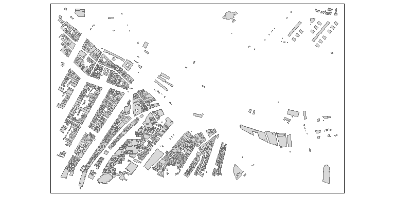<!-- -->


## Wohnstraßen hinzufügen


```r
datl <- st_read("../data/ams_centraal.osm","lines")
```

```
## Reading layer `lines' from data source `D:\github\geocourse\data\ams_centraal.osm' using driver `OSM'
## Simple feature collection with 2372 features and 9 fields
## geometry type:  LINESTRING
## dimension:      XY
## bbox:           xmin: 4.826049 ymin: 52.33891 xmax: 4.95717 ymax: 52.43813
## epsg (SRID):    4326
## proj4string:    +proj=longlat +datum=WGS84 +no_defs
```

```r
roads <- datl[datl$highway %in% c("residential"),]
```

## Der Straßen-Typ `residential`


```r
(map2 <- map1+qtm(st_geometry(roads),lines.col="purple"))
```

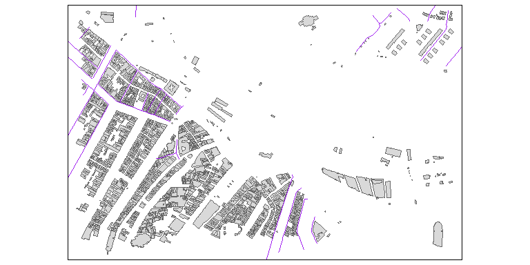<!-- -->

## Weitere Straßen hinzufügen


```r
roads2 <- datl[datl$highway %in% c("tertiary","secondary",
                                  "primary"),]
(map3 <- map2+qtm(st_geometry(roads2),lines.col="red"))
```

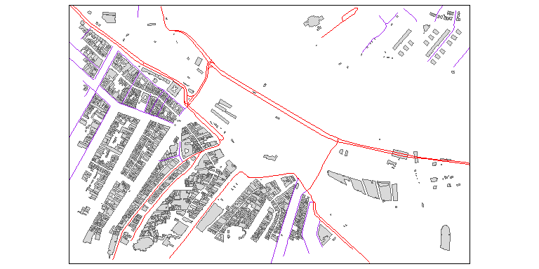<!-- -->


## Eine Demonstartion von sf 

### Beispieldatensatz `nc`


```r
demo(nc, ask = FALSE, echo = FALSE)
```

```
## Reading layer `nc.gpkg' from data source `D:\Eigene Dateien\Dokumente\R\win-library\3.5\sf\gpkg\nc.gpkg' using driver `GPKG'
## Simple feature collection with 100 features and 14 fields
## Attribute-geometry relationship: 0 constant, 8 aggregate, 6 identity
## geometry type:  MULTIPOLYGON
## dimension:      XY
## bbox:           xmin: -84.32385 ymin: 33.88199 xmax: -75.45698 ymax: 36.58965
## epsg (SRID):    4267
## proj4string:    +proj=longlat +datum=NAD27 +no_defs
```


## Die Vignetten für das Paket `sf`

https://r-spatial.github.io/sf/reference/st_as_sf.html

https://r-spatial.github.io/sf/reference/st_read.html

https://r-spatial.github.io/sf/articles/sf1.html
