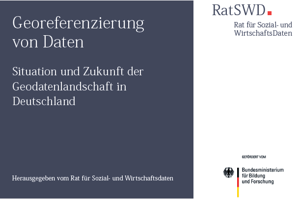
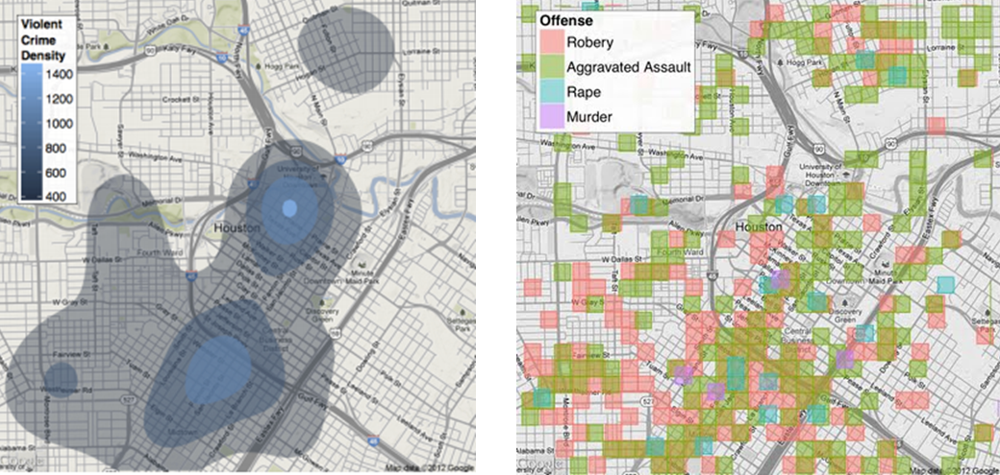
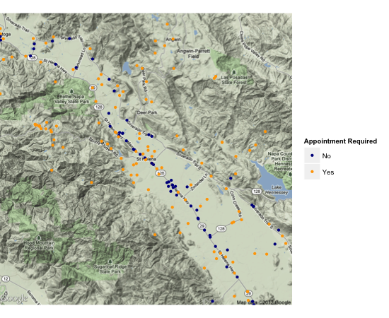
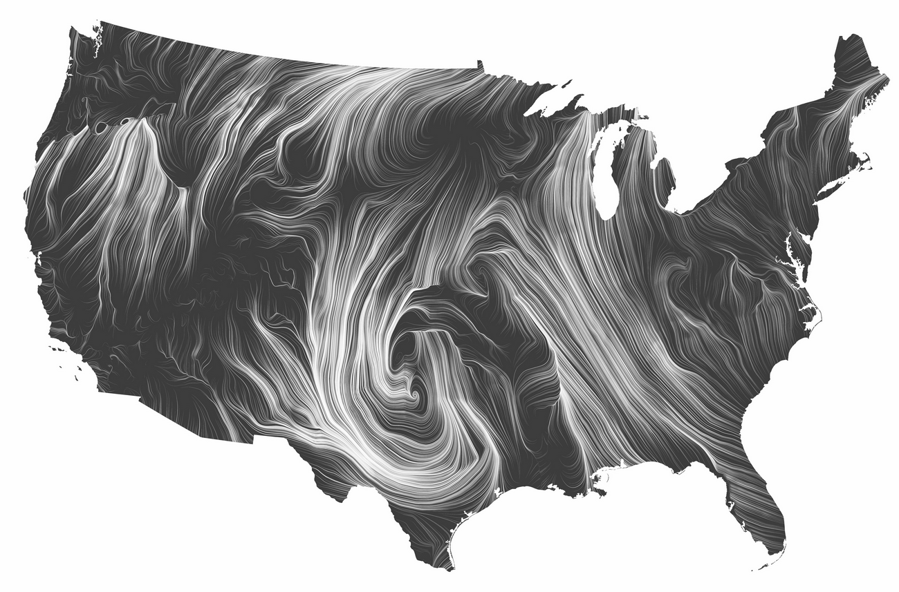

```{r setupIntro, include=FALSE}
knitr::opts_chunk$set(echo = TRUE,message=F,warning=F,cache=T)
```

## Das Thema Geodatenlandschaft


<!--
Background Maps - Download via Tile Servers
-->


<!--
## Inhalt dieses Abschnitts


Einerseits die Daten vorstellen, die vorhanden sind

Zensus, IÖR Daten

Andererseits neue Entwicklungen in R vorstellen

-->





## R-Pakete - Zum Download von Geo-Information

### [Das Paket `ggmap`](https://sites.google.com/site/davidkahle/ggmap)


- David Kahle and Hadley Wickham: `ggmap` - Spatial Visualization with `ggplot2`





## [Worum geht es?](http://blog.revolutionanalytics.com/2012/07/making-beautiful-maps-in-r-with-ggmap.html)


### Weine probieren im Napa Valley?





## Ziel dieses Kurses

### Vorgestellt werden:

- Möglichkeiten für den Download, den Import, die Verarbeitung und die Visualisierung von Geodaten 
<!--
Die Daten auf OSM werden unter der Open Database License (ODbL) 1.0 freigegeben. Das ermöglicht eine Mehrfachverwendung der Daten \citep{schmidt2013extraction}. Die Studie von \cite{barrington2017world} zeigt, dass die Datenqualität von OSM in vielen Ländern bereits ausreichend ist, um sie für wissenschaftliche und analytische Zwecke zu nutzen.
Siehe zum Beispiel das Projekt Simulation of Urban MObility (SUMO) (\citealt{behrisch2011sumo}). Viel mehr Forschung, die in verschiedenen Ländern durchgeführt wird, ist unter \cite{wiki:research} aufgeführt.
-->

- Quellen für Geodaten

- Die wichtigsten Programmierschnittstellen (APIs) um die Daten zu bekommen

- R-Pakete um diese Daten zu verarbeiten und zu visualisieren

## Motivation

### Motivation allgemein

- Raumbezug herstellen/nutzen
- Sekundäranalyse für bestehenden Daten 
- Analysepotentiale der Geokodierung vorstellen
- Verbindung von sozial- mit raumwissenschaftlichen Daten


### Motivation - Warum die Darstellung in Karten

- Darstellung in Karten ermöglicht besseres Verständnis von sozialwissenschaftlichen Phänomene - Attraktiver Output

- Durch die INSPIRE Richtlinie und *Collaborative Mapping* wächst der verfügbare Bestand an Geodaten.

- Daten sind oft frei verfügbar im Internet (z.B. Nutzung von APIs)
- Die Daten sind oft wenig oder gar nicht strukturiert, heterogen und oft nicht zur räumlichen Visualisierung vorgesehen, beinhalten aber implizit  geographische Informationen (Web 2.0)
- Oftmals sind wenig oder keine Metadaten vorhanden

## [Laws of Spatial Sience](http://de.slideshare.net/rheimann04/big-social-data-the-spatial-turn-in-big-data)

### [Tobler's law](https://en.wikipedia.org/wiki/Tobler's_first_law_of_geography)

> everything is related to everything else, but near things are more related than distant things.

### [Spatial Turn](https://de.wikipedia.org/wiki/Spatial_turn)

> Spatial turn is a term used to describe an intellectual movement that places emphasis on place and space in social science and the humanities.

<!--
[Englisches Wikipedia](https://en.wikipedia.org/wiki/Spatial_turn)
-->

<!--

## Regional/geographical differences in the perception of...

- ... measures to promote climatic change
- ... big infrastructure projects


## Nice output - example [Wind Map](http://hint.fm/wind/)

<http://hint.fm/wind/>

<!--

-->

<!--

-->

<!--
## Availability of data - Example Census Atlas
-->

## Ergebnisse des Zensus 2011 zum [**Download**](https://www.zensus2011.de/SharedDocs/Aktuelles/Ergebnisse/DemografischeGrunddaten.html?nn=3065474)

<!--
## Verfügbarkeit von Daten - Beispiel Zensus Atlas

<https://atlas.zensus2011.de/>
-->


### Gemeindeebene

- Bevölkerung nach Geschlecht, Altersgruppe, Familienstatus, Staatsangehörigkeit und Religion

###  1 $\text{km}^2$ Raster

- Bevölkerung, Leerstandsquote, Wohnfläche und Haushaltsgröße

###  100 $\text{m}^2$ Raster

Bevölkerung

## Zensus Ergebnisse

Beispiel Anteil der Personen aus EU27 Land an Einwohnerzahl pro
Gemeinde in Oberfranken


<!--
## Verfügbarkeit der Daten - Beispiel [Fahrradunfälle in Berlin](http://michael-hoerz.de/maps/berlin-bike/)

<http://www.sowirdberlin.de/>


-->

<!--
## Heterogener Datenbestand - Beispiel <http://names.mappinglondon.co.uk/>


-->

<!--
## Übersicht - [warum R](http://www.edureka.co/)


-->

<!--
## [R Nutzer rund um die Welt](http://blog.revolutionanalytics.com/)


## [Wo sind die aktivsten Nutzer?](http://spatial.ly/)


-->

## Openstreetmap Projekt


<!--
https://hal.inria.fr/hal-01852585/document
-->


<!--
## [Openstreetmap Daten](https://github.com/Japhilko/OSMshinyApp/)


-->


## Das Openstreetmap Projekt...

- Durch kollaboratives Mapping ist eine riesige Datenmenge zugänglich. 
- Viele Menschen tragen jeden Tag Informationen bei.
- ... ermöglicht Zugang zu Big Data der Geographie.
- Die wachsende Menge an Geodaten wird von Freiwilligen gesammelt oder über Crowd-sourcing gewonnen.


```{r,eval=F,echo=F}
install.packages("conStruct") # Models Spatially Continuous and Discrete Population Genetic Structure
install.packages("MazamaSpatialUtils") # Spatial Data Download and Utility Functions - 2018-09-18

install.packages("spData")

# 2018-09-18	SPUTNIK	SPatially aUTomatic deNoising for Ims toolKit
# 2018-09-17	sabre	Spatial Association Between Regionalizations
# 2018-09-17	spatsoc	Group Animal Relocation Data by Spatial and Temporal Relationship
# 2018-09-16	mapview	Interactive Viewing of Spatial Data in R
# 2018-09-16	sparr	Spatial and Spatiotemporal Relative Risk
# 2018-09-15	spData	Datasets for Spatial Analysis
```


## Was ist das Ziel - Straßen in Berlin

Dargestellt werden OpenStreetMap Daten, die mit der Overpass API heruntergeladen wurden.


## Globale Muster der Straßeninfrastruktur

<!--
Global patterns of current and future road infrastructure
-->

### Studie von Johan Meijer, Mark AJ Huijbregts,  Kees Schotten,  und Aafke Schipper


<!--
@article{meijer2018global,
  title={Global patterns of current and future road infrastructure},
  author={Meijer, Johan and Huijbregts, Mark AJ and Schotten, Kees and Schipper, Aafke},
  journal={Environmental Research Letters},
  year={2018},
  publisher={IOP Publishing}
}
-->


## Links mit Beispielen

- Shiny App zu [**Indikatoren**](https://japhilko.shinyapps.io/Choropleths/) für Europa

- Räumliche Visualisierung in den USA - [**Walmarts in den USA**](https://rpubs.com/Radcliffe/walmart)
- [**Race Gap Police USA**](http://www.nytimes.com/interactive/2014/09/03/us/the-race-gap-in-americas-police-departments.html?_r=0) - [**Wahl USA**](http://fivethirtyeight.com/)

- Zeit Artikel zum Zustand der [**Eisenbahnbrücken**](http://detektor.fm/digital/datenjournalismus-interaktive-karte-zeigt-marode-deutsche-bahn-bruecken) 

- [**Fahrradunfälle**](http://michael-hoerz.de/maps/berlin-bike/) in Berlin

- [**Verteilung Fußballfans**](http://interaktiv.morgenpost.de/beta-fussballkarte/#7/51.258/10.756)

- [**Plastiktüten im Meer**](http://news.nationalgeographic.com/news/2014/07/140715-ocean-plastic-debris-trash-pacific-garbage-patch/)


### Datenquellen: 

- Datensätze zu [**Pegelständen**](https://www.pegelonline.wsv.de/gast/start) in Deutschland
- Viele Datensätze auf [**driven by data**](http://driven-by-data.net/)

### Resourcen

- Andreas Plank - [**Grafiken und Statistik in R**](http://www.chironomidaeproject.com/fileadmin/downloads/Formeln_in_R.pdf)


<!--
## Verschiedene Kartentypen

- [Create and integrate maps in your R workflow with the cartography package](https://rgeomatic.hypotheses.org/842)


- [Das Paket cartography](https://cran.r-project.org/web/packages/cartography/vignettes/cartography.html)


https://nowosad.github.io/post/world-pop-change/

http://development-frontiers.com/tutorials/

https://m.xkcd.com/2048/

-->
