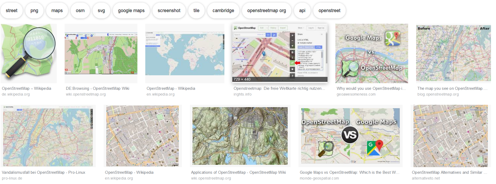
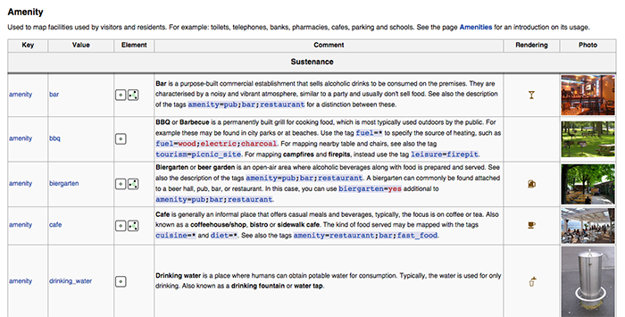
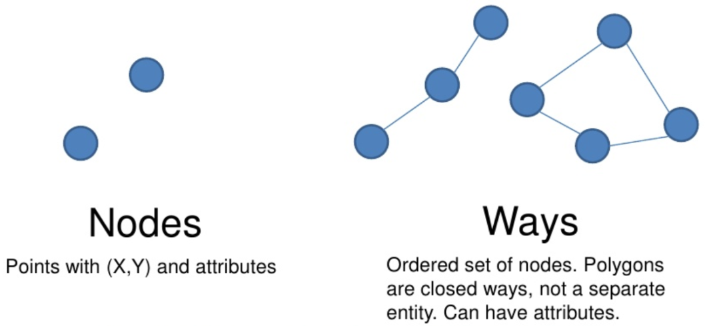
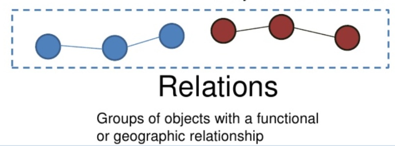
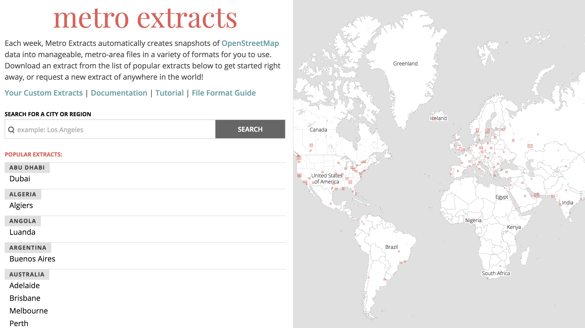
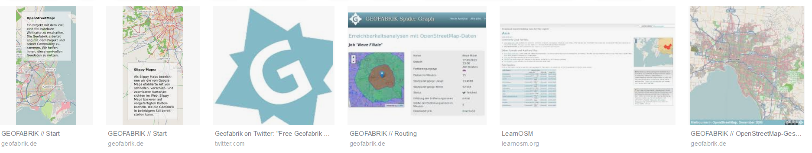
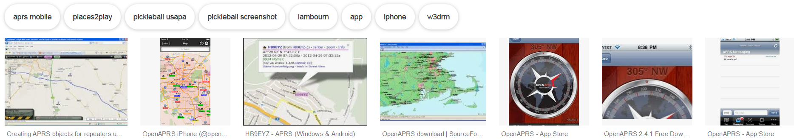
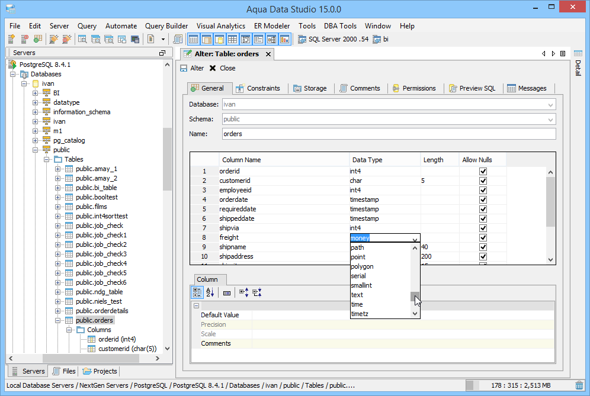
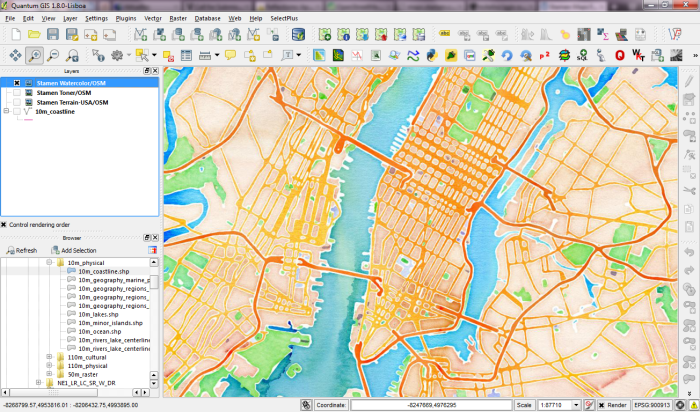

```{r setup_osm, include=FALSE}
knitr::opts_chunk$set(echo = TRUE,cache=T,eval=T,warning=F,message=F)
Ex <- T
```

## Inhalt dieses Abschnitts

- Vorstellung des Openstreetmap (OSM) Projekts
- Welche OSM-Daten sind erhältlich?
- Vorstellung von Forschung die mit OSM-Daten durchgeführt wurde


## [OpenStreetMap](http://www.openstreetmap.de/) Projekt

### http://www.openstreetmap.de/

> OpenStreetMap.org ist ein im Jahre 2004 gegründetes internationales Projekt mit dem Ziel, eine freie Weltkarte zu erschaffen. Dafür sammeln wir weltweit Daten über Straßen, Eisenbahnen, Flüsse, Wälder, Häuser und vieles mehr. 


## OpenStreetMap

### [**Wikipedia - OpenStreetMap**](https://en.wikipedia.org/wiki/OpenStreetMap)

> OpenStreetMap (OSM) ist ein kollaboratives Projekt um eine editierbare Weltkarte zu erzeugen.




## [Openstreetmap Tags](https://wiki.openstreetmap.org/wiki/Tags)


## [OSM Map Features](http://wiki.openstreetmap.org/wiki/DE:Map_Features)




## Objekttypen in OSM

### Es gibt prinipiell drei verschiedene Objekttypen:

- nodes (points), 
- ways (polygons and polylines)
- relations (logical grouping of all three object types
to express real-world geographical relationships)


Hippolyte Pruvost and Peter Mooney: Exploring Data Model Relations in OpenStreetMap


## OpenStreetMap objects

### [**Martijn van Exel**](https://www.slideshare.net/mvexel/openstreetmap-9819440)
- nodes and ways


<!--

-->

## OpenStreetMap objects

### Relations



## Download von OpenStreetMap Daten - [Metro extracts](https://mapzen.com/) 

- Ausschnitte von OpenStreetMap für einzelne Städte ([**metro extracts**](https://mapzen.com/data/metro-extracts/))




## Download von OpenStreetMap Daten - Geofabrik

### Geofabrik

- Über [**Geofabrik**](http://download.geofabrik.de/) lassen sich aktuelle Ausschnitte (auch Shapefiles) herunterladen 



## Download von OpenStreetMap Daten - openaprs

### Kartendaten ([**openaprs**](http://www.openaprs.net/))



## OSM Planet file

### Datenbanklösungen

- Bei den eben vorgestellten Möglichkeiten geht es vor allem um das Herunterladen kleiner Ausschnitte.
- Wenn größere Datenmengen benötigt werden, sollte man eine Datenbanklösung nutzen.
- [**PostgreSQL**](http://www.postgresql.org/) hat den Vorteil, dass es Open-Source ist.

## [Download PostreSQL](http://www.postgresql.org/download/windows/)

- [**Hier**](https://datashenanigan.wordpress.com/2015/05/18/getting-started-with-postgresql-in-r/) ist eine Einführung in PostgreSQL zu finden

<!--

-->


<!--
https://filehippo.com/de/download_postgresql/
http://www.postgresqltutorial.com/what-is-postgresql/
-->

## pgAdmin III

- Sehr empfehlenswert: Arbeiten mit pgAdmin III
- Beispiel: um Verknüpfung zu einer Datenbank herzustellen - Doppelklick auf den Server in pgAdmin III


## PostGIS für PostgreSQL

- [**Installieren**](http://postgis.net/install/) der PostGIS Erweiterung:

```
CREATE EXTENSION postgis;
```


## Programm zum Import der OSM Daten in PostgreSQL- osm2pgsql

- Läuft unter Linux deutlich besser
- so könnte bspw. ein Import in PostgreSQL aussehen:

```
osm2pgsql -c -d osmBerlin --slim -C  -k  berlin-latest.osm.pbf
```

## Nutze bspw. [QGIS](http://www.qgis.org/de/site/) um Shapefiles zu extrahieren

- [Plugin OpenLayers](http://www.qgistutorials.com/de/docs/downloading_osm_data.html)


<!--
https://underdark.files.wordpress.com/2012/07/stamen_watercolor1.png?w=700
-->
```{r,echo=F}
library("knitr")
```


## Links

- [**Wiki zum Downlaod**](http://wiki.openstreetmap.org/wiki/Downloading_data) von Openstreetmap Daten

- [**Openstreetmap Blog**](http://blog.openstreetmap.de/)

- Liste möglicher Datenquellen für räumliche Analysen ([weltweit](http://wiki.openstreetmap.org/wiki/Potential_Datasources) und in  [**Deutschland**](http://wiki.openstreetmap.org/wiki/DE:Potential_Datasources)
)


- [**SALB**](http://wiki.openstreetmap.org/wiki/SALB) - Administrative Grenzen

<http://wiki.openstreetmap.org/wiki/SALB>

