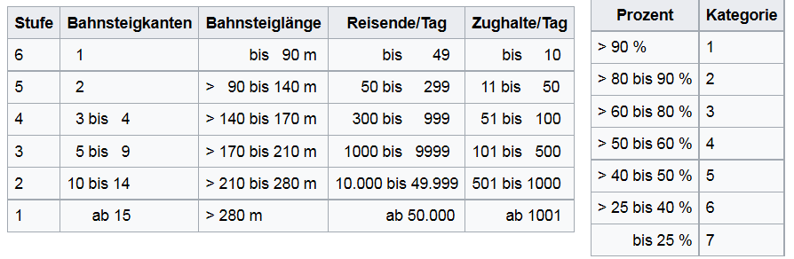

```{r setup, include=FALSE}
knitr::opts_chunk$set(echo = TRUE,cache=T,eval=T,warning=F,message=F)
```


## [Worum geht es?](http://blog.revolutionanalytics.com/2012/07/making-beautiful-maps-in-r-with-ggmap.html)


## [OpenStreetMap](http://www.openstreetmap.de/) Projekt

> OpenStreetMap.org ist ein im Jahre 2004 gegründetes internationales Projekt mit dem Ziel, eine freie Weltkarte zu erschaffen. Dafür sammeln wir weltweit Daten über Straßen, Eisenbahnen, Flüsse, Wälder, Häuser und vieles mehr. 

<http://www.openstreetmap.de/>


## OpenStreetMap

> OpenStreetMap (OSM) ist ein kollaboratives Projekt um eine editierbare Weltkarte zu erzeugen.

[Wikipedia - OpenStreetMap](https://en.wikipedia.org/wiki/OpenStreetMap)

## [OSM Map Features](http://wiki.openstreetmap.org/wiki/DE:Map_Features)


## [Overpass Turbo](https://overpass-turbo.eu/)


## Query Overpass

```
node
  [amenity=bar]
  ({{bbox}});
out;
```

## Download von OpenStreetMap Daten

- https://mapzen.com/ - Ausschnitte von OpenStreetMap für einzelne Städte ([metro extracts](https://mapzen.com/data/metro-extracts/))


- Über Geofabrik lassen sich aktuelle Ausschnitte (auch Shapefiles) herunterladen (http://download.geofabrik.de/)

- Kartendaten ([openaprs](http://www.openaprs.net/))

## Bei großen Datenmengen

- Hier geht es nur um das Herunterladen kleiner Ausschnitte.
- Wenn größere Datenmengen benötigt werden, sollte man eine Datenbanklösung finden.
- [PostgreSQL](http://www.postgresql.org/) hat den Vorteil, dass es Open-Source ist.

- [Download PostreSQL](http://www.postgresql.org/download/windows/)

- [Hier](https://datashenanigan.wordpress.com/2015/05/18/getting-started-with-postgresql-in-r/) ist eine Einführung in PostgreSQL zu finden

- Sehr empfehlenswert: Arbeiten mit pgAdmin III
- Beispiel: um Verknüpfung zu einer Datenbank herzustellen - Doppelklick auf den Server in pgAdmin III


## PostGIS für PostgreSQL

- [Installieren](http://postgis.net/install/) der PostGIS Erweiterung:

```
CREATE EXTENSION postgis;
```


## Programm zum Import der OSM Daten in PostgreSQL- osm2pgsql

- Läuft unter Linux deutlich besser
- so könnte bspw. ein Import in PostgreSQL aussehen:

```
osm2pgsql -c -d osmBerlin --slim -C  -k  berlin-latest.osm.pbf
```

## Nutze bspw. [QGIS](http://www.qgis.org/de/site/) um Shapefiles zu extrahieren

- [Plugin OpenLayers](http://www.qgistutorials.com/de/docs/downloading_osm_data.html)


```{r,echo=F}
library("knitr")
```


## Das R-Paket `XML` - Gaston Sanchez

```{r}
library("XML")
```


Seine Arbeit sieht man [hier](http://gastonsanchez.com/).


## [Das Arbeiten mit XML Daten](https://github.com/gastonstat/tutorial-R-web-data/blob/master/04-parsing-xml/04-parsing-xml.pdf)


## Funktionen im XML Paket

```{r,echo=F,eval=T}
names <- c("xmlName()","name of the node","xmlSize()","number of subnodes","xmlAttrs()","named character vector of all attributes","xmlGetAttr()","value of a single attribute","xmlValue()","contents of a leaf node","xmlParent()","name of parent node","xmlAncestors()","name of ancestor nodes","getSibling()","siblings to the right or to the left","xmlNamespace()","the namespace (if there’s one)")
tab <- data.frame(t(array(names,dim=c(2,length(names)/2))))
colnames(tab) <- c("Function","Description")
kable(tab)
```


## [Einzelne Objekte finden](http://www.openstreetmap.org/export)

<www.openstreetmap.org/export>


## Beispiel: administrative Grenzen Berlin

[Administrative Grenzen für Deutschland](http://wiki.openstreetmap.org/wiki/DE:Grenze#Bundesl.C3.A4ndergrenze_-_admin_level.3D4)

```{r,echo=T}
url <- "http://api.openstreetmap.org/api/0.6/relation/62422"
```

```{r,echo=F}
# library(xml2)
# BE <- read_xml.raw(url)
```


```{r}
BE <- xmlParse(url)
```


## Das XML analysieren

- [Tobi Bosede - Working with XML Data in R](http://www.informit.com/articles/article.aspx?p=2215520)

```{r}
xmltop = xmlRoot(BE)
class(xmltop)
xmlSize(xmltop)
xmlSize(xmltop[[1]])
```


## Nutzung von Xpath

> [Xpath](https://de.wikipedia.org/wiki/XPath), the XML Path Language, is a query language for selecting nodes from an XML document. 

```{r}
xpathApply(BE,"//tag[@k = 'population']")
```


## Quelle für die Bevölkerungsgröße

```{r}
xpathApply(BE,"//tag[@k = 'source:population']")
```

-[Statistik Berlin Brandenburg](https://www.statistik-berlin-brandenburg.de/datenbank/inhalt-datenbank.asp)

## Etwas überraschend: 

```{r}
xpathApply(BE,"//tag[@k = 'name:ta']")
```


## Geographische Region

```{r}
region <- xpathApply(BE,
  "//tag[@k = 'geographical_region']")
# regular expressions
region[[1]]
```

```
<tag k="geographical_region" 
  v="Barnim;Berliner Urstromtal;
  Teltow;Nauener Platte"/>
```

## Landkreis


## Weiteres Beispiel

```{r}
url2<-"http://api.openstreetmap.org/api/0.6/node/25113879"
obj2<-xmlParse(url2)
obj_amenity<-xpathApply(obj2,"//tag[@k = 'amenity']")[[1]]
obj_amenity
```

## Wikipedia Artikel

```{r}
xpathApply(obj2,"//tag[@k = 'wikipedia']")[[1]]
```

```{r,eval=F}
xpathApply(obj2,"//tag[@k = 'wheelchair']")[[1]]
```

```{r,eval=F}
xpathApply(obj2,"//tag[@k = 'name']")[[1]]
```


## Das C und das A

```{r}
url3<-"http://api.openstreetmap.org/api/0.6/node/303550876"
obj3 <- xmlParse(url3)
xpathApply(obj3,"//tag[@k = 'opening_hours']")[[1]]
```

## Hin und weg

```{r }
url4<-"http://api.openstreetmap.org/api/0.6/node/25439439"
obj4 <- xmlParse(url4)
xpathApply(obj4,"//tag[@k = 'railway:station_category']")[[1]]
```

- [Wikipedia Artikel Bahnhofskategorien](https://de.wikipedia.org/wiki/Bahnhofskategorie)



## Exkurs: Bahnhofskategorien

- [rvest: Easily Harvest (Scrape) Web Pages](https://cran.r-project.org/web/packages/rvest/index.html)

```{r}
library(rvest)
bhfkat<-read_html(
  "https://de.wikipedia.org/wiki/Bahnhofskategorie")
df_html_bhfkat<-html_table(
  html_nodes(bhfkat, "table")[[1]],fill = TRUE)
```

## Bahnhofskategorien Übersicht

```{r,echo=F}
library(knitr)
kable(df_html_bhfkat)
```

## Nur fliegen ist schöner

```{r }
url5<-"http://api.openstreetmap.org/api/0.6/way/162149882"
obj5<-xmlParse(url5)
xpathApply(obj5,"//tag[@k = 'name']")[[1]]
```


```{r}
xpathApply(obj5,"//tag[@k = 'website']")[[1]]
```


```{r}
xpathApply(obj5,"//tag[@k = 'iata']")[[1]]
```


## [OSM Ausschnitte herunterladen](http://www.openstreetmap.org/export)

<www.openstreetmap.org/export>


## Mehr Beispiele, wie man mit XML Daten umgeht:


- Deborah Nolan - [Extracting data from XML](http://www.stat.berkeley.edu/~statcur/Workshop2/Presentations/XML.pdf)


- Duncan Temple Lang - [A Short Introduction to the XML package for R](http://www.omegahat.net/RSXML/shortIntro.pdf)


Noch mehr Informationen

- [Web Daten manipulieren](http://www.di.fc.ul.pt/~jpn/r/web/index.html#parsing-xml)

- [Tutorial zu xquery](http://www.w3schools.com/xml/xquery_intro.asp)

- [R und das Web (für Anfänger), Teil II: XML und R](http://giventhedata.blogspot.de/2012/06/r-and-web-for-beginners-part-ii-xml-in.html)

- [String Manipulation](http://gastonsanchez.com/Handling_and_Processing_Strings_in_R.pdf)

- [Nutzung, Vor- und Nachteile OSM](https://www.e-education.psu.edu/geog585/node/738)

- [Forschungsprojekte im Zusammenhang mit OpenStreetMap](http://wiki.openstreetmap.org/wiki/Research)

## Referenzen

```{r}
citation("XML")
```

## Das neuere Paket

```{r}
citation("xml2")
```

## Links

- [Wiki zum Downlaod](http://wiki.openstreetmap.org/wiki/Downloading_data) von Openstreetmap Daten

- [Openstreetmap Blog](http://blog.openstreetmap.de/)

- Liste möglicher Datenquellen für räumliche Analysen ([weltweit](http://wiki.openstreetmap.org/wiki/Potential_Datasources) und in  [Deutschland](http://wiki.openstreetmap.org/wiki/DE:Potential_Datasources)
)


- [SALB](http://wiki.openstreetmap.org/wiki/SALB) - Administrative Grenzen

<http://wiki.openstreetmap.org/wiki/SALB>

