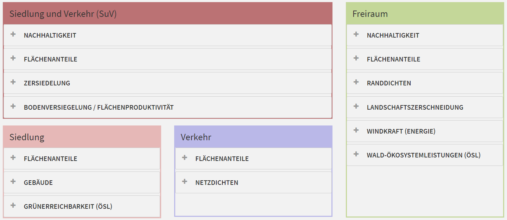

```{r setup, include=FALSE}
knitr::opts_chunk$set(echo = FALSE)
```

## 

```{r eval=FALSE, include=FALSE}
install.packages("rnaturalearth")
```


```{r}
library(rnaturalearth)
usa = ne_countries(country = "United States of America") # United States borders
class(usa)
```

## [](https://geocompr.robinlovelace.net/read-write.html)

```{r}
library(sf)
usa_sf <- st_as_sf(usa)
plot(usa_sf)
```

## [Indikatoren vom Institut für ökologische Raumforschung (IÖR)](http://www.ioer-monitor.de/)


