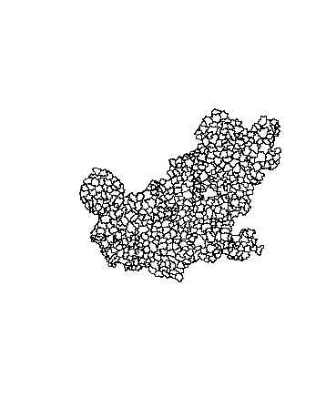

```{r setup, include=FALSE}
knitr::opts_chunk$set(echo = FALSE,cache=T)
GESIS <- F
athome <- !GESIS
```


## Worum geht es in diesem Abschnitt

- Shapefiles mit Vorwahl- und PLZ-Bereichen importieren
- PLZ-Bereiche zusammenfassen
- Eine räumliche Stichprobe ziehen
- Adressen für die gezogenen Punkte bestimmen
- Adressdatensatz bereinigen
- Entfernung zum Hauptbahnhof bestimmen


## Ortsnetzbereiche

Quelle: [Bundesnetzagentur](http://www.bundesnetzagentur.de/DE/Sachgebiete/Telekommunikation/Unternehmen_Institutionen/Nummerierung/Rufnummern/ONVerzeichnisse/GISDaten_ONBGrenzen/ONBGrenzen_Basepage.html)


```{r,echo=T,eval=GESIS}
setwd("D:/Daten/Daten/GeoDaten/")
library(maptools)
onb <- readShapePoly("onb_grenzen.shp")
```

## Die Karte zeichnen

```{r,eval=GESIS}
par(mai=c(0,0,0,0))
plot(onb)
```


## Einen Vorwahlbereich ausschneiden

```{r,eval=GESIS}
vwb <- onb@data$ONB_NUMMER
vwb1 <- substr(vwb, 1,1)
```

```{r,eval=GESIS}
barchart(table(vwb1),col="royalblue",
         xlab="Häufigkeit")
```

<!--

-->

## Vorwahlbereich ausschneiden

```{r,eval=GESIS}
vwb6 <- onb[vwb1==6,]
plot(vwb6)
```

<!--

-->

## Shapefiles zusammenfassen

```{r,eval=GESIS}
vwb6c <- unionSpatialPolygons(vwb6,
              rep(1,length(vwb6)))
plot(vwb6c,col="royalblue")
```

<!--

-->


## PLZ Datensatz einlesen

- [**Quelle**](http://arnulf.us/PLZ) für PLZ Shapefiles

```{r,eval=athome,echo=F}
data_path <- "D:/GESIS/data/"
```

```{r,eval=GESIS,echo=F}
data_path <- "D:/Daten/Daten/GeoDaten/"
```


```{r}
library(rgdal)
```


```{r}
setwd(data_path)
plz <- readOGR ("post_pl.shp","post_pl")
```

## Die Daten plotten

```{r}
plzbereich <- substr(plz@data$PLZ99,1,2)
plot(plz[plzbereich=="68",])
```


## Die Grenze von Mannheim

```{r}
ma_map <- plz[plz$PLZORT99=="Mannheim",]
plot(ma_map)
```

## Die PLZ-Bereiche von Mannheim zusammenfassen

- Wir nutzen den Befehl `unionSpatialPolygons` im Paket `maptools`

```{r}
library(maptools)
ma_map2 <- unionSpatialPolygons(SpP = ma_map,
                                IDs = rep(1,length(ma_map)))
plot(ma_map2)
```


## Der Grenze von Deutschland

```{r}
ddat <- maptools::unionSpatialPolygons(SpP = plz,
                                IDs = rep(1,length(plz)))

```


```{r,eval=F,echo=F}
save(ddat,file="../data/ddat.RData")
```


## [Räumliche Stichprobe](https://www.rdocumentation.org/packages/sp/versions/1.3-1/topics/spsample)

```{r}
# set.seed(323)
set.seed(5)
n <- 1000
spatsamp <- spsample(ddat,n,type="random")
```


## Reverse Geokodierung

```{r}
library(ggmap)
```


```{r,eval=F}
spatlist <- list()
for (i in 1:n){
  spatlist[[i]] <- ggmap::revgeocode(c(spatsamp[i,]$x,
                                       spatsamp[i,]$y))  
}

spatvec <- unlist(spatlist)
spatsamp$adress <- spatvec
```

```{r,eval=F,echo=F}
plz_place <- "Deutschland"
save(spatsamp,file=paste0("../data/spatsamp_",plz_place,".RData"))
```

```{r,echo=F}
load(paste0("../data/spatsamp_Deutschland.RData"))
load("../data/ddat.RData")
```

## Die räumliche Stichprobe plotten

```{r}
plot(ddat)
points(spatsamp)
```


## Nur tatsächliche Adressen

- [**Reguläre Ausdrücke**](http://stat545.com/block022_regular-expression.html) in R

```{r}
addr_list <- spatsamp$adress
  # Adressen raus nehmen, die NA sind
indna <- which(is.na(addr_list))
addr_list <- as.character(addr_list)
addr_list2 <- strsplit(x = addr_list,split = " ")
addr_list2b <- unlist(lapply(addr_list2,length))
ind_ua <- which(addr_list2b<3)
addr_list3 <- unlist(lapply(addr_list2,function(x)x[1]))
  # Adressen rauß nehmen, die Landstraßen 
  # oder Autobahnen sind
addr_list3 <- tolower(addr_list3)
ind_str <- grep("^[a-z][1-9]", addr_list3, value = F)
ind_str2 <- agrep("unnamed", addr_list3, value = F)


addr_list_t <- addr_list[-c(ind_str,ind_str2,ind_ua,indna)]
```

```{r,eval=F,echo=F}
save(addr_list_t,file=paste0("../data/addr_list_t_",plz_place,"_samp1",".RData"))
```

## Das Ergebnis plotten

```{r}
plot(ddat)
points(spatsamp,pch=20)
points(spatsamp[ind_str,],pch=20,col="green")
points(spatsamp[ind_ua,],pch=20,col="purple")
points(spatsamp[indna,],pch=20,col="red")
```

## Distanzen berechnen

```{r,eval=F,echo=F}
install.packages("SoDA")
```


```{r}
library("SoDA")
```

```{r}
?geoDist
```


## Das shapefile Format ... 

- ... ist ein beliebtes Format räumlicher Vektordaten für geographisches Informationssysteme (GIS).
- Es wurde entwickelt und reguliert von [ESRI](http://www.esri.com/)

- (meist) offene Spezifikation um Daten Interoperabilität zwischen Esri und anderen Formaten zu sichern. 

- Es können Punkte, Linien und Polygone beschrieben werden

- Jedes Element hat Attribute, wie bspw. Name oder Temperatur die es beschreiben.

Quelle: <https://en.wikipedia.org/wiki/Shapefile>


## Global Adminastrative Boundaries - [GADM](http://www.gadm.org/) - NUTS level 1

```{r}
library(raster)
```


```{r,warning=F,message=F,eval=T}
library(raster)
LUX1 <- getData('GADM', country='LUX', level=1)
plot(LUX1)
```


## Ein Blick auf die Daten

```{r,eval=F,echo=F}
LUXA <- LUX1[1,]
plot(LUXA)
```

Koordinaten im polygon slot
```{r,eval=F}
LUX1@polygons[[1]]@Polygons[[1]]@coords
```

```{r,echo=F,eval=T}
head(LUX1@polygons[[1]]@Polygons[[1]]@coords)
```

## Der Datenslot

```{r,eval=T}
head(LUX1@data)
```

```{r,eval=F,echo=F}
kable(head(LUX1@data))
```

## [GADM](http://www.gadm.org/)- NUTS level 3

```{r LUX3,warning=F,eval=T}
LUX3 <- getData('GADM', country='LUX', level=3)
plot(LUX3)
```

## [GADM](http://www.gadm.org/)- NUTS level 4

```{r LUX4,warning=F,eval=T}
LUX4 <- getData('GADM', country='LUX', level=4)
plot(LUX4)
```

## [GADM](http://www.gadm.org/)- NUTS level 3

```{r DEU3,warning=F,eval=F}
DEU3 <- getData('GADM', country='DEU', level=3)
plot(DEU3)
```


## PLZ für Deutschland

- <http://datahub.io/de/dataset/postal-codes-de>

- datahub.io funktioniert leider nicht mehr
- <http://arnulf.us/PLZ>

```{r,eval=F,echo=F}
setwd("D:/Daten/Daten/GeoDaten")
```

```{r}
library(rgdal)
```


```{r,echo=T,message=F,eval=F}
PLZ <- readOGR ("post_pl.shp","post_pl")
```


```{r,warning=F,message=F,eval=F,echo=F}
library(maptools)
PLZ <- readShapePoly("post_pl.shp")
```

## Der R Befehl readShapePoly

Um Shape-Dateien zu lesen, ist es notwendig, 
die drei Dateien mit den folgenden Dateierweiterungen im gleichen Verzeichnis zu haben:

- .shp
- .dbf
- .shx

## Mannheim zeichnen

```{r,echo=F}
#bbox4 <- bbox(MA)
```

```{r,eval=F,warning=F}
MA <- PLZ[PLZ@data$PLZORT99=="Mannheim",]
plot(MA)
```


## Gemeinden in Deutschland

[Bundesamt für Kartographie und Geodäsie (BKG)](http://www.geodatenzentrum.de/geodaten/gdz_rahmen.gdz_div?gdz_spr=deu&gdz_akt_zeile=5&gdz_anz_zeile=1&gdz_unt_zeile=15&gdz_user_id=0)

```{r,eval=F,echo=F}
setwd("D:/Daten/Daten/GeoDaten/vg250_ebenen")
```


```{r,cache=F,message=F,warning=F,eval=F}
library(maptools)
krs <- readShapePoly("vg250_krs.shp")
plot(krs)
```


## Kreise eines Bundeslandes

```{r,eval=F}
fds <- substr(krs@data$AGS,1,2)

plot(krs[fds=="05",])
```


## [Vorwahlbereiche in Deutschland](http://www.bundesnetzagentur.de/SharedDocs/Downloads/DE/Sachgebiete/Telekommunikation/Unternehmen_Institutionen/Nummerierung/Rufnummern/ONVerzeichnisse/ONBGrenzen/ONB_Grenzen.html)

<http://www.bundesnetzagentur.de/>

```{r,eval=F,echo=F}
setwd("D:/Daten/Daten/GeoDaten")
par(mai=c(0,0,0,0))
```


```{r,eval=F}
onb <- readShapePoly("onb_grenzen.shp")
```

```{r,eval=F,echo=F}
kable(head(onb@data))
```


|   |VORWAHL |NAME                 |KENNUNG |
|:--|:-------|:--------------------|:-------|
|0  |04651   |Sylt                 |NA      |
|1  |04668   |Klanxbüll            |NA      |
|2  |04664   |Neukirchen b Niebüll |NA      |
|3  |04663   |Süderlügum           |NA      |
|4  |04666   |Ladelund             |NA      |
|5  |04631   |Glücksburg Ostsee    |NA      |


## Vorwahlbereich 06

```{r,eval=F}
VW <- substr(onb@data$VORWAHL,1,2)
plot(onb[VW=="06",])
```



## Wo ist Mannheim?

```{r,eval=F}
Com <- onb@data$NAME
plot(onb[VW=="06",])
plot(onb[Com=="Mannheim",],col="red",add=T)
plot(onb[Com=="Heidelberg",],col="green",add=T)
plot(onb[Com=="Kaiserslautern",],col="blue",add=T)
```


## Andere Quellen

- [World Port Index](http://msi.nga.mil/NGAPortal/MSI.portal?_nfpb=true&_pageLabel=msi_portal_page_62&pubCode=0015)

```{r,echo=F,eval=F}
setwd("D:/Daten/Daten/GeoDaten/WPI_Shapefile")
```


```{r,message=F,warning=F,eval=F,echo=T}
library(rgdal)
WPI <- readOGR ("WPI.shp","WPI")
plot(WPI)
```


```{r,eval=F,echo=F}
git.path <- "C:/Users/kolbjp/Documents/GitHub/GeoData"
setwd(git.path)
```

Datenbanken für Karten

```{r,eval=F,echo=F}
install.packages("mapdata")
```


```{r,message=F,warning=F}
library(mapdata)
```

## Weitere Quellen

- [Eurostat Karten](http://epp.eurostat.ec.europa.eu/portal/page/portal/gisco_Geographical_information_maps/popups/
references/administrative_units_statistical_units_1)

- [Open linked data](https://www.ordnancesurvey.co.uk/business-and-government/products/opendata-products-grid.html)

- [World Borders Datensatz](http://thematicmapping.org/downloads/world_borders.php)

- [National Historical Information System](https://www.nhgis.org/)

- [Freie polygon Daten für die USA](http://www.freemapdata.com/html/free_polygon_data.html)

- [Spatial Data in R](https://science.nature.nps.gov/im/datamgmt/statistics/r/advanced/spatial.cfm)

- [ggmap und shapefiles](http://www.r-bloggers.com/shapefile-polygons-plotted-on-google-maps-using-ggmap-in-r-throw-some-throw-some-stats-on-that-mappart-2/)
