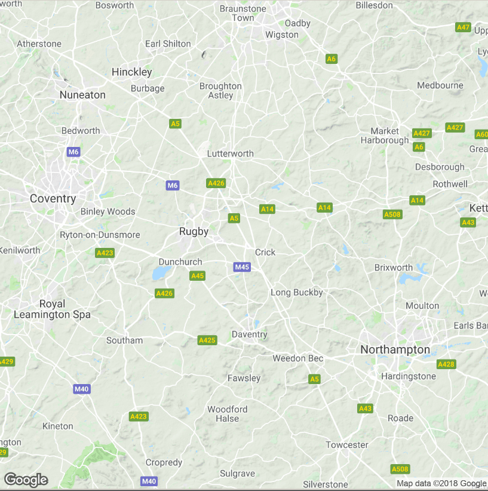

Inhalt dieses Abschnitts
------------------------

Arten von räumlichen Daten:

-   [**Straßenkarten**](https://www.nceas.ucsb.edu/~frazier/RSpatialGuides/ggmap/ggmapCheatsheet.pdf)
-   [**Satelliten Bilder**](http://www.mostlymuppet.com/tag/maps/)
-   [**Physische Daten und
    Karten**](http://gis.stackexchange.com/questions/3083/what-makes-a-map-beautiful/45518#45518)
-   [**Abstrakte
    Karten**](http://www.designfaves.com/2014/03/abstracted-maps-reveal-cities-personalities)
-   …

Das R-paket
[**`ggmap`**](http://journal.r-project.org/archive/2013-1/kahle-wickham.pdf)
wird im folgenden genutzt um verschiedene Kartentypen darzustellen.

Mit [**`qmap`**](http://www.inside-r.org/packages/cran/ggmap/docs/qmap)
kann man eine schnelle Karte erzeugen.

Installieren des Paketes
------------------------

-   Zur Erstellung der Karten brauchen wir das Paket `ggmap`:

<!-- -->

    devtools::install_github("dkahle/ggmap")
    devtools::install_github("hadley/ggplot2")
    install.packages("ggmap")

Paket ggmap - Hallo Welt
------------------------

-   Um das Paket zu laden verwenden wir den Befehl `library`

<!-- -->

    library(ggmap)

Und schon kann die erste Karte erstellt werden:

    qmap("Mannheim")


Karte für eine Sehenswürdigkeit
---------------------------------

    qmap("Berlin Brandenburger Tor")


Karte für einen ganzen Staat
-----------------------------

    qmap("Germany")

-   Wir brauchen ein anderes *zoom level*


Ein anderes *zoom level*
------------------------

-   level 3 - Kontinent / level 10 - Stadt / level 21 - Gebäude

<!-- -->

    qmap("England", zoom = 6)



Hilfe bekommen wir mit dem Fragezeichen
---------------------------------------

    ?qmap

Verschiedene Abschnitte in der Hilfe:

-   Description
-   Usage
-   Arguments
-   Value
-   Author(s)
-   See Also
-   Examples

<!--
## Ein anderes *zoom level*


```r
qmap("Hamburg", zoom = 12)
```


-->
Ganz nah dran
-------------

    qmap('Mannheim', zoom = 20)


`ggmap` - maptype satellite
---------------------------

    qmap('Hamburg', zoom = 14, maptype="satellite")


`ggmap` - maptype satellite zoom 20
-----------------------------------

    qmap('Hamburg', zoom = 20, maptype="hybrid")


Terrain/physical maps
---------------------

-   Aus Physischen Karten kann man Informationen über Berge, Flüsse
    und Seen ablesen.

-   Farben werden oft genutzt um Höhenunterschiede zu visualisieren

<!-- -->

    qmap('Arequipa', maptype="terrain")

Eine physische Karte von Arequipa
---------------------------------


<!--
### `ggmap` - terrain map


```r
qmap('Donnersberg', zoom = 14, maptype="terrain")
```


-->
<!--

-->
<!--

-->
Abstrahierte Karten ([http://www.designfaves.com](http://www.designfaves.com/2014/03/abstracted-maps-reveal-cities-personalities))
----------------------------------------------------------------------------------------------------------------------------------


-   Abstraktion wird genutzt um nur die essentiellen Informationen einer
    Karte zu zeigen.

-   Bsp. U-Bahn Karten - wichtig sind Richtungen und wenig Infos zur
    Orientierung

-   Im folgenden werden Karten vorgestellt, die sich gut als
    Hintergrundkarten eignen.

ggmap - maptype watercolor
--------------------------

    qmap('Los Angeles', zoom = 14,
     maptype="watercolor",source="stamen")


<!--
## ggmap - source stamen


```r
qmap('Mannheim', zoom = 14,
 maptype="toner",source="stamen")
```


## ggmap - maptype toner-lite


```r
qmap('Mannheim', zoom = 14,
 maptype="toner-lite",source="stamen")
```

## ggmap - maptype toner-hybrid


```r
qmap('Mannheim', zoom = 14,
 maptype="toner-hybrid",source="stamen")
```


## ggmap - maptype terrain-lines


```r
qmap('Mannheim', zoom = 14,
 maptype="terrain-lines",source="stamen")
```
-->
Graphiken speichern
-------------------


ggmap - ein Objekt erzeugen
---------------------------

-   `<-` ist der Zuweisungspfeil um ein Objekt zu erzeugen
-   Dieses Vorgehen macht bspw. Sinn, wenn mehrere Karten nebeneinander
    gebraucht werden.

<!-- -->

    MA_map <- qmap('Mannheim', 
                   zoom = 14,
                   maptype="toner",
                   source="stamen")

<!--
## 


```r
library(ggmap)
```


```r
?qmap
```


```r
triermap <- qmap(location = "Trier", zoom = 14,scale=2)
```


-->
[Eine Karte für die USA](https://blog.dominodatalab.com/geographic-visualization-with-rs-ggmaps/)
--------------------------------------------------------------------------------------------------

-   Mit dem Befehl `OSM_scale_lookup` bekommt man heraus, welchen Wert
    man für `scale` angeben muss.

<!-- -->

    OSM_scale_lookup(zoom = 10)
    qmap(location = "Trier", zoom = 10, source = "osm",
         scale=575000)

Cheatsheet
----------

-   Cheatsheet zu [data
    visualisation](https://www.rstudio.com/wp-content/uploads/2015/04/ggplot2-cheatsheet.pdf)

<https://www.rstudio.com/>


Resourcen und Literatur
-----------------------

-   Artikel von [**David Kahle und Hadley
    Wickham**](http://journal.r-project.org/archive/2013-1/kahle-wickham.pdf)
    zur Nutzung von `ggmap`.

-   [**Schnell eine Karte
    bekommen**](http://rpackages.ianhowson.com/cran/ggmap/man/get_map.html)

-   [**Karten machen mit
    R**](http://www.kevjohnson.org/making-maps-in-r-part-2/)
